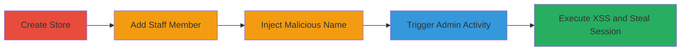

# Stored XSS in Shopify Staff Names Leading to Admin Account Takeover

Multi-stage attack chain demonstrating a complete attack workflow exploiting insufficient sanitization in Shopify's activity log feature.

## Chain Metrics Dashboard

| Metric | Value |
|--------|-------|
| Chain Status | Unverified |
| Total Steps | 4 |
| Execution Time | ~10 minutes |
| Skill Level | Intermediate |
| Complexity | Medium |
| Impact Level | High |

## Attack Flow Visualization

## Prerequisites & Requirements

### Required Tools

- Web browser (e.g., Chrome)
- Shopify account credentials (attacker's limited access)

### Target Environment

- Shopify admin dashboard
- Web platform with JavaScript enabled

### Initial Access Requirements

- Valid Shopify store owner credentials
- Ability to invite staff members
- Admin user performing actions (target)

## Detailed Attack Procedures

### Step 1: Create a Store
procedure: [[procedures/Create-a-Shopify-Store]]

**Objective**: Establish a new Shopify store to serve as the attack base.

**Instructions**: Use Shopify's signup interface to create a new store account. Provide necessary details like store name, email, and password.

**Expected Output**: Confirmation of store creation with access to the admin dashboard.

**Success Indicators**:
- Dashboard accessible at admin.shopify.com/store-name
- Store settings editable

### Step 2: Add a Staff Member
procedure: [[procedures/Add-a-Staff-Member-to-the-Store]]

**Objective**: Introduce a controllable staff account into the store environment.

**Instructions**: Navigate to Settings > Users and permissions in the admin dashboard, then invite a new staff member via email or add directly if possible.

**Expected Output**: Invitation sent or staff member added with limited permissions.

**Success Indicators**:
- Staff member appears in the users list
- Permissions assigned (e.g., view-only or limited)

### Step 3: Inject Malicious Payload
procedure: [[procedures/Set-Malicious-Payload-as-Staff-Name]]

**Objective**: Set the staff member's display name to a stored XSS payload that will be rendered unsanitized in activity logs.

**Instructions**: Edit the staff member's profile and set the display name to a payload like `hunter'><svg/onload=alert(2)>`. Save the changes.

**Expected Output**: Name updated in the staff profile.

**Success Indicators**:
- Name change reflected in user settings
- No immediate errors on save

### Step 4: Trigger Execution and Exfiltration
procedure: [[procedures/Trigger-XSS-via-Admin-Activity]]

**Objective**: Cause the admin to generate an activity log entry that renders the malicious name, executing the XSS payload to steal session cookies.

**Instructions**: As the admin, log in and perform an action like updating store settings. The activity log will display the staff name, injecting and executing the JavaScript (e.g., alert or cookie theft via document.cookie).

**Expected Output**: JavaScript execution in the admin's browser, such as an alert popup or network request exfiltrating cookies.

**Success Indicators**:
- Alert triggered or console logs showing execution
- Attacker receives stolen session data
- Potential admin account access

## Attack Chain Summary

### Key Achievements

1. Successful injection of stored XSS payload via staff name.
2. Execution of arbitrary JavaScript in the admin context.
3. Theft of admin session cookies leading to account takeover.

## Technique & Tactic Coverage

### MITRE ATT&CK Techniques

- [[JavaScript]]

### MITRE ATT&CK Tactics

- [[Execution]]
- [[Collection]]

---
*Last updated: 2023-10-01T12:00:00Z*
