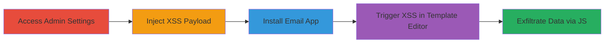

# Stored XSS in Shopify Store Address Leading to Email App JavaScript Execution

Multi-stage attack chain demonstrating a complete attack workflow exploiting insufficient input sanitization in Shopify's admin settings to achieve arbitrary JavaScript execution in the Shopify Email App.

## Chain Metrics Dashboard

| Metric | Value |
|--------|-------|
| Chain Status | Unverified |
| Total Steps | 4 |
| Execution Time | ~5 minutes |
| Skill Level | Intermediate |
| Complexity | Medium |
| Impact Level | High |

## Attack Flow Visualization

## Prerequisites & Requirements

### Required Tools

- Web browser (e.g., Chrome with developer tools)

### Target Environment

- Shopify admin panel (https://*.myshopify.com/admin)
- Access to Settings > General section
- Shopify Email App installed post-injection

### Initial Access Requirements

- Valid Shopify account with Settings permissions (no full admin required)
- Network access to Shopify admin and app store

## Detailed Attack Procedures

### Step 1: Access Admin Settings
procedure: [[procedures/Access-Shopify-Admin-Settings]]

**Objective**: Navigate to the store address configuration to prepare for payload injection.

**Instructions**: Open a web browser and log in to the Shopify admin panel. Directly navigate to the general settings page where the store address fields are editable.

**Expected Output**: The Settings > General page loads, displaying the store address input fields.

**Success Indicators**:
- Page loads without errors
- 'Apartment, suite, etc. (optional)' field is visible and editable

### Step 2: Inject XSS Payload into Store Address
procedure: [[procedures/Inject-XSS-Payload-into-Store-Address]]

**Objective**: Store malicious HTML/JavaScript in the optional address field to persist the payload across the application.

**Instructions**: In the 'Apartment, suite, etc. (optional)' field, insert the crafted payload that uses an image tag with an onerror handler to delay and exfiltrate data. Save the settings to store the payload.

**Expected Output**: Settings save successfully without validation errors; payload is stored.

**Success Indicators**:
- No character limit enforcement blocks the payload
- Settings update confirmation appears

### Step 3: Install Shopify Email App
procedure: [[procedures/Install-Shopify-Email-App]]

**Objective**: Add the Shopify Email App to the store to access template editing features that render the vulnerable store address.

**Instructions**: Visit the Shopify App Store, search for and install the official Shopify Email App. Authorize it with the necessary permissions.

**Expected Output**: App installs and appears in the admin apps list.

**Success Indicators**:
- Installation completes without issues
- App dashboard is accessible

### Step 4: Trigger XSS via Email Template Editing
procedure: [[procedures/Trigger-XSS-via-Email-Template-Editing]]

**Objective**: Edit an email template that includes the store address, causing the injected payload to render and execute in the app's context.

**Instructions**: In the Shopify Email App, select and open a template editor that displays the full store address. The payload executes automatically upon rendering.

**Expected Output**: JavaScript runs, sending a POST request to the external server (e.g., https://fbs.ninja) with exfiltrated HTML like CSRF tokens.

**Success Indicators**:
- Network request to external server observed in browser dev tools
- Internal GraphQL endpoint (https://email.shopifyapps.com/graphql) potentially triggered

## Attack Chain Summary

### Key Achievements

1. Persistent storage of XSS payload in admin settings with minimal permissions
2. Arbitrary JS execution in the Shopify Email App context without direct app access
3. Data exfiltration of sensitive elements like CSRF tokens to external servers
4. Potential for further abuse of internal APIs like GraphQL

## Technique & Tactic Coverage

### MITRE ATT&CK Techniques

- [[JavaScript]]

### MITRE ATT&CK Tactics

- [[Execution]]
- [[Collection]]

---
*Last updated: 2023-10-01T00:00:00Z*
