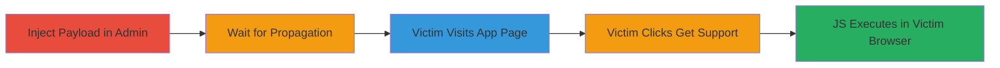

---
tags:
  - xss
  - stored-xss
  - shopify
  - javascript
  - session-hijacking
type: attack_chain
tools: []
tactics:
  - '[[Execution]]'
  - '[[Initial Access]]'
verified: false
platforms:
  - Web
submitted: true
complexity: medium
created_at: '2023-10-01T00:00:00Z'
procedures:
  - '[[procedures/Inject-Malicious-Payload-into-Store-Contact-Email]]'
  - '[[procedures/Wait-for-Payload-Propagation-and-Verify]]'
  - '[[procedures/Navigate-to-App-Page-on-apps-shopify-com]]'
  - '[[procedures/Click-Get-Support-Link-to-Trigger-XSS]]'
  - '[[procedures/Observe-JS-Payload-Execution]]'
step_count: 5
techniques:
  - '[[JavaScript]]'
  - '[[Drive-by Compromise]]'
updated_at: '2025-12-13T23:52:21.013Z'
description: >-
  Multi-stage stored XSS attack exploiting unsanitized email field in Shopify
  admin to inject JS payload that executes on public app profile pages when
  victims click 'Get support'.
skill_level: intermediate
impact_level: high
id: c0f7e1b2-d73a-4c44-9a02-fdc03b3aeb2b
validated: true
mitre_tactics:
  - '[[Execution]]'
  - '[[Initial Access]]'
mitre_techniques:
  - '[[JavaScript]]'
  - '[[Drive-by Compromise]]'
---
# Stored XSS in Shopify Store Contact Email Leading to JS Execution on apps.shopify.com

Multi-stage attack chain demonstrating a complete stored XSS workflow in Shopify, where an admin injects a payload into the store contact email, which propagates to public app profiles and executes JS when victims interact with support links.

## Chain Metrics Dashboard

| Metric | Value |
|--------|-------|
| Chain Status | Unverified |
| Total Steps | 5 |
| Execution Time | ~60 minutes |
| Skill Level | Intermediate |
| Complexity | Medium |
| Impact Level | High |

## Attack Flow Visualization

## Prerequisites & Requirements

### Required Tools

- Web browser (e.g., Chrome with developer tools for testing)

### Target Environment

- Shopify store with admin access
- Access to *.myshopify.com/admin
- Public visibility on apps.shopify.com

### Initial Access Requirements

- Valid admin credentials for the target Shopify store
- No special network position required; standard internet access
- Prior store ownership or compromised admin account

## Detailed Attack Procedures

### Step 1: Inject Payload
procedure: [[procedures/Inject-Malicious-Payload-into-Store-Contact-Email]]

**Objective**: Insert a malicious JS payload into the store's contact email field to store XSS content in the backend.

**Instructions**: Log in to the Shopify admin panel and navigate to the general settings page. Enter the crafted payload in the email field to break out of the input context and inject HTML/JS.

**Expected Output**: Payload saved without immediate error; field updates to include the injected content.

**Success Indicators**:
- Payload appears in the email field upon save
- No validation errors block submission

### Step 2: Wait for Propagation
procedure: [[procedures/Wait-for-Payload-Propagation-and-Verify]]

**Objective**: Allow Shopify's backend to sync the injected payload to the public apps.shopify.com domain.

**Instructions**: After injection, monitor the public shop profile on apps.shopify.com for the updated email field containing the payload.

**Expected Output**: After ~60 minutes, the shop's profile shows the malicious email.

**Success Indicators**:
- Payload visible in shop profile HTML
- No sanitization applied to the email content

### Step 3: Victim Navigation
procedure: [[procedures/Navigate-to-App-Page-on-apps-shopify-com]]

**Objective**: Direct or lure a victim to an app page where the shop profile sidebar is visible.

**Instructions**: Have the victim (or simulate) visit any app listing page on apps.shopify.com, such as a delivery app.

**Expected Output**: Page loads with shop-related sidebar elements.

**Success Indicators**:
- App page renders successfully
- Sidebar with shop info is present

### Step 4: Trigger Interaction
procedure: [[procedures/Click-Get-Support-Link-to-Trigger-XSS]]

**Objective**: Cause the rendering of the unsanitized email field by clicking the support link.

**Instructions**: Click the 'Get support' link in the sidebar, which loads the shop's contact details including the injected email.

**Expected Output**: Support modal or page opens, displaying the email field content.

**Success Indicators**:
- Support interface loads
- Injected email renders as HTML

### Step 5: Execution
procedure: [[procedures/Observe-JS-Payload-Execution]]

**Objective**: Confirm arbitrary JS execution in the victim's browser context on apps.shopify.com.

**Instructions**: Upon rendering, the payload's onerror event triggers, executing the JS (e.g., alert).

**Expected Output**: JS alert or other effects fire in the browser.

**Success Indicators**:
- Alert box appears showing document.domain
- Browser console logs JS execution
- Potential for further exploitation like session theft

## Attack Chain Summary

### Key Achievements

1. Successful payload injection and storage in admin email field
2. Propagation to public domain without sanitization
3. Triggering of XSS via user interaction on app pages
4. Arbitrary JS execution enabling session hijacking or phishing

## Technique & Tactic Coverage

### MITRE ATT&CK Techniques

- [[JavaScript]]
- [[Drive-by Compromise]]

### MITRE ATT&CK Tactics

- [[Execution]]
- [[Initial Access]]

---
*Last updated: 2023-10-01T00:00:00Z*
