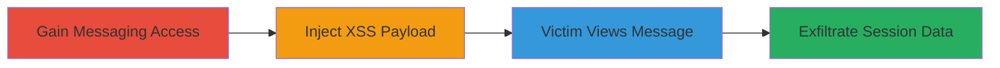

---
tags:
  - xss
  - stored-xss
  - session-theft
  - account-takeover
  - web-vulnerability
type: attack_chain
tools: []
tactics:
  - '[[Execution]]'
  - '[[Collection]]'
commands: []
platforms:
  - Web
complexity: medium
procedures:
  - '[[procedures/Gain-Messaging-Access-via-Forum-Post]]'
  - '[[procedures/Inject-Stored-XSS-Payload-in-Private-Message]]'
  - '[[procedures/Exfiltrate-Session-Data-via-XSS-Execution]]'
step_count: 3
techniques:
  - '[[JavaScript]]'
  - '[[Drive-by Compromise]]'
description: >-
  A multi-step attack exploiting a stored XSS vulnerability in SideFX's private
  messaging to inject malicious JavaScript, execute it when viewed by victims,
  and exfiltrate session data for account takeover.
skill_level: intermediate
impact_level: high
id: 1bd3f98a-dd1b-4611-bb04-4c280cceda07
created_at: '2025-12-13T23:56:03.319Z'
updated_at: '2025-12-13T23:56:03.319Z'
verified: false
validated: true
submitted: true
mitre_tactics:
  - '[[Execution]]'
  - '[[Collection]]'
mitre_techniques:
  - '[[JavaScript]]'
  - '[[Drive-by Compromise]]'
---
# Stored XSS in SideFX Private Messages Leading to Session Theft and Account Takeover

Multi-stage attack chain demonstrating exploitation of a stored cross-site scripting (XSS) vulnerability in the SideFX website's private messaging feature. Attackers inject malicious JavaScript payloads into messages, which execute in the victim's browser upon viewing, enabling theft of session IDs from the /account/sessions/ page and potential account takeover for any user interacting with the message. The attack targets the lack of proper HTML and JavaScript sanitization in message content.

## Chain Metrics Dashboard

| Metric | Value |
|--------|-------|
| Chain Status | Unverified |
| Total Steps | 3 |
| Execution Time | ~5 minutes |
| Skill Level | Intermediate |
| Complexity | Medium |
| Impact Level | High |

## Attack Flow Visualization

## Prerequisites & Requirements

### Required Tools

- Web browser for testing payloads
- Attacker-controlled server for data exfiltration

### Target Environment

- SideFX website (web platform)
- Required services: Private messaging, Forum
- Network access requirements: Internet access to SideFX.com

### Initial Access Requirements

- Attacker account on SideFX (requires admin approval via forum post)
- No special credentials beyond standard user registration
- Prior access: None, but forum interaction needed for messaging privileges

## Detailed Attack Procedures

### Step 1: Gain Messaging Access
procedure: [[procedures/Gain-Messaging-Access-via-Forum-Post]]

**Objective**: Obtain authorization to send private messages by getting the attacker account approved.

**Instructions**: Register an account on SideFX if not already done, then post on the forum to trigger admin approval. This step ensures the account is authorized for messaging.

**Expected Output**: Account approval notification, enabling access to private messaging.

**Success Indicators**:
- Account status updated to approved
- Ability to access and use the private messaging interface

### Step 2: Inject Stored XSS Payload
procedure: [[procedures/Inject-Stored-XSS-Payload-in-Private-Message]]

**Objective**: Send a malicious message containing an encoded XSS payload to a target user.

**Instructions**: Compose and send a private message with an encoded HTML img tag payload, such as one that triggers JavaScript on error. Target users can be selected from the forum user list.

**Expected Output**: Message sent successfully and stored on the server.

**Success Indicators**:
- Message appears in target's inbox
- No immediate errors during sending

### Step 3: Trigger Execution and Exfiltrate Data
procedure: [[procedures/Exfiltrate-Session-Data-via-XSS-Execution]]

**Objective**: Have the victim view the message to execute the payload and steal session data.

**Instructions**: Wait for the victim to open the message, at which point the payload executes, fetching session data from /account/sessions/ and sending it to the attacker-controlled site.

**Expected Output**: JavaScript execution (e.g., alert or data exfiltration to attacker's server).

**Success Indicators**:
- Alert box or network request to attacker site
- Receipt of stolen session data on attacker server

## Attack Chain Summary

### Key Achievements

1. Bypassed messaging restrictions via forum interaction
2. Injected and stored malicious XSS payload without detection
3. Achieved arbitrary JavaScript execution in victim browsers, enabling session theft and potential account takeover

## Technique & Tactic Coverage

### MITRE ATT&CK Techniques

- [[JavaScript]]
- [[Drive-by Compromise]]

### MITRE ATT&CK Tactics

- [[Execution]]
- [[Collection]]

---
*Last updated: 2023-10-01*
