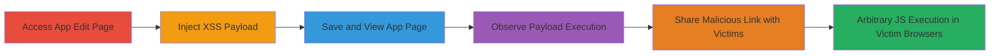

---
tags:
  - xss
  - stored-xss
  - slack
  - javascript
  - session-hijacking
type: attack_chain
tools: []
tactics:
  - '[[Execution]]'
  - '[[Collection]]'
verified: false
platforms:
  - Web
  - Slack Apps
submitted: true
complexity: medium
created_at: '2023-10-01T00:00:00Z'
procedures:
  - '[[procedures/Inject-XSS-Payload-into-Slack-App-Name]]'
  - '[[procedures/Trigger-and-Observe-XSS-Execution]]'
  - '[[procedures/Share-Malicious-Slack-App-Link]]'
step_count: 5
techniques:
  - '[[JavaScript]]'
updated_at: '2025-12-13T23:52:25.654Z'
description: >-
  A multi-stage attack exploiting a stored XSS vulnerability in the Slack app
  name field to inject and execute malicious JavaScript, enabling data theft or
  session hijacking when victims view the app page.
skill_level: intermediate
impact_level: high
id: 659a7ed0-2310-41f0-952e-2c43815d3ac5
validated: true
mitre_tactics:
  - '[[Execution]]'
  - '[[Collection]]'
mitre_techniques:
  - '[[JavaScript]]'
---
# Stored XSS in Slack App Name for Arbitrary JavaScript Execution and Session Hijacking

Multi-stage attack chain demonstrating a complete attack workflow exploiting insufficient input validation in Slack's app name field to store and execute JavaScript payloads, leading to arbitrary code execution in victims' browsers.

## Chain Metrics Dashboard

| Metric | Value |
|--------|-------|
| Chain Status | Unverified |
| Total Steps | 5 |
| Execution Time | ~5 minutes |
| Skill Level | Intermediate |
| Complexity | Medium |
| Impact Level | High |

## Attack Flow Visualization

## Prerequisites & Requirements

### Required Tools

- Web browser (e.g., Chrome or Firefox with developer tools)

### Target Environment

- Slack workspace with app management access
- Target platform: Web-based Slack app configuration at https://api.slack.com/apps
- Required services/ports: HTTPS (port 443) for Slack API and app pages
- Network access requirements: Valid Slack authentication and app permissions

### Initial Access Requirements

- Slack account with permissions to edit apps (e.g., app owner or admin)
- Network position: Direct access to Slack web interface
- Prior access needed: Authenticated session in the target Slack workspace

## Detailed Attack Procedures

### Step 1: Navigate to App Edit Page
procedure: [[procedures/Inject-XSS-Payload-into-Slack-App-Name]]

**Objective**: Gain access to the Slack app configuration page to prepare for payload injection.

**Instructions**: Open a web browser and log in to your Slack account with app editing privileges. Navigate to the app's general settings page using the URL format https://api.slack.com/apps/[appid]/general, replacing [appid] with the target app's ID (e.g., https://api.slack.com/apps/A21B3V9GA/general).

**Expected Output**: The app edit interface loads, displaying fields like the app name.

**Success Indicators**:
- App edit page is accessible without errors
- Name field is visible and editable

### Step 2: Inject XSS Payload into App Name
procedure: [[procedures/Inject-XSS-Payload-into-Slack-App-Name]]

**Objective**: Insert a malicious JavaScript payload into the app name field to store it persistently.

**Instructions**: In the 'Name' field, enter the payload `'>` to break out of the HTML context and inject executable script. Click 'Save changes' to persist the payload.

**Expected Output**: The app name updates successfully, storing the payload without immediate errors.

**Success Indicators**:
- Changes saved confirmation appears
- No validation errors block the save

### Step 3: Open App Page to Trigger Payload
procedure: [[procedures/Trigger-and-Observe-XSS-Execution]]

**Objective**: Load the app viewing page to execute the stored payload in the browser context.

**Instructions**: Open a new tab or incognito browser window. Access the app page URL in the format https://[workspace].slack.com/apps/[appid]--[payload], for example https://bhativictim.slack.com/apps/A21B3V9GA--scriptalert-bhati-script, where [payload] is a URL-encoded version of the injected script.

**Expected Output**: The page loads with the injected script executing automatically.

**Success Indicators**:
- JavaScript alert box pops up displaying '/Bhati/'
- Browser console shows no blocking errors

### Step 4: Observe Payload Execution
procedure: [[procedures/Trigger-and-Observe-XSS-Execution]]

**Objective**: Verify the XSS vulnerability by confirming arbitrary JavaScript execution.

**Instructions**: Upon loading the page, inspect the browser's developer tools (F12) to monitor network requests and console output. The payload should trigger without user interaction.

**Expected Output**: Alert executes, proving DOM-based script injection.

**Success Indicators**:
- Script runs in the context of the Slack domain
- Potential for further payloads like cookie theft is confirmed

### Step 5: Share Malicious Link for Victim Exploitation
procedure: [[procedures/Share-Malicious-Slack-App-Link]]

**Objective**: Distribute the tainted app link to propagate the XSS to other users.

**Instructions**: Copy the malicious app URL (e.g., https://bhativictim.slack.com/apps/A21B3V9GA--scriptalert-bhati-script) and share it via Slack messages, email, or other channels to target victims.

**Expected Output**: Victims who click the link experience the same payload execution in their browsers.

**Success Indicators**:
- Victims report alert popups or unexpected behavior
- Attacker observes indirect signs like stolen data exfiltration

## Attack Chain Summary

### Key Achievements

1. Persistent storage of JavaScript payload in Slack app metadata
2. Automatic execution on app page load for any viewer
3. Propagation via shareable links leading to widespread compromise

## Technique & Tactic Coverage

### MITRE ATT&CK Techniques

- [[JavaScript]]

### MITRE ATT&CK Tactics

- [[Execution]]
- [[Collection]]

---
*Last updated: 2023-10-01T00:00:00Z*
