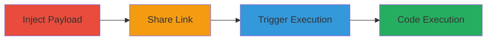

# Stored XSS in Slack BoxNote for Team-Wide Arbitrary Code Execution

Multi-stage attack chain demonstrating a complete attack workflow exploiting insufficient sanitization in Slack's BoxNote feature on files.slack.com.

## Chain Metrics Dashboard

| Metric | Value |
|--------|-------|
| Chain Status | Unverified |
| Total Steps | 3 |
| Execution Time | ~5 minutes |
| Skill Level | Intermediate |
| Complexity | Medium |
| Impact Level | High |

## Attack Flow Visualization

## Prerequisites & Requirements

### Required Tools

- Web browser (e.g., Chrome)
- Access to a Slack workspace

### Target Environment

- Slack platform (Web)
- Authenticated access to files.slack.com
- No specific ports or services beyond standard HTTPS

### Initial Access Requirements

- Valid Slack team membership
- Ability to create and share BoxNotes
- No prior network position needed beyond internet access

## Detailed Attack Procedures

### Step 1: Inject XSS Payload into BoxNote

procedure: [[procedures/Create-Malicious-BoxNote-with-XSS-Payload]]

**Objective**: Create a BoxNote snippet with a malicious JavaScript payload that will be stored and persist for later execution.

**Instructions**: Log into Slack, navigate to the BoxNote creation interface, and inject the payload into the content field. Use a payload like: `XSS") ;</script>  "><marquee>` to bypass sanitization and include an onerror event handler.

**Expected Output**: A saved BoxNote snippet containing the unsanitized payload.

**Success Indicators**:
- Payload is accepted without errors
- Snippet saves successfully in Slack

### Step 2: Share BoxNote to Generate Link

procedure: [[procedures/Share-BoxNote-Snippet-to-Generate-Link]]

**Objective**: Upload the malicious BoxNote to files.slack.com and obtain a shareable link for distribution within the team.

**Instructions**: Upload the BoxNote via Slack's file sharing, ensuring it generates a URL like `https://files.slack.com/files-pri/T027N7MK3-F1NCA92JF/XSS______script___img_src___img_src_search__onerror_alert__Xss__________marquee__boxnote.boxnote`. Share the link with team members.

**Expected Output**: A publicly accessible (within team) file URL pointing to the malicious snippet.

**Success Indicators**:
- Link is generated and accessible
- Snippet appears in Slack files without visible payload execution

### Step 3: Trigger XSS Execution

procedure: [[procedures/Trigger-XSS-via-View-Raw-Option]]

**Objective**: Have a team member access the 'view raw' option to execute the stored payload in their browser context.

**Instructions**: Direct a team member to the shared link, then select the 'view raw' option on the BoxNote. This renders the raw content, executing the injected script such as alerting `document.domain`.

**Expected Output**: JavaScript execution in the victim's browser, e.g., alert popup or arbitrary code running.

**Success Indicators**:
- Payload executes (e.g., alert fires)
- Potential for session theft or data exfiltration confirmed

## Attack Chain Summary

### Key Achievements

1. Persistent storage of malicious JavaScript in a shared Slack feature
2. Team-wide exploitation via a single link
3. Arbitrary code execution leading to session hijacking or data theft

## Technique & Tactic Coverage

### MITRE ATT&CK Techniques

- [[JavaScript]]

### MITRE ATT&CK Tactics

- [[Execution]]

---
*Last updated: 2023-10-01T00:00:00Z*
