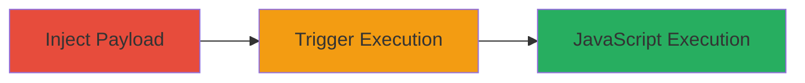

# Stored XSS in Slack Company Name Field for Arbitrary JavaScript Execution

Multi-stage attack chain demonstrating a complete attack workflow exploiting a stored XSS vulnerability in Slack.

## Chain Metrics Dashboard

| Metric | Value |
|--------|-------|
| Chain Status | Unverified |
| Total Steps | 2 |
| Execution Time | ~5 minutes |
| Skill Level | Intermediate |
| Complexity | Low |
| Impact Level | High |

## Attack Flow Visualization

## Prerequisites & Requirements

### Required Tools

- Web browser (e.g., Chrome)
- Access to a Slack workspace for testing

### Target Environment

- Slack web application
- Authenticated user account with permission to edit company name

### Initial Access Requirements

- Valid Slack account credentials
- Ability to create or modify workspace settings

## Detailed Attack Procedures

### Step 1: Inject XSS Payload
procedure: [[procedures/Inject-XSS-Payload-into-Slack-Company-Name]]

**Objective**: Inject a malicious JavaScript payload into the company name field during account setup or modification, storing it for later reflection.

**Instructions**: Access the Slack workspace settings, navigate to the company name field, and set it to the XSS payload: ">". Save the changes. This payload will be stored without sanitization.

**Expected Output**: Company name updated successfully, with no immediate errors.

**Success Indicators**:
- Company name field accepts and saves the payload
- No validation errors during submission

### Step 2: Trigger Stored XSS
procedure: [[procedures/Trigger-Stored-XSS-in-Slack-Message-Room]]

**Objective**: Log in as a victim user and view a message room where the company name is displayed, causing the payload to execute in the browser.

**Instructions**: Log in to the Slack web application with victim credentials, then navigate to any message room. The injected company name will be rendered unsanitized, triggering the onerror event in the IMG tag and executing the JavaScript alert.

**Expected Output**: Alert popup displaying "XSS-by-Imran" in the victim's browser.

**Success Indicators**:
- JavaScript alert executes upon viewing the message room
- Potential for further payload escalation, such as session hijacking

## Attack Chain Summary

### Key Achievements

1. Successful injection of stored XSS payload into Slack's company name field
2. Triggering of arbitrary JavaScript execution in authenticated users' browsers
3. Demonstration of potential for session hijacking or data theft

## Technique & Tactic Coverage

### MITRE ATT&CK Techniques

- [[JavaScript]]

### MITRE ATT&CK Tactics

- [[Execution]]

---
*Last updated: 2023-10-01T00:00:00Z*
