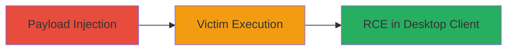

# Stored XSS in Slack Files Posts Leading to Desktop Client RCE

Multi-stage attack chain demonstrating exploitation of a stored XSS vulnerability in Slack's file sharing and Posts feature to achieve remote code execution in the desktop client.

## Chain Metrics Dashboard

| Metric | Value |
|--------|-------|
| Chain Status | Unverified |
| Total Steps | 1 |
| Execution Time | ~5 minutes |
| Skill Level | Intermediate |
| Complexity | Medium |
| Impact Level | High |

## Attack Flow Visualization



## Prerequisites & Requirements

### Required Tools

- None (uses built-in Slack web interface)

### Target Environment

- Slack workspace with access to files.slack.com
- Victim using Slack desktop client (Electron-based)

### Initial Access Requirements

- Valid Slack account with permission to upload files and post comments
- Network access to Slack's web services
- No prior victim access needed; relies on social engineering to get victim to view the file/post

## Detailed Attack Procedures

### Step 1: Payload Injection and Storage
procedure: [[procedures/Inject-Malicious-Payload-into-Slack-Posts]]

**Objective**: Inject a malicious JavaScript payload into a Slack Post on files.slack.com, where it is stored and later rendered/executed in the victim's desktop client.

**Instructions**: Log in to your Slack workspace via the web interface. Navigate to files.slack.com, upload a benign file (e.g., an image), and add a comment or post containing the XSS payload. The payload exploits inadequate backend input validation, storing the script server-side. Share the file link in a channel to lure the victim into viewing it.

Example payload for testing (escalate to RCE via Electron APIs for full exploit):

```html
<script>alert('XSS'); // For RCE: Use Electron's remote module or similar to execute system commands</script>
```

**Expected Output**: The post appears innocuous in the web view but executes JavaScript when rendered in the desktop client.

**Success Indicators**:
- Payload stored without sanitization (visible in source or basic alert test)
- Script executes in desktop client upon victim access (e.g., alert pops or code runs)
- Potential RCE: Arbitrary code execution in victim's local environment

## Attack Chain Summary

### Key Achievements

1. Bypassed input validation to store malicious script in Slack's Posts feature
2. Achieved client-side execution leading to potential RCE in Electron-based desktop app
3. Demonstrated impact without needing client updates, relying on backend fix for mitigation

## Technique & Tactic Coverage

### MITRE ATT&CK Techniques

- [[Exploit Public-Facing Application]]
- [[JavaScript]]

### MITRE ATT&CK Tactics

- [[Initial Access]]
- [[Execution]]

---
*Last updated: 2023-10-01T00:00:00Z*
