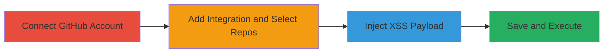

# Stored XSS in Slack GitHub Integration via Unsanitized Branches Field

Multi-stage attack chain demonstrating a complete attack workflow exploiting stored XSS in Slack's GitHub integration setup.

## Chain Metrics Dashboard

| Metric | Value |
|--------|-------|
| Chain Status | Unverified |
| Total Steps | 4 |
| Execution Time | ~5 minutes |
| Skill Level | Intermediate |
| Complexity | Medium |
| Impact Level | High |

## Attack Flow Visualization

## Prerequisites & Requirements

### Required Tools

- Web browser (e.g., Chrome, Firefox)

### Target Environment

- Slack workspace with admin or integration setup permissions
- GitHub account with repositories
- Web-based Slack interface

### Initial Access Requirements

- Valid Slack user account with permission to add integrations
- Valid GitHub account
- No special network access beyond internet connectivity

## Detailed Attack Procedures

### Step 1: Connect GitHub Account
procedure: [[procedures/Connect-GitHub-Account-to-Slack]]

**Objective**: Link the attacker's GitHub account to Slack to enable integration setup.

**Instructions**: Authenticate and authorize the GitHub account connection within Slack's integration settings.

**Expected Output**: Successful authorization message confirming the GitHub account is linked to Slack.

**Success Indicators**:
- GitHub account appears in Slack's connected services
- No authentication errors

### Step 2: Add New GitHub Integration and Select Repositories
procedure: [[procedures/Add-New-GitHub-Integration-and-Select-Repositories]]

**Objective**: Initiate the GitHub integration setup and choose target repositories to prepare for payload injection.

**Instructions**: Navigate to Slack's integration menu, select GitHub, and pick repositories for monitoring.

**Expected Output**: Integration setup form loads with repository selection complete.

**Success Indicators**:
- Repositories listed in the integration configuration
- Form proceeds to advanced options like Branches field

### Step 3: Inject XSS Payload into Branches Field
procedure: [[procedures/Inject-XSS-Payload-into-Branches-Field]]

**Objective**: Insert a malicious JavaScript payload into the optional Branches textfield to exploit lack of sanitization.

**Instructions**: In the Branches field, enter the payload `'>'`.

**Expected Output**: Payload accepted without validation errors.

**Success Indicators**:
- Field accepts arbitrary input including script tags and event handlers
- No immediate sanitization feedback

### Step 4: Save Integration and Trigger XSS Execution
procedure: [[procedures/Save-Integration-and-Trigger-XSS-Execution]]

**Objective**: Persist the payload and execute it by saving the configuration, leading to arbitrary JS in the viewer's browser.

**Instructions**: Click the 'Save integration' button to store and render the unsanitized input.

**Expected Output**: Alert box pops up displaying the document domain (e.g., slack.com), confirming XSS execution.

**Success Indicators**:
- Alert triggered on save
- Potential for further payloads to steal cookies or perform actions

## Attack Chain Summary

### Key Achievements

1. Successful linkage of GitHub to Slack without detection
2. Injection and storage of XSS payload in integration settings
3. Execution of arbitrary JavaScript in the context of Slack's web interface
4. Potential for session hijacking or data exfiltration on affected users

## Technique & Tactic Coverage

### MITRE ATT&CK Techniques

- [[JavaScript]]

### MITRE ATT&CK Tactics

- [[Execution]]

---
*Last updated: 2023-10-01T12:00:00Z*
