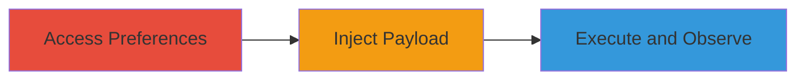

# Stored XSS in Slack Highlight Words Feature for Cookie Theft

Multi-stage attack chain demonstrating a complete attack workflow exploiting a stored XSS vulnerability in Slack's highlight words feature.

## Chain Metrics Dashboard

| Metric | Value |
|--------|-------|
| Chain Status | Unverified |
| Total Steps | 3 |
| Execution Time | ~1 minutes |
| Skill Level | Intermediate |
| Complexity | Low |
| Impact Level | Low |

## Attack Flow Visualization

## Prerequisites & Requirements

### Required Tools

- None (browser-based exploitation)

### Target Environment

- Web platform
- Slack account with access to preferences
- No specific services/ports required beyond standard web access

### Initial Access Requirements

- Valid Slack user credentials
- Direct browser access to the Slack web application
- No prior network position needed beyond internet connectivity

## Detailed Attack Procedures

### Step 1: Access Slack Account Preferences
procedure: [[procedures/Access-Slack-Account-Preferences]]

**Objective**: Navigate to the vulnerable preferences page to prepare for payload injection.

**Instructions**: Open a web browser and log in to your Slack account. Then, directly navigate to the account preferences page with the highlight words update parameter.

**Expected Output**: The preferences page loads, displaying the highlight words input field within a textarea.

**Success Indicators**:
- Preferences page is accessible
- Highlight words section is visible

### Step 2: Inject XSS Payload into Highlight Words
procedure: [[procedures/Inject-XSS-Payload-into-Highlight-Words]]

**Objective**: Insert a malicious payload into the highlight words field to exploit the stored XSS vulnerability.

**Instructions**: In the highlight words textarea, enter the payload `</textarea>` and save the preferences.

**Expected Output**: The payload is stored without sanitization, closing the textarea and injecting the script tag.

**Success Indicators**:
- Preferences save successfully
- No immediate errors on submission

### Step 3: Observe XSS Payload Execution
procedure: [[procedures/Observe-XSS-Payload-Execution]]

**Objective**: Trigger and verify the execution of the injected script to demonstrate XSS impact.

**Instructions**: Refresh or revisit the preferences page to reflect the stored payload. The script should execute automatically upon page load.

**Expected Output**: A browser prompt displays the document's cookies, confirming JavaScript execution.

**Success Indicators**:
- Script executes, prompting cookies
- Cookies are visible in the prompt (self-XSS confirmed)

## Attack Chain Summary

### Key Achievements

1. Successful navigation to the vulnerable preferences endpoint
2. Injection and storage of XSS payload bypassing sanitization
3. Execution of arbitrary JavaScript for cookie theft in the attacker's session

## Technique & Tactic Coverage

### MITRE ATT&CK Techniques

- [[JavaScript]]

### MITRE ATT&CK Tactics

- [[Execution]]

---
*Last updated: 2023-10-01T00:00:00Z*
