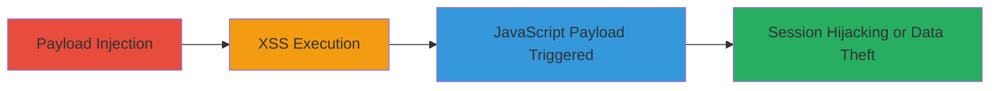

# Stored XSS in Slack Integrations Leading to Arbitrary JavaScript Execution

Multi-stage attack chain demonstrating a complete attack workflow exploiting a stored cross-site scripting (XSS) vulnerability in Slack's integrations feature on slack.com. The attacker injects a malicious payload into the integrations, which is stored server-side without proper sanitization. When authenticated users view the integration details, the payload executes arbitrary JavaScript in their browser context, potentially leading to session hijacking, data theft, or further exploitation as shown in the proof-of-concept video from the HackerOne report.

## Chain Metrics Dashboard

| Metric | Value |
|--------|-------|
| Chain Status | Unverified |
| Total Steps | 2 |
| Execution Time | ~5 minutes |
| Skill Level | Intermediate |
| Complexity | Medium |
| Impact Level | High |

## Attack Flow Visualization

## Prerequisites & Requirements

### Required Tools

- Web browser (e.g., Chrome with developer tools for payload crafting)
- Access to a Slack workspace with integration creation permissions

### Target Environment

- Platform: Web (slack.com)
- Required services/ports: HTTPS on port 443
- Network access requirements: Internet access to slack.com

### Initial Access Requirements

- Credential requirements: Valid Slack account with permissions to create/edit integrations
- Network position: Direct access to slack.com
- Prior access needed: Authenticated session in the target Slack workspace

## Detailed Attack Procedures

### Step 1: Payload Injection
procedure: [[procedures/Inject-Stored-XSS-Payload-into-Slack-Integrations]]

**Objective**: Inject a malicious payload into the Slack integrations feature to store unsanitized input server-side.

**Instructions**: Log in to slack.com with an account that has integration creation permissions. Navigate to the integrations section and attempt to add or edit an integration, inserting the crafted payload in a field that accepts URLs or text input, such as a description or callback URL field. The payload used is 'http://jeroldcamacho.com/%5Ex1s1s/slack.com.txt', which evades sanitization and is stored without encoding.

**Expected Output**: The payload is successfully saved in the integration configuration without errors.

**Success Indicators**:
- Integration saves successfully with the injected payload visible in the backend or admin view
- No immediate sanitization errors during submission

### Step 2: Trigger Execution
procedure: [[procedures/Trigger-XSS-Execution-by-Viewing-Slack-Integration-Details]]

**Objective**: Cause the stored payload to execute JavaScript in the victim's browser by accessing the integration details page.

**Instructions**: Share the integration details with target users or trick them into viewing the integration page (e.g., via a direct link or workspace notification). When the victim, who is authenticated in Slack, loads the page, the stored payload is rendered without proper output encoding, executing the JavaScript. Monitor for execution via the proof-of-concept setup, such as alerting or exfiltrating data to the attacker's server.

**Expected Output**: JavaScript executes in the browser console, as demonstrated in the proof-of-concept video, potentially showing an alert or network request to the attacker's domain.

**Success Indicators**:
- Victim's browser executes the payload (e.g., alert pops up or data is sent to attacker-controlled server)
- Session cookies or sensitive data can be accessed via the executed JS

## Attack Chain Summary

### Key Achievements

1. Successful storage of unsanitized malicious payload in Slack integrations
2. Arbitrary JavaScript execution in authenticated users' browsers
3. Potential for session hijacking or theft of sensitive workspace data

## Technique & Tactic Coverage

### MITRE ATT&CK Techniques

- [[JavaScript]]
- [[Drive-by Compromise]]

### MITRE ATT&CK Tactics

- [[Execution]]
- [[Collection]]

---
*Last updated: 2024-10-01T00:00:00Z*
