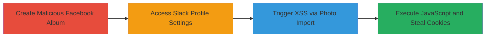

---
tags:
  - xss
  - stored-xss
  - slack
  - facebook
  - javascript-injection
type: attack_chain
tools:
  - '[[tools/jQuery-Facebook-Photo-Selector]]'
tactics:
  - '[[Execution]]'
  - '[[Credential Access]]'
verified: false
platforms:
  - Web
submitted: true
complexity: medium
created_at: '2024-01-01T00:00:00Z'
procedures:
  - '[[procedures/Create-Malicious-Facebook-Album]]'
  - '[[procedures/Access-Slack-Profile-Photo-Settings]]'
  - '[[procedures/Trigger-XSS-via-Facebook-Photo-Import-in-Slack]]'
step_count: 3
techniques:
  - '[[JavaScript]]'
  - '[[Steal Web Session Cookie]]'
updated_at: '2025-12-14T03:16:08.071Z'
description: >-
  A multi-stage attack exploiting a stored XSS vulnerability in Slack's
  Facebook-integrated profile photo upload feature by using a malicious album
  name to inject and trigger JavaScript, potentially leading to session cookie
  theft.
skill_level: intermediate
impact_level: high
id: cd41fefd-ea1f-42f8-9059-87fd284c5fe0
validated: true
mitre_tactics:
  - '[[Execution]]'
  - '[[Credential Access]]'
mitre_techniques:
  - '[[JavaScript]]'
  - '[[Steal Web Session Cookie]]'
---
# Stored XSS in Slack Profile Photo via Malicious Facebook Album Name

Multi-stage attack chain demonstrating a complete attack workflow exploiting a stored XSS in Slack's profile photo upload via Facebook integration.

## Chain Metrics Dashboard

| Metric | Value |
|--------|-------|
| Chain Status | Unverified |
| Total Steps | 3 |
| Execution Time | ~5 minutes |
| Skill Level | Intermediate |
| Complexity | Medium |
| Impact Level | High |

## Attack Flow Visualization

## Prerequisites & Requirements

### Required Tools

- Facebook account with photo upload permissions
- Slack account in a team

### Target Environment

- Web browser (e.g., Chrome)
- Access to Facebook and Slack web applications
- No specific ports or services beyond standard HTTPS

### Initial Access Requirements

- Valid Facebook credentials
- Valid Slack credentials
- Ability to create and share Facebook albums (optionally shared for broader impact)

## Detailed Attack Procedures

### Step 1: Create Malicious Album
procedure: [[procedures/Create-Malicious-Facebook-Album]]

**Objective**: Prepare a Facebook album with an XSS payload in its name to store the malicious input for later reflection in Slack.

**Instructions**: Log in to Facebook, navigate to Photos > Albums > Create Album. Set the album name to a payload like `'>`. Upload any photo to the album to make it selectable.

**Expected Output**: Album created successfully with the malicious name.

**Success Indicators**:
- Album appears in Facebook's photo library
- Name includes the unescaped payload

### Step 2: Access Profile Settings
procedure: [[procedures/Access-Slack-Profile-Photo-Settings]]

**Objective**: Reach the Slack interface where Facebook integration for photo upload is available.

**Instructions**: Log in to Slack, click on your profile picture in the top-right, select "View profile". Then click "Edit profile" and navigate to the photo upload section, e.g., via https://yourteam.slack.com/account/photo.

**Expected Output**: Profile photo settings page loads, showing options to change photo including Facebook integration.

**Success Indicators**:
- Facebook import option is visible and clickable
- No errors in accessing the page

### Step 3: Trigger XSS
procedure: [[procedures/Trigger-XSS-via-Facebook-Photo-Import-in-Slack]]

**Objective**: Import from the malicious album to reflect the unsanitized album name and execute the XSS payload.

**Instructions**: On the Slack photo change page, select "Change using Facebook". Authorize the integration if prompted. In the photo selector, choose the malicious album. The album name will be rendered without sanitization, triggering the onerror event to alert document.cookie.

**Expected Output**: JavaScript alert pops up displaying Slack session cookies.

**Success Indicators**:
- Alert box appears with cookie contents
- Potential for further exploitation like exfiltrating cookies to an attacker-controlled server

## Attack Chain Summary

### Key Achievements

1. Successful injection of XSS payload into a persistent Facebook album name
2. Reflection and execution of the payload in Slack's web interface via third-party library
3. Potential theft of session cookies for account takeover, especially in shared album scenarios

## Technique & Tactic Coverage

### MITRE ATT&CK Techniques

- [[JavaScript]]
- [[Steal Web Session Cookie]]

### MITRE ATT&CK Tactics

- [[Execution]]
- [[Credential Access]]

---

*Last updated: 2024-01-01T00:00:00Z*
