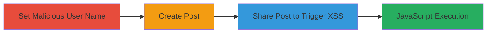

# Stored XSS in Slack Share Post Menu via Malicious User Names

Multi-stage attack chain demonstrating a complete attack workflow exploiting insufficient sanitization of user names in Slack's share post menu, resulting in stored XSS and arbitrary JavaScript execution.

## Chain Metrics Dashboard

| Metric | Value |
|--------|-------|
| Chain Status | Unverified |
| Total Steps | 3 |
| Execution Time | ~5 minutes |
| Skill Level | Intermediate |
| Complexity | Medium |
| Impact Level | High |

## Attack Flow Visualization

## Prerequisites & Requirements

### Required Tools

- None (manual browser-based actions)

### Target Environment

- Slack workspace with administrative or editing permissions for user profiles and posts
- Web browser with authenticated Slack session
- No specific services/ports required beyond standard HTTPS access to Slack

### Initial Access Requirements

- Authenticated access to a Slack workspace
- Ability to edit teammate names (requires workspace admin or appropriate permissions)
- Network access to https://app.slack.com

## Detailed Attack Procedures

### Step 1: Set Malicious User Name
procedure: [[procedures/Set-Malicious-User-Name-in-Slack]]

**Objective**: Inject an XSS payload into a teammate's user name, which is stored in Slack's profile system without proper sanitization.

**Instructions**: Log in to the Slack workspace, navigate to the user directory, select a target teammate, and edit their display name to include the payload ``. Save the changes to store the payload.

**Expected Output**: The user's name is updated and appears with the injected HTML in profiles.

**Success Indicators**:
- User name change confirmed in Slack's user management interface
- Payload visible but not executed in profile views

### Step 2: Create Post in Slack Workspace
procedure: [[procedures/Create-Post-in-Slack-Workspace]]

**Objective**: Generate a benign post that can later be shared, setting up the delivery mechanism for the XSS trigger.

**Instructions**: In the Slack workspace, go to the files or messages section and create a new post or upload a file via the creation interface at a URL like https://yourworkspace.slack.com/files/create/space. Add neutral content to avoid suspicion.

**Expected Output**: A new post or file is created and visible in the workspace.

**Success Indicators**:
- Post successfully uploaded or created
- Post ID or link generated for sharing

### Step 3: Share Post to Trigger XSS
procedure: [[procedures/Share-Post-to-Trigger-XSS-in-Slack]]

**Objective**: Share the post via direct message or team share to the victim with the malicious name, causing the unsanitized name to render and execute the XSS payload in the victim's browser.

**Instructions**: Open the share menu for the created post, select the option to share as a direct message or to the team including the victim with the malicious name. This renders the user name in the HTML context, triggering the onerror event.

**Expected Output**: Alert box or JavaScript execution in the victim's browser upon viewing the share interface.

**Success Indicators**:
- JavaScript alert (or payload) executes in the recipient's session
- Potential for further actions like session theft confirmed via console logs

## Attack Chain Summary

### Key Achievements

1. Successful storage of XSS payload in user profile
2. Delivery of payload via post sharing without direct suspicion
3. Arbitrary JavaScript execution in victim's authenticated session, enabling data exfiltration or session hijacking

## Technique & Tactic Coverage

### MITRE ATT&CK Techniques

- [[JavaScript]]

### MITRE ATT&CK Tactics

- [[Execution]]

---
*Last updated: 2023-10-01T00:00:00Z*
