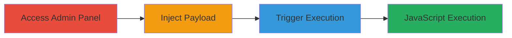

---
tags:
  - xss
  - stored-xss
  - slack
  - javascript-execution
type: attack_chain
tools: []
tactics:
  - '[[Execution]]'
  - '[[Collection]]'
verified: false
platforms:
  - Web
submitted: true
complexity: medium
created_at: '2023-10-01T00:00:00Z'
procedures:
  - '[[procedures/Access-Slack-Team-Admin-Panel]]'
  - '[[procedures/Inject-XSS-Payload-into-Slack-Team-Name]]'
  - '[[procedures/Trigger-Stored-XSS-via-Slack-Services-Import]]'
step_count: 3
techniques:
  - '[[JavaScript]]'
updated_at: '2025-12-14T03:16:19.794Z'
description: >-
  A multi-step attack exploiting a stored XSS vulnerability in Slack's team name
  field to inject and trigger malicious JavaScript on the services import page.
skill_level: intermediate
impact_level: high
id: aa65934f-1801-45c2-9472-55fd984fa314
validated: true
mitre_tactics:
  - '[[Execution]]'
  - '[[Collection]]'
mitre_techniques:
  - '[[JavaScript]]'
---
# Stored XSS in Slack Team Name for Arbitrary JavaScript Execution

Multi-stage attack chain demonstrating a complete attack workflow exploiting insufficient input sanitization in Slack's team name field to achieve stored XSS and arbitrary JavaScript execution.

## Chain Metrics Dashboard

| Metric | Value |
|--------|-------|
| Chain Status | Unverified |
| Total Steps | 3 |
| Execution Time | ~5 minutes |
| Skill Level | Intermediate |
| Complexity | Medium |
| Impact Level | High |

## Attack Flow Visualization

## Prerequisites & Requirements

### Required Tools

- Web browser (e.g., Chrome with developer tools)

### Target Environment

- Slack workspace with admin privileges
- Access to /admin/name endpoint
- Web platform

### Initial Access Requirements

- Valid admin credentials for the Slack workspace
- Network access to the Slack domain (e.g., https://hunter22.slack.com)
- No prior access needed beyond authentication

## Detailed Attack Procedures

### Step 1: Access Team Admin Panel
procedure: [[procedures/Access-Slack-Team-Admin-Panel]]

**Objective**: Gain access to the team administration interface to modify the team name.

**Instructions**: Log in to the Slack workspace with admin privileges and navigate to the admin panel.

Open your web browser and go to `https://hunter22.slack.com/admin/name` (replace `hunter22` with the actual workspace subdomain).

**Expected Output**: The team name modification form loads without errors.

**Success Indicators**:
- Admin panel is accessible
- Team name field is editable

### Step 2: Inject XSS Payload
procedure: [[procedures/Inject-XSS-Payload-into-Slack-Team-Name]]

**Objective**: Inject a malicious JavaScript payload into the team name field to store the XSS.

**Instructions**: In the team name input field, enter the payload `'>` to break out of HTML context and trigger JavaScript via an onerror event.

Submit the form to update the team name. The payload closes any open HTML attributes and injects an image tag that executes JavaScript on error.

**Expected Output**: Team name updates successfully without visible errors; payload is stored.

**Success Indicators**:
- No sanitization errors on submission
- Team name reflects the injected content in the UI

### Step 3: Trigger Stored XSS
procedure: [[procedures/Trigger-Stored-XSS-via-Slack-Services-Import]]

**Objective**: Visit the services import page to render the unsanitized team name and execute the payload.

**Instructions**: Navigate to `https://hunter22.slack.com/services/import` in the same browser session or another user's session.

The page renders the team name, executing the injected JavaScript, such as prompting the document domain.

**Expected Output**: A JavaScript alert or prompt appears, confirming execution (e.g., displaying the domain).

**Success Indicators**:
- Payload executes, showing a prompt
- Potential for session hijacking if extended

## Attack Chain Summary

### Key Achievements

1. Admin access to inject payload without detection
2. Stored XSS persistence across user sessions
3. Arbitrary JavaScript execution for client-side attacks like session theft

## Technique & Tactic Coverage

### MITRE ATT&CK Techniques

- [[JavaScript]]

### MITRE ATT&CK Tactics

- [[Execution]]
- [[Collection]]

---
*Last updated: 2023-10-01T00:00:00Z*
