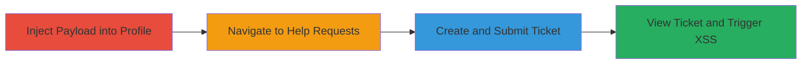

---
tags:
  - xss
  - stored-xss
  - self-xss
  - slack
  - zendesk
type: attack_chain
tools: []
tactics:
  - '[[Execution]]'
verified: false
platforms:
  - Web
submitted: true
complexity: low
created_at: '2023-10-01T00:00:00Z'
procedures:
  - '[[procedures/Inject-XSS-Payload-into-Slack-Profile-Name]]'
  - '[[procedures/Navigate-to-Help-Requests-New-Ticket]]'
  - '[[procedures/Create-and-Submit-Help-Ticket]]'
  - '[[procedures/View-Submitted-Ticket-to-Trigger-XSS]]'
step_count: 4
techniques:
  - '[[JavaScript]]'
updated_at: '2025-12-14T03:16:14.611Z'
description: >-
  A multi-step attack exploiting a stored XSS vulnerability in Slack's user
  profile name field, which executes JavaScript only when the name is displayed
  in the Zendesk-integrated help requests ticket view, resulting in self-XSS.
skill_level: beginner
impact_level: low
id: b959cc71-cd5b-4383-81af-8fb5b77ff526
validated: true
mitre_tactics:
  - '[[Execution]]'
mitre_techniques:
  - '[[JavaScript]]'
---
# Stored XSS in Slack User Profile Name Leading to Self-XSS in Help Requests

Multi-stage attack chain demonstrating a stored XSS vulnerability in Slack's user profile, where the payload is sanitized on the profile page but executes in the help requests ticket view due to improper output encoding.

## Chain Metrics Dashboard

| Metric | Value |
|--------|-------|
| Chain Status | Unverified |
| Total Steps | 4 |
| Execution Time | ~5 minutes |
| Skill Level | Beginner |
| Complexity | Low |
| Impact Level | Low |

## Attack Flow Visualization

## Prerequisites & Requirements

### Required Tools

- Web browser (e.g., Chrome, Firefox)

### Target Environment

- Slack workspace with access to help requests (https://*.slack.com/help/requests)
- Zendesk-integrated help system
- Authenticated user session in Slack

### Initial Access Requirements

- Valid Slack account credentials
- No special privileges required; works in user's own session

## Detailed Attack Procedures

### Step 1: Inject XSS Payload into Profile Name
procedure: [[procedures/Inject-XSS-Payload-into-Slack-Profile-Name]]

**Objective**: Modify the user's profile name to include a malicious XSS payload that will be stored but not immediately executed.

**Instructions**: Log in to Slack, navigate to profile settings, and update the name field with the payload. The payload is sanitized on the profile page, so no execution occurs here.

**Expected Output**: Profile name updated successfully without errors; no JavaScript execution visible.

**Success Indicators**:
- Profile name reflects the injected payload when viewed.
- No alert or prompt appears on the profile page.

### Step 2: Navigate to Help Requests New Ticket Page
procedure: [[procedures/Navigate-to-Help-Requests-New-Ticket]]

**Objective**: Access the help requests interface where the profile name will later be displayed.

**Instructions**: From the Slack sidebar or directly via URL, go to the new help ticket creation page.

**Expected Output**: Help requests form loads without issues.

**Success Indicators**:
- Page accessible at https://*.slack.com/help/requests/new.
- Form fields visible for ticket creation.

### Step 3: Create and Submit Help Ticket
procedure: [[procedures/Create-and-Submit-Help-Ticket]]

**Objective**: Submit a ticket that incorporates the user's profile name, setting up the condition for XSS execution.

**Instructions**: Fill out the ticket form with any details (e.g., a generic request) and submit it. The profile name is automatically included in the ticket data.

**Expected Output**: Ticket submitted successfully; confirmation message or ticket ID displayed.

**Success Indicators**:
- Ticket creation completes without validation errors.
- Redirect to ticket view or list.

### Step 4: View Submitted Ticket to Trigger XSS
procedure: [[procedures/View-Submitted-Ticket-to-Trigger-XSS]]

**Objective**: Display the ticket, causing the improperly encoded profile name to execute the XSS payload.

**Instructions**: Navigate to the newly created ticket's view page. The name is rendered without proper escaping, triggering the JavaScript.

**Expected Output**: JavaScript prompt (e.g., alert with value 12) appears in the browser.

**Success Indicators**:
- Prompt box executes, confirming XSS.
- JavaScript runs only in the attacker's session (self-XSS).

## Attack Chain Summary

### Key Achievements

1. Successful injection of stored XSS payload into Slack profile name.
2. Triggering of self-XSS via Zendesk help ticket view.
3. Demonstration of improper output encoding in integrated systems.

## Technique & Tactic Coverage

### MITRE ATT&CK Techniques

- [[JavaScript]]

### MITRE ATT&CK Tactics

- [[Execution]]

---
*Last updated: 2023-10-01T00:00:00Z*
