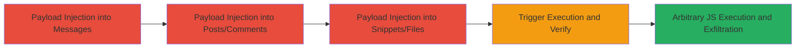

---
tags:
  - xss
  - stored-xss
  - slack
  - svg-payload
  - javascript-execution
type: attack_chain
tools: []
tactics:
  - '[[Execution]]'
  - '[[Collection]]'
verified: false
platforms:
  - Web
submitted: true
complexity: medium
created_at: '2023-10-01T00:00:00Z'
procedures:
  - '[[procedures/Inject-XSS-Payload-into-Slackbot-and-Messages]]'
  - '[[procedures/Inject-XSS-Payload-into-Posts-and-Comments]]'
  - '[[procedures/Inject-XSS-Payload-into-Snippets-and-Files]]'
  - '[[procedures/Trigger-and-Verify-Stored-XSS-Execution]]'
step_count: 4
techniques:
  - '[[JavaScript]]'
  - '[[Drive-by Compromise]]'
updated_at: '2025-12-14T03:15:47.445Z'
description: >-
  A multi-stage stored XSS attack in Slack exploiting improper sanitization of
  SVG content in messages posts comments snippets and files leading to arbitrary
  JavaScript execution upon page refresh or team switch.
skill_level: intermediate
impact_level: high
id: 5ed56e31-c167-4866-8700-8f412bb716bf
validated: true
mitre_tactics:
  - '[[Execution]]'
  - '[[Collection]]'
mitre_techniques:
  - '[[JavaScript]]'
  - '[[Drive-by Compromise]]'
---
# Stored XSS in Slack via Malicious SVG Payloads in Files Snippets and Messages

Multi-stage attack chain demonstrating a complete stored XSS workflow in Slack where malicious SVG payloads with onload JavaScript are injected into various content types and persist to execute on victims' browsers potentially enabling session hijacking through cookie theft.

## Chain Metrics Dashboard

| Metric | Value |
|--------|-------|
| Chain Status | Unverified |
| Total Steps | 4 |
| Execution Time | ~5 minutes |
| Skill Level | Intermediate |
| Complexity | Medium |
| Impact Level | High |

## Attack Flow Visualization

## Prerequisites & Requirements

### Required Tools

- Web browser (e.g. Chrome Firefox)
- Valid Slack workspace access with permissions to post messages create posts and upload snippets/files

### Target Environment

- Slack web application (yourdomain.slack.com)
- Authenticated session in a Slack workspace
- No specific ports or services beyond standard HTTPS access to Slack

### Initial Access Requirements

- Active Slack user account with write permissions to channels slackbot and file/snippet creation
- Network access to Slack's web interface
- No prior elevated access needed but victim must interact with affected content

## Detailed Attack Procedures

### Step 1: Inject Payload into Slackbot and Messages
procedure: [[procedures/Inject-XSS-Payload-into-Slackbot-and-Messages]]

**Objective**: Introduce the malicious SVG payload into slackbot interactions to test initial storage and reflection.

**Instructions**: Open Slack web interface navigate to a direct message with slackbot and enter the payload as a message. The payload combines an emoji image tag with an SVG onload handler to bypass basic filters.

**Expected Output**: Payload appears in the message history without immediate execution.

**Success Indicators**:
- Payload stored in slackbot conversation
- No errors on submission

### Step 2: Inject Payload into Posts and Comments
procedure: [[procedures/Inject-XSS-Payload-into-Posts-and-Comments]]

**Objective**: Embed the payload in workspace posts and associated comments to expand storage points.

**Instructions**: Create a new post in Slack enter the payload in the title and body as code then share it to slackbot and add a comment with the same payload.

**Expected Output**: Post created with payload in title body and comment visible in the workspace.

**Success Indicators**:
- Post and comment saved without sanitization errors
- Payload visible in post preview

### Step 3: Inject Payload into Snippets and Files
procedure: [[procedures/Inject-XSS-Payload-into-Snippets-and-Files]]

**Objective**: Store the payload in snippets and files which render in the /files section and can reflect to the main page.

**Instructions**: Create a new snippet select HTML format enter the payload in the content add a comment with the payload and finalize creation.

**Expected Output**: Snippet uploaded to /files with payload embedded.

**Success Indicators**:
- Snippet appears in files list
- Comment attached successfully

### Step 4: Trigger and Verify Stored XSS Execution
procedure: [[procedures/Trigger-and-Verify-Stored-XSS-Execution]]

**Objective**: Activate the stored payload to execute JavaScript and confirm persistence for victim impact.

**Instructions**: Refresh the Slack page or switch teams to force re-rendering then inspect the /files page source to verify payload wrapping in script tags.

**Expected Output**: Alert or prompt box appears executing prompt(document.domain) indicating JS execution.

**Success Indicators**:
- JavaScript alert fires on refresh
- Source code shows unsanitized payload in /files

## Attack Chain Summary

### Key Achievements

1. Successful injection of SVG onload payload across multiple Slack content types without detection
2. Persistent storage leading to execution on page interactions like refresh or team switch
3. Potential for session hijacking by exfiltrating cookies via executed JS in victims' browsers

## Technique & Tactic Coverage

### MITRE ATT&CK Techniques

- [[JavaScript]]
- [[Drive-by Compromise]]

### MITRE ATT&CK Tactics

- [[Execution]]
- [[Collection]]

---
*Last updated: 2023-10-01T00:00:00Z*
