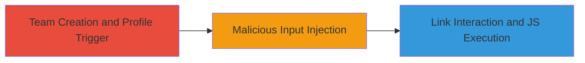

# Stored XSS in Slackbot Profile Completion for Arbitrary JavaScript Execution

Multi-stage attack chain demonstrating a complete attack workflow exploiting stored XSS in Slack's onboarding process.

## Chain Metrics Dashboard

| Metric | Value |
|--------|-------|
| Chain Status | Unverified |
| Total Steps | 3 |
| Execution Time | ~5 minutes |
| Skill Level | Intermediate |
| Complexity | Medium |
| Impact Level | High |

## Attack Flow Visualization

## Prerequisites & Requirements

### Required Tools

- Web browser (e.g., Chrome, Firefox)
- Slack account with team creation permissions

### Target Environment

- Slack web application
- Required services: Slackbot messaging
- Network access: Internet connectivity to slack.com

### Initial Access Requirements

- Valid Slack account
- Permissions to create a new workspace/team
- No prior access to victim sessions needed; affects new team members viewing messages

## Detailed Attack Procedures

### Step 1: Team Creation and Profile Trigger
procedure: [[procedures/Create-Slack-Team-to-Trigger-Profile-Completion]]

**Objective**: Initiate the Slack onboarding process to prompt Slackbot's automated profile completion questions.

**Instructions**: Log in to Slack and navigate to create a new workspace. During the team creation flow, Slackbot will send direct messages asking for profile details such as first name, last name, and Skype account.

**Expected Output**: Receipt of direct messages from Slackbot with input prompts for profile information.

**Success Indicators**:
- Slackbot DMs appear in the new team's messaging interface
- Prompts for first name, last name, and Skype account are visible

### Step 2: Malicious Input Injection
procedure: [[procedures/Inject-Malicious-Payload-into-Slackbot-Fields]]

**Objective**: Supply a JavaScript payload in response to Slackbot's questions, which gets stored and rendered unsafely as a clickable link.

**Instructions**: In response to Slackbot's DMs, enter the payload `<javascript:alert(document.cookie);>` in fields like first name or Skype account. Slackbot stores this input and renders it in the direct message thread as an anchor tag: `<a href="javascript:alert(document.cookie);">...</a>`.

**Expected Output**: The malicious input is echoed back in the DM thread as a clickable hyperlink.

**Success Indicators**:
- Payload appears in the conversation history
- The text is wrapped in an anchor tag when viewed in the web client

### Step 3: Link Interaction and JS Execution
procedure: [[procedures/Trigger-XSS-Execution-via-Link-Interaction]]

**Objective**: Interact with the rendered malicious link to execute arbitrary JavaScript in the victim's browser context.

**Instructions**: In the Slack web interface, click on the anchor tag containing the javascript: URI. This triggers the execution of the payload, such as alerting the document cookies.

**Expected Output**: Browser alert box displaying the victim's session cookies or other client-side data.

**Success Indicators**:
- JavaScript alert pops up with cookie contents
- Potential for further exploitation like session hijacking if payload is modified

## Attack Chain Summary

### Key Achievements

1. Successful storage of XSS payload during Slack onboarding
2. Rendering of payload as executable javascript: URI in DMs
3. Arbitrary JS execution leading to client-side data exfiltration

## Technique & Tactic Coverage

### MITRE ATT&CK Techniques

- [[JavaScript]]

### MITRE ATT&CK Tactics

- [[Execution]]

---
*Last updated: 2023-10-01T00:00:00Z*
