---
tags:
  - xss
  - rce
  - steam
  - uri-abuse
  - bbcode
type: attack_chain
tools:
  - '[[tools/Chrome-DevTools]]'
  - '[[tools/React-Chrome-Extension]]'
  - '[[tools/Remote-Chrome-Console]]'
  - '[[tools/Binary-Grep]]'
  - '[[tools/Vim]]'
  - '[[tools/Steam-Console]]'
tactics:
  - '[[Initial Access]]'
  - '[[Execution]]'
  - '[[Discovery]]'
  - '[[Lateral Movement]]'
commands:
  - '[[commands/open-steam-uri]]'
  - '[[commands/object-keys-window]]'
  - '[[commands/window-top-postmessage]]'
  - '[[commands/txt-hello-protocol]]'
  - '[[commands/steam-openexternalforpid]]'
  - '[[commands/steam-console]]'
  - '[[commands/steam-run-gameid]]'
platforms:
  - Windows
  - Web
  - Chrome Embedded Framework (CEF)
complexity: high
procedures:
  - '[[procedures/Reconnaissance-on-Steam-Chat-Application]]'
  - '[[procedures/Testing-BBCode-for-XSS-Vulnerabilities]]'
  - '[[procedures/Exploiting-XSS-with-JavaScript-URIs]]'
  - '[[procedures/Escalating-with-Steam-URI-Schemes]]'
  - '[[procedures/Achieving-RCE-via-Openexternalforpid]]'
step_count: 5
techniques:
  - '[[JavaScript]]'
  - '[[Exploit Public-Facing Application]]'
  - '[[Command-Line Interface]]'
description: >-
  Multi-stage attack chain exploiting stored XSS in Steam's React chat client to
  execute arbitrary JavaScript and escalate to remote code execution using
  steam:// URIs on Windows machines.
skill_level: advanced
impact_level: high
id: 738f5f7e-d729-41cb-aa57-f37f23c24e9a
created_at: '2025-12-14T00:11:25.304Z'
updated_at: '2025-12-14T00:11:25.304Z'
verified: false
validated: true
submitted: true
mitre_tactics:
  - '[[Initial Access]]'
  - '[[Execution]]'
  - '[[Discovery]]'
  - '[[Lateral Movement]]'
mitre_techniques:
  - '[[JavaScript]]'
  - '[[Exploit Public-Facing Application]]'
  - '[[Command-Line Interface]]'
---
# Stored XSS in Steam Chat Leading to RCE via Steam URI Abuse

Multi-stage attack chain demonstrating a complete attack workflow from reconnaissance to remote code execution in the Steam chat client.

## Chain Metrics Dashboard

| Metric | Value |
|--------|-------|
| Chain Status | Unverified |
| Total Steps | 5 |
| Execution Time | ~30 minutes |
| Skill Level | Advanced |
| Complexity | High |
| Impact Level | High |

## Attack Flow Visualization

```mermaid
graph LR
    A[Reconnaissance] --> B[XSS Testing]
    B --> C[XSS Exploitation]
    C --> D[URI Escalation]
    D --> E[RCE Achievement]

    style A fill:#e74c3c
    style B fill:#f39c12
    style C fill:#3498db
    style D fill:#2c3e50
    style E fill:#27ae60
```



## Prerequisites & Requirements

### Required Tools

- [[tools/Chrome-DevTools]]
- [[tools/React-Chrome-Extension]]
- [[tools/Remote-Chrome-Console]]
- [[tools/Binary-Grep]]
- [[tools/Vim]]
- [[tools/Steam-Console]]

### Target Environment

- Windows OS with Steam client installed
- Access to Steam chat (web or desktop)
- Services: Steam Chat, OEMBED, Embedly

### Initial Access Requirements

- Steam account with chat access to the victim
- Network access to send chat messages

## Detailed Attack Procedures

### Step 1: Reconnaissance on Steam Chat Application
procedure: [[procedures/Reconnaissance-on-Steam-Chat-Application]]

**Objective**: Identify the codebase and potential vulnerabilities in the Steam chat application.

**Instructions**: Use [[tools/Chrome-DevTools]] and [[tools/React-Chrome-Extension]] to inspect the application. Observe WebSocket usage and confirm React components.

**Expected Output**: Identification of React usage and potential unsafe patterns like dangerouslySetInnerHTML.

**Success Indicators**:
- Codebase confirmed as React-based
- WebSocket binary frames observed

### Step 2: Testing BBCode for XSS Vulnerabilities
procedure: [[procedures/Testing-BBCode-for-XSS-Vulnerabilities]]

**Objective**: Test BBCode tags for reflection and potential XSS vectors.

**Instructions**: Send various BBCode tags like [url=xxx] using [[tools/Chrome-DevTools]] and monitor server responses for unsanitized reflections.

**Expected Output**: Discovery that [url] tags allow arbitrary URLs including javascript: URIs.

**Success Indicators**:
- Arbitrary URLs reflected without stripping
- Potential XSS vectors identified

### Step 3: Exploiting XSS with JavaScript URIs
procedure: [[procedures/Exploiting-XSS-with-JavaScript-URIs]]

**Objective**: Achieve stored XSS by injecting javascript: URIs via BBCode.

**Instructions**: Send [url=javascript:...] tags in chat messages to execute arbitrary JavaScript.

**Expected Output**: JavaScript execution in the victim's chat client context.

**Success Indicators**:
- XSS payload persists in chat
- Arbitrary JS runs without errors

### Step 4: Escalating with Steam URI Schemes
procedure: [[procedures/Escalating-with-Steam-URI-Schemes]]

**Objective**: Escalate privileges using steam:// URIs and OEMBED injections.

**Instructions**: Use [[commands/open-steam-uri]] to test steam:// actions:

```javascript
open("steam://xxx")
```

Embed codepen.io via OEMBED and inspect with [[commands/object-keys-window]]:

```javascript
Object.keys(window)
```

And test postMessage with [[commands/window-top-postmessage]]:

```javascript
window.top.postMessage()
```

Reverse-engineer binaries using [[tools/Binary-Grep]] and [[tools/Vim]] to find undocumented URIs.

**Expected Output**: Execution of privileged steam:// actions and window property dumps.

**Success Indicators**:
- Steam URIs execute without confirmation
- Undocumented protocols discovered

### Step 5: Achieving RCE via Openexternalforpid
procedure: [[procedures/Achieving-RCE-via-Openexternalforpid]]

**Objective**: Achieve remote code execution by abusing the openexternalforpid protocol.

**Instructions**: Send [url=steam://openexternalforpid/10400/file:///C:/Windows/cmd.exe] using [[commands/steam-openexternalforpid]]:

```bash
steam://openexternalforpid/10400/file:///C:/Windows/cmd.exe
```

Monitor with [[commands/steam-console]]:

```bash
steam://console
```

**Expected Output**: cmd.exe opens on the victim's machine.

**Success Indicators**:
- Arbitrary commands execute remotely
- RCE confirmed via console logs

## Attack Chain Summary

### Key Achievements

1. Stored XSS via BBCode
2. Privilege escalation with steam:// URIs
3. Full RCE on Windows targets

## Technique & Tactic Coverage

### MITRE ATT&CK Techniques

- [[JavaScript]]
- [[Exploit Public-Facing Application]]
- [[Command-Line Interface]]

### MITRE ATT&CK Tactics

- [[Initial Access]]
- [[Execution]]
- [[Discovery]]
- [[Lateral Movement]]

*Last updated: 2023-10-01*
