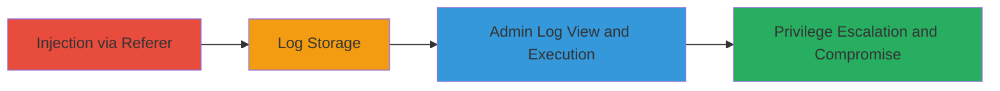

# Stored XSS in Stream WordPress Plugin via Unsanitized Log Entries

Multi-stage attack chain demonstrating a complete attack workflow exploiting a stored XSS vulnerability in the Stream WordPress plugin on a target site like newsroom.uber.com. An unauthenticated attacker injects malicious JavaScript via a crafted HTTP Referer header during a redirect, which is logged unsanitized. When an administrator views the Stream log in the dashboard, the payload executes with admin privileges, enabling site takeover, content modification, and potential server-side PHP file uploads for full compromise.

## Chain Metrics Dashboard

| Metric | Value |
|--------|-------|
| Chain Status | Unverified |
| Total Steps | 2 |
| Execution Time | ~5 minutes |
| Skill Level | Intermediate |
| Complexity | Medium |
| Impact Level | High |

## Attack Flow Visualization



## Prerequisites & Requirements

### Required Tools

- [[tools/curl]]

### Target Environment

- WordPress site with Stream plugin (e.g., version 1.4.9)
- Web platform accessible over HTTP/HTTPS
- No specific ports beyond standard 80/443

### Initial Access Requirements

- No authentication required for injection
- Network access to the target WordPress login endpoint
- Attacker must be able to send crafted HTTP requests

## Detailed Attack Procedures

### Step 1: Inject XSS Payload
procedure: [[procedures/Inject-XSS-Payload-via-Crafted-Referer]]

**Objective**: Inject a malicious JavaScript payload into the Stream plugin's log entry using an unauthenticated HTTP request that triggers an unsanitized redirect log.

**Instructions**: Use [[commands/curl-inject-xss]] to send a POST request to the wp-login.php postpass action with a crafted Referer header containing the XSS payload encoded in the 'file' parameter.

```bash
curl -v -H 'Referer: /hello?plugin-editor.php&file=aaa%3cscript%3ealert(%27stored%20xss%27);%3c/script%3e' --data 'post-password=foo' 'https://newsroom.uber.com/wp-login.php?action=postpass'
```

**Expected Output**: Verbose HTTP response showing a 302 redirect; the payload is logged in the Stream database table without sanitization.

**Success Indicators**:
- HTTP 302 redirect response confirming the hook trigger
- No direct error; verify later by checking if log entry appears (requires admin access or monitoring)

### Step 2: Trigger Stored XSS Execution
procedure: [[procedures/Trigger-Stored-XSS-in-Admin-Log]]

**Objective**: Cause the injected JavaScript to execute by having an administrator view the tainted Stream log in the WordPress dashboard, leading to arbitrary code execution with admin privileges.

**Instructions**: As an administrator, navigate to the WordPress admin dashboard and access the Stream tab to view recent log entries. No specific command needed; the unsanitized 'file' parameter from the log will render the HTML/JS payload.

**Expected Output**: JavaScript alert or executed payload (e.g., alert('stored xss')); potential for further actions like DOM manipulation or file uploads.

**Success Indicators**:
- Alert box or console errors indicating JS execution
- Ability to perform admin actions like editing PHP files if payload is extended

## Attack Chain Summary

### Key Achievements

1. Unauthenticated injection of persistent XSS payload into plugin logs
2. Execution of JavaScript in admin context upon log viewing
3. Potential full site compromise via privilege escalation and server-side modifications

## Technique & Tactic Coverage

### MITRE ATT&CK Techniques

- [[Exploit Public-Facing Application]]
- [[JavaScript]]

### MITRE ATT&CK Tactics

- [[Initial Access]]
- [[Execution]]

---
*Last updated: 2023-10-01T00:00:00Z*
