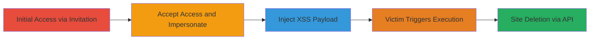

---
tags:
  - xss
  - stored-xss
  - streamlabs
  - admin-access
  - site-deletion
type: attack_chain
tools: []
tactics:
  - '[[Initial Access]]'
  - '[[Execution]]'
commands:
  - '[[commands/stored-xss-alert-payload]]'
  - '[[commands/stored-xss-delete-site-payload]]'
platforms:
  - Web
complexity: medium
procedures:
  - '[[procedures/Create-Shared-Admin-Invitation-in-Streamlabs]]'
  - '[[procedures/Accept-Shared-Access-Invitation]]'
  - '[[procedures/Access-Victims-Dashboard-as-Admin]]'
  - '[[procedures/Inject-Stored-XSS-in-Goal-Title]]'
  - '[[procedures/Trigger-XSS-Execution-on-Victim-Visit]]'
step_count: 5
techniques:
  - '[[Valid Accounts]]'
  - '[[JavaScript]]'
description: >-
  Multi-stage attack exploiting shared admin access in Streamlabs to inject
  stored XSS in goal setting pages, enabling arbitrary JavaScript execution in
  the victim's browser for potential account takeover and site deletion.
skill_level: intermediate
impact_level: high
id: df366a45-4cdc-4960-9720-7c9978e4c3b7
created_at: '2025-12-13T23:52:55.381Z'
updated_at: '2025-12-13T23:52:55.381Z'
verified: false
validated: true
submitted: true
mitre_tactics:
  - '[[Initial Access]]'
  - '[[Execution]]'
mitre_techniques:
  - '[[Valid Accounts]]'
  - '[[JavaScript]]'
---
# Stored XSS in Streamlabs Goal Pages via Shared Admin Access Leading to Site Deletion

Multi-stage attack chain demonstrating exploitation of shared administrator access in Streamlabs to inject a stored XSS payload into goal setting pages, resulting in arbitrary JavaScript execution when the victim accesses their dashboard. This can lead to session theft, API manipulation, and complete site deletion.

## Chain Metrics Dashboard

| Metric | Value |
|--------|-------|
| Chain Status | Unverified |
| Total Steps | 5 |
| Execution Time | ~10 minutes |
| Skill Level | Intermediate |
| Complexity | Medium |
| Impact Level | High |

## Attack Flow Visualization



## Prerequisites & Requirements

### Required Tools

- Web browser (e.g., Chrome with developer tools)

### Target Environment

- Streamlabs web dashboard (https://streamlabs.com/dashboard)
- Victim account with goal setting features enabled
- Attacker account on Streamlabs

### Initial Access Requirements

- Social engineering to obtain invitation link from victim
- Valid attacker credentials for Streamlabs
- No prior network access beyond internet

## Detailed Attack Procedures

### Step 1: Create Shared Admin Invitation
procedure: [[procedures/Create-Shared-Admin-Invitation-in-Streamlabs]]

**Objective**: Trick the victim into generating an admin invitation link for shared access to their dashboard.

**Instructions**: The victim must navigate to the shared access settings and create an invitation. No direct attacker action here; relies on phishing or social engineering to prompt the victim.

**Expected Output**: Generation of a temporary invitation link for administrator role.

**Success Indicators**:
- Victim shares the invitation link with attacker
- Link is valid and unexpired

### Step 2: Accept Shared Access Invitation
procedure: [[procedures/Accept-Shared-Access-Invitation]]

**Objective**: Gain temporary administrator privileges on the victim's account using the invitation.

**Instructions**: Open the invitation link in the attacker's logged-in browser session and confirm acceptance to link the accounts.

**Expected Output**: Attacker's account now has shared admin access to victim's dashboard.

**Success Indicators**:
- Confirmation message on acceptance
- Victim's username appears in attacker's shared-access page

### Step 3: Access Victim's Dashboard as Admin
procedure: [[procedures/Access-Victims-Dashboard-as-Admin]]

**Objective**: Impersonate the victim to access their dashboard settings.

**Instructions**: From the attacker's shared-access page, click the hyperlink on the victim's username to navigate to the act-as endpoint.

**Expected Output**: Redirect to victim's dashboard at https://streamlabs.com/dashboard/act-as/{userId}.

**Success Indicators**:
- Full access to victim's goal setting pages
- Ability to modify titles without victim's direct involvement

### Step 4: Inject Stored XSS in Goal Title
procedure: [[procedures/Inject-Stored-XSS-in-Goal-Title]]

**Objective**: Store a malicious JavaScript payload in the goal page title field for later execution.

**Instructions**: Navigate to a goal page like https://streamlabs.com/dashboard#/followergoal. In the Manage Goal Title field, inject the payload using [[commands/stored-xss-alert-payload]] for testing or [[commands/stored-xss-delete-site-payload]] for impact, then save.

```javascript
">
```

or

```javascript
<script>eval(atob("..."))</script>
```

**Expected Output**: Payload saved without errors; page updates with injected content.

**Success Indicators**:
- Title field accepts and stores the payload
- No immediate sanitization errors

### Step 5: Trigger XSS Execution on Victim Visit
procedure: [[procedures/Trigger-XSS-Execution-on-Victim-Visit]]

**Objective**: Cause the victim to execute the stored payload, leading to JavaScript actions like site deletion.

**Instructions**: Victim logs in and navigates to the affected goal page (e.g., https://streamlabs.com/dashboard#/followergoal). The payload executes automatically in their browser context.

**Expected Output**: Alert popup for basic payload or API deletion request for advanced, resulting in site data removal.

**Success Indicators**:
- JavaScript alert or network request to DELETE /api/v6/site/everything
- Confirmation of site deletion via API response

## Attack Chain Summary

### Key Achievements

1. Temporary admin access via shared invitation
2. Stored XSS injection in multiple goal pages
3. Arbitrary JS execution for session theft or destructive actions

## Technique & Tactic Coverage

### MITRE ATT&CK Techniques

- [[Valid Accounts]]
- [[JavaScript]]

### MITRE ATT&CK Tactics

- [[Initial Access]]
- [[Execution]]

---
*Last updated: 2023-10-01*
