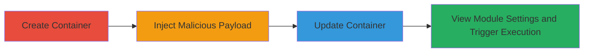

# Stored XSS in Stripo Email Template Module Name Leading to Arbitrary JavaScript Execution

Multi-stage attack chain demonstrating a complete attack workflow exploiting a stored cross-site scripting (XSS) vulnerability in Stripo Inc's email template editor.

## Chain Metrics Dashboard

| Metric | Value |
|--------|-------|
| Chain Status | Unverified |
| Total Steps | 4 |
| Execution Time | ~5 minutes |
| Skill Level | Intermediate |
| Complexity | Medium |
| Impact Level | High |

## Attack Flow Visualization

## Prerequisites & Requirements

### Required Tools

- Browser with developer tools (e.g., Chrome DevTools for payload testing)

### Target Environment

- Web-based email template editor application (Stripo Inc)
- Authenticated access to create and edit modules/containers
- No specific ports or services beyond standard HTTPS web access

### Initial Access Requirements

- Valid user credentials for the Stripo application
- Direct network access to the web interface
- No prior access needed beyond authentication

## Detailed Attack Procedures

### Step 1: Create New Container
procedure: [[procedures/Exploit-Stored-XSS-in-Stripo-Module-Name]]

**Objective**: Establish a new container in the email template editor to serve as the injection point for the malicious payload.

**Instructions**: Navigate to the container creation section in the Stripo editor and create a new container. The type of container (e.g., text block, image) does not impact the vulnerability.

**Expected Output**: A new container is added to the template workspace, ready for configuration.

**Success Indicators**:
- Container appears in the editor interface
- Module settings panel is accessible for the new container

### Step 2: Inject Malicious Payload into Module Name
procedure: [[procedures/Exploit-Stored-XSS-in-Stripo-Module-Name]]

**Objective**: Insert a JavaScript payload into the module name field to exploit the lack of input sanitization.

**Instructions**: In the module name input field of the container settings, paste the payload: `">
Hello :)`. This payload closes the HTML attribute and injects an onmouseover event handler.

**Expected Output**: The payload is accepted without validation errors and stored temporarily in the interface.

**Success Indicators**:
- Payload enters the field without immediate rejection
- No client-side escaping is applied visibly

### Step 3: Update and Save Container
procedure: [[procedures/Exploit-Stored-XSS-in-Stripo-Module-Name]]

**Objective**: Persist the injected payload by saving the container, making the XSS stored and retrievable.

**Instructions**: Click the update or save button to commit the changes to the container, including the tainted module name.

**Expected Output**: Confirmation of save, with the container updated in the backend.

**Success Indicators**:
- Save operation completes successfully
- Container remains editable without payload loss

### Step 4: View Module Settings to Trigger Execution
procedure: [[procedures/Exploit-Stored-XSS-in-Stripo-Module-Name]]

**Objective**: Trigger the stored payload execution by accessing the module settings, leading to arbitrary JavaScript in the viewer's browser.

**Instructions**: Reopen the module settings panel for the affected container. Hover over the injected element to fire the onmouseover event.

**Expected Output**: An alert box pops up displaying 'XSS', confirming JavaScript execution.

**Success Indicators**:
- Alert or other JS effect (e.g., session theft simulation) occurs
- Payload executes in the context of the viewer's session

## Attack Chain Summary

### Key Achievements

1. Successful injection and storage of malicious JavaScript via unsanitized user input in the module name field.
2. Persistent XSS enabling execution on any user viewing the affected module.
3. Potential for session hijacking, data theft, or further client-side attacks on authenticated users.

## Technique & Tactic Coverage

### MITRE ATT&CK Techniques

- [[JavaScript]]
- [[Exploit Public-Facing Application]]

### MITRE ATT&CK Tactics

- [[Initial Access]]
- [[Execution]]
- [[Collection]]

---
*Last updated: 2023-10-01T12:00:00Z*
