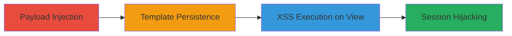

# Stored XSS in Stripo Template Editor Accordion Section Name for Session Hijacking

Multi-stage attack chain demonstrating exploitation of a stored XSS vulnerability in Stripo Inc's Template Editor to inject and execute malicious JavaScript, leading to potential session hijacking or data theft for authenticated users viewing the affected template.

## Chain Metrics Dashboard

| Metric | Value |
|--------|-------|
| Chain Status | Unverified |
| Total Steps | 2 |
| Execution Time | ~5 minutes |
| Skill Level | Intermediate |
| Complexity | Medium |
| Impact Level | High |

## Attack Flow Visualization

## Prerequisites & Requirements

### Required Tools

- Browser with developer tools (e.g., Chrome DevTools)

### Target Environment

- Stripo Inc platform (web-based email template editor)
- Authenticated access to Template Editor

### Initial Access Requirements

- Valid user account on Stripo platform
- No special privileges required beyond template editing access

## Detailed Attack Procedures

### Step 1: Payload Injection
procedure: [[procedures/Inject-Stored-XSS-Payload-in-Accordion-Section-Name]]

**Objective**: Inject malicious JavaScript into the Accordion block's Section Name field to store the payload persistently in the template.

**Instructions**: Log in to the Stripo Template Editor, create or edit a template, add an Accordion block, and input the XSS payload in the Section Name field. For testing, use a simple alert; for exploitation, use a payload to steal cookies or session data.

**Expected Output**: The payload is saved without sanitization, appearing as the section name in the template preview.

**Success Indicators**:
- Payload reflected in template without escaping
- No immediate errors during save

### Step 2: Trigger XSS Execution
procedure: [[procedures/Trigger-XSS-Execution-on-Template-View]]

**Objective**: Cause the stored payload to execute when another authenticated user views or interacts with the template.

**Instructions**: Share the template with a target user or wait for them to access it. Upon viewing the Accordion block, the JavaScript executes in the victim's browser context.

**Expected Output**: Malicious script runs, e.g., alert pops up or data is exfiltrated to attacker-controlled server.

**Success Indicators**:
- JavaScript execution confirmed (e.g., alert or network request to attacker server)
- Victim's session cookies or data captured

## Attack Chain Summary

### Key Achievements

1. Persistent injection of JavaScript via unsanitized Section Name field
2. Execution in context of other users viewing templates
3. Potential for session hijacking, data theft, or defacement

## Technique & Tactic Coverage

### MITRE ATT&CK Techniques

- [[JavaScript]]

### MITRE ATT&CK Tactics

- [[Execution]]

---
*Last updated: 2023-10-01T00:00:00Z*
