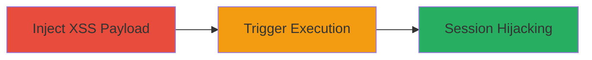

---
tags:
  - xss
  - stored-xss
  - web
  - session-hijacking
  - rockstar-games
type: attack_chain
tools: []
tactics:
  - '[[Execution]]'
  - '[[Collection]]'
commands: []
platforms:
  - Web
complexity: medium
procedures:
  - '[[procedures/Inject-Malicious-XSS-Payload-into-Thread-Title]]'
  - '[[procedures/Trigger-XSS-via-Title-Suggestion]]'
step_count: 2
techniques:
  - '[[JavaScript]]'
description: >-
  A multi-stage attack exploiting a stored XSS vulnerability in the title field
  of Rockstar Games Support Community threads, allowing arbitrary JavaScript
  execution in victims' browsers via title suggestions.
skill_level: intermediate
impact_level: high
id: de006b91-379b-474b-a37f-2da3c0222cdd
created_at: '2025-12-13T23:52:43.799Z'
updated_at: '2025-12-13T23:52:43.799Z'
verified: false
validated: true
submitted: true
mitre_tactics:
  - '[[Execution]]'
  - '[[Collection]]'
mitre_techniques:
  - '[[JavaScript]]'
---
# Stored XSS in Support Community Thread Titles Leading to Session Hijacking

Multi-stage attack chain demonstrating a complete attack workflow exploiting stored XSS on support.rockstargames.com.

## Chain Metrics Dashboard

| Metric | Value |
|--------|-------|
| Chain Status | Unverified |
| Total Steps | 2 |
| Execution Time | ~5 minutes |
| Skill Level | Intermediate |
| Complexity | Medium |
| Impact Level | High |

## Attack Flow Visualization

## Prerequisites & Requirements

### Required Tools

- Web browser with developer tools
- Account on support.rockstargames.com

### Target Environment

- Web platform: support.rockstargames.com Support Community
- Required services/ports: HTTPS (443)
- Network access requirements: Internet access to the target site

### Initial Access Requirements

- Valid user account on the Rockstar Support Community
- No special privileges needed; standard user access suffices
- Prior access needed: Ability to create threads

## Detailed Attack Procedures

### Step 1: Inject Malicious Payload
procedure: [[procedures/Inject-Malicious-XSS-Payload-into-Thread-Title]]

**Objective**: Store a malicious XSS payload in a thread title to persist it for later suggestions.

**Instructions**: Log in to support.rockstargames.com, navigate to the Support Community, and create a new thread. In the title field, enter a payload such as `` or a more advanced one like `` to exfiltrate data. Complete the thread creation with any body content.

**Expected Output**: Thread created successfully, payload stored in the database without immediate execution.

**Success Indicators**:
- Thread appears in the community list with the malicious title
- No errors during submission

### Step 2: Trigger XSS Execution
procedure: [[procedures/Trigger-XSS-via-Title-Suggestion]]

**Objective**: Cause the payload to execute in a victim's browser by simulating a title suggestion during new thread creation.

**Instructions**: Have a victim (or use another account) start creating a new thread with a title similar to the injected one (e.g., if injected title is 'Help with GTA', use 'Help with GT'). The system will suggest the stored malicious title, displaying it unsanitized and executing the script.

**Expected Output**: JavaScript executes in the victim's browser, such as an alert popup or data exfiltration request.

**Success Indicators**:
- Script runs in victim's session (e.g., alert fires or network request to attacker server)
- Victim's cookies or session data potentially stolen

## Attack Chain Summary

### Key Achievements

1. Persistent storage of XSS payload in thread titles
2. Execution of arbitrary JavaScript via autocomplete suggestions
3. Potential for session hijacking and client-side attacks

## Technique & Tactic Coverage

### MITRE ATT&CK Techniques

- [[JavaScript]]

### MITRE ATT&CK Tactics

- [[Execution]]
- [[Collection]]

---
*Last updated: 2024-01-01*
