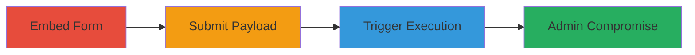

# Stored XSS in SupportFlow WordPress Plugin via Unescaped Ticket Messages

Multi-stage attack chain demonstrating a complete attack workflow exploiting a stored XSS vulnerability in the SupportFlow WordPress plugin.

## Chain Metrics Dashboard

| Metric | Value |
|--------|-------|
| Chain Status | Unverified |
| Total Steps | 3 |
| Execution Time | ~5 minutes |
| Skill Level | Intermediate |
| Complexity | Medium |
| Impact Level | High |

## Attack Flow Visualization

## Prerequisites & Requirements

### Required Tools

- WordPress admin or user access
- Browser for form submission and admin navigation

### Target Environment

- WordPress site with SupportFlow plugin installed and active
- Access to create pages and submit tickets as a logged-in user
- Admin privileges to view ticket list (for exploitation phase)

### Initial Access Requirements

- Valid user account on the WordPress site
- No special network access beyond standard web connectivity
- Plugin version vulnerable to unescaped ticket message output (e.g., pre-patch versions)

## Detailed Attack Procedures

### Step 1: Embed Ticket Submission Form
procedure: [[procedures/Embed-SupportFlow-Ticket-Submission-Form]]

**Objective**: Insert the SupportFlow ticket submission form into a public or accessible WordPress page to enable payload submission.

**Instructions**: Log in to WordPress as a user, navigate to Pages > Add New, and insert the shortcode `[supportflow_submissionform]` into the page content using the editor. Publish the page to make the form available.

**Expected Output**: A functional ticket submission form appears on the published page.

**Success Indicators**:
- Form renders correctly on the page
- No errors in form display

### Step 2: Submit Ticket with XSS Payload
procedure: [[procedures/Submit-Ticket-with-XSS-Payload]]

**Objective**: Inject a malicious JavaScript payload into a ticket message, which is stored without proper sanitization for output.

**Instructions**: Visit the page with the embedded form, fill in required fields (e.g., subject, name), and enter the payload `` in the message textarea. Submit the form while logged in.

**Expected Output**: Ticket is submitted successfully, and a confirmation message appears.

**Success Indicators**:
- Ticket appears in the database (verifiable via admin if accessible)
- No input validation errors block submission

### Step 3: Trigger XSS in Admin Ticket List
procedure: [[procedures/Trigger-XSS-in-Admin-Ticket-List]]

**Objective**: Cause the stored payload to execute by rendering the ticket list in the admin interface, leading to arbitrary JavaScript execution in the admin's browser.

**Instructions**: As an admin or editor, log in to WordPress and navigate to `/wp-admin/edit.php?post_type=sf_ticket`. The ticket message will be displayed unescaped in the table, triggering the payload.

**Expected Output**: JavaScript alert or other payload effects execute in the browser.

**Success Indicators**:
- Alert box or payload action triggers
- Potential for further exploitation like session hijacking

## Attack Chain Summary

### Key Achievements

1. Successful embedding and payload submission without detection
2. Storage of unescaped malicious script in ticket data
3. Execution of JavaScript in high-privilege admin context, enabling data theft or escalation

## Technique & Tactic Coverage

### MITRE ATT&CK Techniques

- [[JavaScript]]

### MITRE ATT&CK Tactics

- [[Execution]]

---
*Last updated: 2023-10-01T12:00:00Z*
