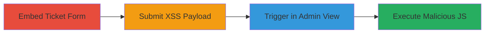

---
tags:
  - xss
  - stored-xss
  - wordpress
  - plugin-vulnerability
type: attack_chain
tools: []
tactics:
  - '[[Execution]]'
verified: false
platforms:
  - Web
  - WordPress
submitted: true
complexity: medium
created_at: '2023-10-01T00:00:00Z'
procedures:
  - '[[procedures/Embed-SupportFlow-Ticket-Submission-Form]]'
  - '[[procedures/Inject-XSS-Payload-into-Ticket-Message]]'
  - '[[procedures/Trigger-XSS-in-Admin-Ticket-List]]'
step_count: 3
techniques:
  - '[[JavaScript]]'
updated_at: '2025-12-14T17:28:51.823Z'
description: >-
  A multi-stage attack exploiting a stored XSS vulnerability in the SupportFlow
  WordPress plugin by injecting malicious JavaScript into ticket messages, which
  executes when admins view the tickets list.
skill_level: intermediate
impact_level: high
id: 23091e69-4e1c-4185-8ed4-18b261d9c0de
validated: true
mitre_tactics:
  - '[[Execution]]'
mitre_techniques:
  - '[[JavaScript]]'
---
# Stored XSS in SupportFlow WordPress Plugin via Unescaped Ticket Messages

Multi-stage attack chain demonstrating a complete attack workflow exploiting a stored XSS vulnerability in the SupportFlow WordPress plugin.

## Chain Metrics Dashboard

| Metric | Value |
|--------|-------|
| Chain Status | Unverified |
| Total Steps | 3 |
| Execution Time | ~5 minutes |
| Skill Level | Intermediate |
| Complexity | Medium |
| Impact Level | High |

## Attack Flow Visualization

## Prerequisites & Requirements

### Required Tools

- Web browser (e.g., Chrome with developer tools for payload testing)

### Target Environment

- WordPress site with SupportFlow plugin installed and active
- Access to create/edit pages (contributor role or higher)
- Logged-in user account (admin or editor role to bypass sanitization on submission)

### Initial Access Requirements

- Valid WordPress credentials for a logged-in user
- No special network access beyond standard HTTP/HTTPS to the site
- Prior access to the frontend for page editing

## Detailed Attack Procedures

### Step 1: Embed Ticket Submission Form
procedure: [[procedures/Embed-SupportFlow-Ticket-Submission-Form]]

**Objective**: Create a page with the embedded SupportFlow ticket submission form to allow payload injection.

**Instructions**: Log in to the WordPress dashboard, navigate to Pages > Add New, and insert the shortcode `[supportflow_submissionform]` into the page content using the Gutenberg editor or classic editor. Publish the page and access it via the frontend.

**Expected Output**: A functional ticket submission form displayed on the page.

**Success Indicators**:
- Form fields (e.g., message textarea) are visible and interactive
- No errors on page load

### Step 2: Inject XSS Payload into Ticket Message
procedure: [[procedures/Inject-XSS-Payload-into-Ticket-Message]]

**Objective**: Submit a ticket containing an unescaped JavaScript payload that will be stored and later displayed to admins.

**Instructions**: While logged in with admin or editor privileges, visit the embedded form page, fill in required fields, and enter the XSS payload `` (or a more malicious one like ``) in the message textarea. Submit the form.

**Expected Output**: Ticket submission confirmation; payload stored without sanitization due to role privileges.

**Success Indicators**:
- Ticket appears in the admin tickets list without visible alterations to the payload
- No client-side validation errors during submission

### Step 3: Trigger XSS in Admin Ticket List
procedure: [[procedures/Trigger-XSS-in-Admin-Ticket-List]]

**Objective**: View the tickets list as an admin to execute the stored payload in the browser context.

**Instructions**: Log in as an admin (or have an admin visit), navigate to `/wp-admin/edit.php?post_type=sf_ticket`. The unescaped message in the table will render the script tag, executing the JavaScript.

**Expected Output**: Alert box or malicious action (e.g., cookie exfiltration) triggers in the admin's browser.

**Success Indicators**:
- JavaScript executes (e.g., alert pops up)
- Browser console shows script execution errors or network requests to attacker server

## Attack Chain Summary

### Key Achievements

1. Successful embedding of the vulnerable form without detection
2. Injection of arbitrary JavaScript bypassing role-based sanitization
3. Execution of payload in admin context, enabling session hijacking or data theft

## Technique & Tactic Coverage

### MITRE ATT&CK Techniques

- [[JavaScript]]

### MITRE ATT&CK Tactics

- [[Execution]]

---
*Last updated: 2023-10-01T00:00:00Z*
