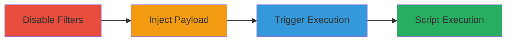

# Stored XSS in SupportFlow WordPress Plugin via Unescaped Ticket Subject

Multi-stage attack chain demonstrating exploitation of a stored XSS vulnerability in the SupportFlow WordPress plugin, where ticket subjects are not properly escaped, allowing JavaScript injection that executes when admins view tickets.

## Chain Metrics Dashboard

| Metric | Value |
|--------|-------|
| Chain Status | Unverified |
| Total Steps | 3 |
| Execution Time | ~5 minutes |
| Skill Level | Intermediate |
| Complexity | Medium |
| Impact Level | High |

## Attack Flow Visualization



## Prerequisites & Requirements

### Required Tools

- None (uses WordPress admin access and code modifications)

### Target Environment

- WordPress site with SupportFlow plugin installed and active
- Admin access to create and view tickets
- Access to theme's functions.php file for filter modifications

### Initial Access Requirements

- Authenticated user with ticket creation privileges (e.g., customer or support role)
- Admin privileges for viewing tickets to trigger the payload
- No network position restrictions; operates within the WordPress dashboard

## Detailed Attack Procedures

### Step 1: Disable WPTexturize Filter
procedure: [[procedures/Disable-WPTexturize-Filter]]

**Objective**: Prevent WordPress from automatically processing and escaping text in ticket subjects, allowing raw HTML and script tags to be injected without alteration.

**Instructions**: Add the filter disablement to your active theme's functions.php file or via a custom plugin. Use the [[commands/disable-wptexturize-filter]] command:

```php
add_filter( 'run_wptexturize', '__return_false' );
```

Save the file and refresh the WordPress admin area to apply the change.

**Expected Output**: No direct output; subsequent ticket subjects will accept raw HTML without texturization.

**Success Indicators**:
- Ticket creation form accepts unescaped HTML in the subject field without automatic conversion (e.g., quotes remain literal).
- No errors in WordPress debug logs related to text processing.

### Step 2: Create Malicious Ticket
procedure: [[procedures/Create-Malicious-SupportFlow-Ticket]]

**Objective**: Inject a malicious JavaScript payload into a new ticket's subject field, storing it persistently in the database for later execution.

**Instructions**: Log in to the WordPress frontend or support portal and navigate to the SupportFlow ticket creation form. Enter the payload in the subject field, such as `1"><script>alert('hi');</script>`, and submit the ticket with any body content.

**Expected Output**: Ticket created successfully with the malicious subject stored in the database.

**Success Indicators**:
- Ticket appears in the SupportFlow -> All Tickets list with the exact payload in the subject.
- No sanitization errors during submission.

### Step 3: Trigger Stored XSS
procedure: [[procedures/Trigger-Stored-XSS-in-SupportFlow-Ticket]]

**Objective**: View the injected ticket as an admin to execute the stored JavaScript payload in the browser context.

**Instructions**: Log in as an admin user and navigate to SupportFlow -> All Tickets, then click on the ticket ID containing the payload. The subject will be rendered in an input element without proper escaping, triggering the script.

**Expected Output**: JavaScript alert (or other payload effects) executes in the admin's browser.

**Success Indicators**:
- Alert box or script effects appear when viewing the ticket.
- Browser developer tools show the script executing from the input value attribute.

## Attack Chain Summary

### Key Achievements

1. Bypassed WordPress text processing to enable raw payload injection.
2. Stored malicious JavaScript in a persistent ticket subject.
3. Achieved arbitrary script execution in the admin dashboard context, enabling potential session hijacking or data theft.

## Technique & Tactic Coverage

### MITRE ATT&CK Techniques

- [[JavaScript]]

### MITRE ATT&CK Tactics

- [[Execution]]
- [[Collection]]

---
*Last updated: 2023-10-01T00:00:00Z*
