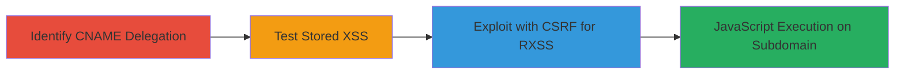

---
tags:
  - xss
  - stored-xss
  - rxss
  - csrf
  - self-xss
  - web-vulnerability
type: attack_chain
tools: []
tactics:
  - '[[Execution]]'
  - '[[Collection]]'
verified: false
platforms:
  - Web
submitted: true
complexity: medium
created_at: '2023-10-01T00:00:00Z'
procedures:
  - '[[procedures/Identify-CNAME-Delegation-to-Third-Party-Vendor]]'
  - '[[procedures/Test-Stored-XSS-in-Authenticated-Endpoint]]'
  - '[[procedures/Exploit-Stored-XSS-with-CSRF-for-RXSS]]'
step_count: 3
techniques:
  - '[[JavaScript]]'
  - '[[Drive-by Compromise]]'
updated_at: '2025-12-13T23:52:49.579Z'
description: >-
  A multi-stage attack exploiting a stored XSS vulnerability in a third-party
  vendor's authenticated endpoint, inherited by HackerOne via CNAME delegation,
  resulting in reflected XSS through CSRF and self-XSS.
skill_level: intermediate
impact_level: low
id: 6a41de57-1b4d-4d3d-9cf3-dcefe0afd4fc
validated: true
mitre_tactics:
  - '[[Execution]]'
  - '[[Collection]]'
mitre_techniques:
  - '[[JavaScript]]'
  - '[[Drive-by Compromise]]'
---
# Stored XSS in Third-Party Vendor Leading to RXSS on HackerOne Subdomain

Multi-stage attack chain demonstrating exploitation of a stored XSS vulnerability in a third-party event management vendor integrated with HackerOne via CNAME for events.hackerone.com. The attack leverages subdomain inheritance to execute arbitrary JavaScript on the HackerOne subdomain, potentially enabling session hijacking or phishing, though no sensitive data was compromised due to the system's limited scope.

## Chain Metrics Dashboard

| Metric | Value |
|--------|-------|
| Chain Status | Unverified |
| Total Steps | 3 |
| Execution Time | ~15 minutes |
| Skill Level | Intermediate |
| Complexity | Medium |
| Impact Level | Low |

## Attack Flow Visualization



## Prerequisites & Requirements

### Required Tools

- None specific; relies on browser developer tools and DNS lookup utilities.

### Target Environment

- Web platform with third-party integrations via CNAME.
- Authenticated access to vendor endpoints.
- Services: Third-party event management.

### Initial Access Requirements

- Valid credentials for the vendor's authenticated endpoint.
- Network access to resolve DNS and interact with https://events.hackerone.com.
- No prior access beyond standard user authentication.

## Detailed Attack Procedures

### Step 1: Identify CNAME Delegation
procedure: [[procedures/Identify-CNAME-Delegation-to-Third-Party-Vendor]]

**Objective**: Discover subdomain control by a third-party vendor through DNS resolution, revealing potential inheritance of vulnerabilities.

**Instructions**: Perform DNS lookup on the target subdomain to identify CNAME records pointing to external services. Use command-line tools like dig or nslookup to query the CNAME.

For example, query the DNS:

```bash
dig CNAME events.hackerone.com
```

This reveals the delegation to the vendor's domain.

**Expected Output**: CNAME record showing events.hackerone.com aliases to vendor's domain, indicating external control.

**Success Indicators**:
- CNAME record confirmed.
- Subdomain inheritance identified for further testing.

### Step 2: Test Stored XSS in Authenticated Endpoint
procedure: [[procedures/Test-Stored-XSS-in-Authenticated-Endpoint]]

**Objective**: Authenticate to the vendor's endpoint and inject test payloads to identify lack of input sanitization, confirming stored XSS vulnerability.

**Instructions**: Log in to the vendor's system via the HackerOne subdomain. Locate an input field in an authenticated endpoint (e.g., event submission form) and submit a test payload like `<script>alert('XSS')</script>`.

Submit the payload through the web interface or API endpoint accessible at https://events.hackerone.com.

**Expected Output**: Payload stored and reflected back without sanitization, triggering an alert on page load.

**Success Indicators**:
- Payload persists in storage.
- JavaScript executes on subsequent page views.

### Step 3: Exploit Stored XSS with CSRF for RXSS
procedure: [[procedures/Exploit-Stored-XSS-with-CSRF-for-RXSS]]

**Objective**: Chain the stored XSS with CSRF to induce self-XSS, achieving reflected XSS execution on the HackerOne subdomain.

**Instructions**: Craft a malicious page or link that uses CSRF to submit the stored payload to the vulnerable endpoint. Trick the victim (or self for testing) into visiting the page, causing the payload to execute via the subdomain.

For example, host a simple HTML page with a form that auto-submits the payload:

```html
<form action="https://events.hackerone.com/vendor-endpoint" method="POST">
  <input type="hidden" name="input_field" value="<script>alert(document.domain)</script>">
</form>
<script>document.forms[0].submit();</script>
```

Visit this page while authenticated to trigger self-XSS, confirming execution on events.hackerone.com.

**Expected Output**: Arbitrary JavaScript runs in the context of the HackerOne subdomain.

**Success Indicators**:
- Script executes, showing the subdomain in alert.
- Potential for session hijacking or phishing demonstrated.

## Attack Chain Summary

### Key Achievements

1. Identified vulnerability inheritance via CNAME to third-party.
2. Confirmed stored XSS in authenticated vendor endpoint.
3. Demonstrated RXSS impact through CSRF and self-XSS chaining.

## Technique & Tactic Coverage

### MITRE ATT&CK Techniques

- [[JavaScript]]
- [[Drive-by Compromise]]

### MITRE ATT&CK Tactics

- [[Execution]]
- [[Collection]]

---
*Last updated: 2023-10-01T00:00:00Z*
