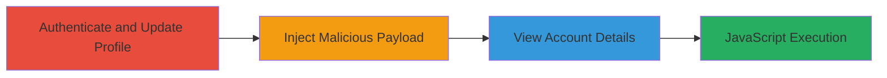

---
tags:
  - xss
  - stored-xss
  - web-vulnerability
type: attack_chain
tools: []
tactics:
  - '[[Initial Access]]'
  - '[[Execution]]'
commands: []
platforms:
  - Web
complexity: low
procedures:
  - '[[procedures/Exploit-Stored-XSS-in-ThisData-Profile-Update]]'
step_count: 1
techniques:
  - '[[JavaScript]]'
description: >-
  A stored cross-site scripting attack exploiting insufficient input validation
  in user profile update fields to inject and execute malicious JavaScript when
  viewing account details.
skill_level: intermediate
impact_level: medium
id: e482d7ef-7868-4dbc-81d6-ea60b60d530e
created_at: '2025-12-14T03:15:26.849Z'
updated_at: '2025-12-14T03:15:26.849Z'
verified: false
validated: true
submitted: true
mitre_tactics:
  - '[[Initial Access]]'
  - '[[Execution]]'
mitre_techniques:
  - '[[JavaScript]]'
---
# Stored XSS in ThisData via Name or Email Update Leading to Account Compromise

Multi-stage attack chain demonstrating a complete attack workflow.

## Chain Metrics Dashboard

| Metric | Value |
|--------|-------|
| Chain Status | Unverified |
| Total Steps | 1 |
| Execution Time | ~5 minutes |
| Skill Level | Intermediate |
| Complexity | Low |
| Impact Level | Medium |

## Attack Flow Visualization

## Prerequisites & Requirements

### Required Tools

- Web browser (e.g., Chrome with developer tools for payload testing)

### Target Environment

- Web application: ThisData platform
- Required services/ports: HTTPS on port 443
- Network access requirements: Internet access to the ThisData application

### Initial Access Requirements

- Credential requirements: Valid user account credentials for the target ThisData instance
- Network position: Direct access to the web application
- Prior access needed: Authentication to the user's account

## Detailed Attack Procedures

### Step 1: Inject and Trigger Stored XSS
procedure: [[procedures/Exploit-Stored-XSS-in-ThisData-Profile-Update]]

**Objective**: Inject a malicious JavaScript payload into the name or email field during profile update, which executes when the account details are viewed, potentially allowing session hijacking or data theft within the affected account.

**Instructions**: Authenticate to the ThisData application, navigate to the account update section, and submit a payload like `` in the name or email field. Then, view the account details page to trigger execution.

**Expected Output**: JavaScript alert or other payload effects appear when viewing the profile, confirming execution in the victim's browser context.

**Success Indicators**:
- Malicious script executes without errors when account details are loaded
- Payload persists across sessions or views

## Attack Chain Summary

### Key Achievements

1. Successful injection of persistent JavaScript via profile fields
2. Execution of arbitrary code in the context of the viewing user's session
3. Potential for account-specific compromise, such as stealing session tokens or sensitive data

## Technique & Tactic Coverage

### MITRE ATT&CK Techniques

- [[JavaScript]]

### MITRE ATT&CK Tactics

- [[Initial Access]]
- [[Execution]]

---
*Last updated: 2023-10-01*
