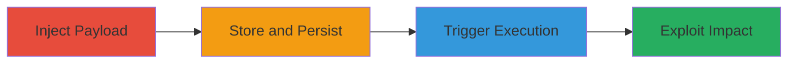

# Stored XSS in TikTok Ads Text Field for Browser Script Execution

Multi-stage attack chain demonstrating exploitation of a stored cross-site scripting (XSS) vulnerability in the text field on ads.tiktok.com. An attacker injects malicious JavaScript that is stored server-side and served to users, executing in their browsers to steal sessions or deface content. This was reported via HackerOne (Report #1376961) with medium severity (CVSS 5.4).

## Chain Metrics Dashboard

| Metric | Value |
|--------|-------|
| Chain Status | Unverified |
| Total Steps | 3 |
| Execution Time | ~5 minutes |
| Skill Level | Intermediate |
| Complexity | Medium |
| Impact Level | Medium |

## Attack Flow Visualization

## Prerequisites & Requirements

### Required Tools

- Browser developer tools
- Proxy tool like Burp Suite (optional for interception)

### Target Environment

- Web platform
- TikTok Ads service (ads.tiktok.com)
- No specific ports required; standard HTTPS (443)

### Initial Access Requirements

- Valid user account on ads.tiktok.com
- Ability to submit content via the text field
- No prior privileged access needed

## Detailed Attack Procedures

### Step 1: Identify and Access Vulnerable Text Field
procedure: [[procedures/Inject-Stored-XSS-Payload-in-Text-Field]]

**Objective**: Locate the text field on ads.tiktok.com and prepare to inject a malicious payload without sanitization.

**Instructions**: Log in to ads.tiktok.com and navigate to the ad creation or editing section containing the vulnerable text field. Use browser developer tools to inspect the field and confirm lack of input sanitization by testing benign scripts.

**Expected Output**: Access to the form; successful submission of test input that echoes back unsanitized.

**Success Indicators**:
- Text field accepts input without escaping
- Submitted content is stored and retrievable

### Step 2: Inject and Store Malicious Payload
procedure: [[procedures/Inject-Stored-XSS-Payload-in-Text-Field]]

**Objective**: Submit a stored XSS payload that persists on the server and executes when viewed by other users.

**Instructions**: In the text field, enter a payload like `` or more advanced ``. Submit the form to store it. Verify storage by accessing the ad or content page where the field is displayed.

**Expected Output**: Payload stored server-side; no immediate execution in attacker's browser due to context.

**Success Indicators**:
- Payload appears in stored content
- No server-side blocking or encoding applied

### Step 3: Trigger Execution and Exploit
procedure: [[procedures/Trigger-XSS-Execution-in-Victim-Browser]]

**Objective**: Have a victim view the stored content, triggering script execution in their browser context for impact like session theft or defacement.

**Instructions**: Share the link to the ad/content with a victim or wait for natural viewing. In the victim's browser, the payload executes, e.g., stealing cookies via `document.cookie` sent to an attacker-controlled server.

**Expected Output**: Alert or network request from victim's browser executing the script.

**Success Indicators**:
- Script runs in victim context
- Potential data exfiltration or UI manipulation observed

## Attack Chain Summary

### Key Achievements

1. Persistent storage of malicious JavaScript in TikTok Ads text field
2. Execution in unsuspecting users' browsers
3. Medium-impact outcomes like session hijacking or phishing setup

## Technique & Tactic Coverage

### MITRE ATT&CK Techniques

- [[JavaScript]]

### MITRE ATT&CK Tactics

- [[Execution]]

---
*Last updated: 2023-10-01T00:00:00Z*
