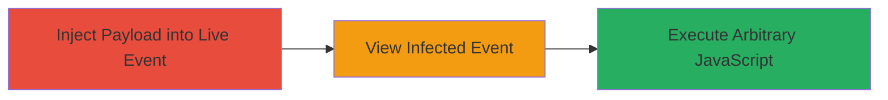

# Stored XSS in TikTok Live Event Description for Arbitrary JavaScript Execution

Multi-stage attack chain demonstrating a complete attack workflow exploiting insufficient input sanitization in TikTok's Live event creation.

## Chain Metrics Dashboard

| Metric | Value |
|--------|-------|
| Chain Status | Unverified |
| Total Steps | 2 |
| Execution Time | ~2 minutes |
| Skill Level | Intermediate |
| Complexity | Low |
| Impact Level | High |

## Attack Flow Visualization

## Prerequisites & Requirements

### Required Tools

- TikTok mobile app (authenticated account)

### Target Environment

- TikTok mobile app on Android or iOS
- Access to Live event creation feature
- No specific ports or services beyond app connectivity

### Initial Access Requirements

- Valid authenticated TikTok user account
- Network access to TikTok servers
- No prior access needed beyond app login

## Detailed Attack Procedures

### Step 1: Inject Malicious Payload
procedure: [[procedures/Inject-Malicious-Payload-into-TikTok-Live-Description]]

**Objective**: Create a Live event and store a malicious JavaScript payload in the Description field to persist it for later execution.

**Instructions**: Open the TikTok app, navigate to the Live creation screen, and input a payload like `` or more advanced code for session hijacking (e.g., stealing cookies via `document.cookie`) into the Description field. Submit the event creation.

**Expected Output**: The Live event is created successfully with the payload stored in the backend without sanitization.

**Success Indicators**:
- Event creation succeeds without errors
- Payload is accepted in the Description field

### Step 2: Trigger Stored XSS Execution
procedure: [[procedures/Trigger-Stored-XSS-via-Live-Event-Viewing]]

**Objective**: Have other users (or self) view the Live event, causing the stored payload to render and execute in their app's context.

**Instructions**: Share the Live event link or wait for users to discover and view it. Upon viewing, the Description field renders the unsanitized payload, executing the JavaScript in the viewer's browser or WebView context.

**Expected Output**: Arbitrary JavaScript runs, such as an alert popup or data exfiltration to an attacker-controlled server.

**Success Indicators**:
- JavaScript executes (e.g., alert fires or network request sent)
- Potential impacts like session cookies stolen or phishing prompts displayed

## Attack Chain Summary

### Key Achievements

1. Successful injection of unsanitized user input into a restricted Live event endpoint
2. Persistent storage of malicious payload accessible to other users
3. Execution of arbitrary code leading to risks like session hijacking, phishing, or data theft

## Technique & Tactic Coverage

### MITRE ATT&CK Techniques

- [[JavaScript]]

### MITRE ATT&CK Tactics

- [[Execution]]

---
*Last updated: 2023-10-01T00:00:00Z*
