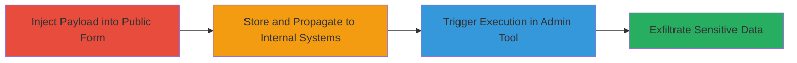

# Stored XSS in TikTok Partner Contact Form Leading to Internal Administrative Data Theft

Multi-stage attack chain demonstrating the exploitation of a stored cross-site scripting (XSS) vulnerability in TikTok's publicly accessible partner application contact form. The attack involves injecting a malicious JavaScript payload, which is stored in the backend and propagated to TikTok's internal Dorado/DataLeap big data analytics environment. Upon review by a privileged employee, the payload executes in the administrative browser session, enabling the theft of sensitive data such as session tokens, JWT credentials, PII (emails, phone numbers), API keys, internal paths, and backend architecture details.

## Chain Metrics Dashboard

| Metric | Value |
|--------|-------|
| Chain Status | Unverified |
| Total Steps | 4 |
| Execution Time | ~5 minutes |
| Skill Level | Intermediate |
| Complexity | Medium |
| Impact Level | High |

## Attack Flow Visualization

## Prerequisites & Requirements

### Required Tools

- Web browser (e.g., Chrome with developer tools for payload crafting)
- JavaScript payload generator or editor

### Target Environment

- Web platform with public-facing contact forms
- Internal backend integrated with analytics tools like Dorado/DataLeap
- Administrative browser-based interfaces for data review

### Initial Access Requirements

- Public internet access to the partner application form
- No authentication required for form submission
- Knowledge of the target's internal data flow (inferred from public reports)

## Detailed Attack Procedures

### Step 1: Inject Malicious Payload into Public Contact Form
procedure: [[procedures/Inject-Stored-XSS-Payload-via-Public-Contact-Form]]

**Objective**: Submit unfiltered malicious JavaScript via the public partner contact form to initiate the stored XSS attack.

**Instructions**: Access the TikTok partner application contact form (publicly available). Craft a JavaScript payload, such as one that captures and exfiltrates data (e.g., ``). Submit the form with the payload in an input field like the message or comments section, which lacks sanitization.

**Expected Output**: Form submission success message, with the payload stored in the backend without visible errors.

**Success Indicators**:
- Submission accepted without validation errors
- No immediate payload execution (indicating storage rather than reflection)

### Step 2: Payload Storage and Propagation to Internal Systems
procedure: [[procedures/Propagate-Stored-Payload-to-Internal-Analytics]]

**Objective**: Ensure the injected payload is persisted in the backend and routed to TikTok's internal big data analytics environment for administrative review.

**Instructions**: No active intervention required post-submission; the backend automatically stores the payload and integrates it into the Dorado/DataLeap analytics system. Monitor for propagation by submitting multiple test payloads if possible, or wait for internal processing (typically immediate in such systems).

**Expected Output**: Payload becomes part of the internal dataset accessible via administrative tools.

**Success Indicators**:
- Payload not rejected or sanitized during storage
- Internal logs or follow-up (if accessible) confirm integration into analytics

### Step 3: Trigger Payload Execution in Administrative Interface
procedure: [[procedures/Trigger-XSS-Execution-in-Administrative-Interface]]

**Objective**: Cause the stored payload to execute when a privileged employee reviews the submission in the internal browser-based analytics tool.

**Instructions**: The trigger occurs passively when an admin accesses the Dorado/DataLeap interface and views the tainted submission. The untrusted JavaScript runs in the employee's authenticated browser session within the closed administrative environment, bypassing typical web isolation.

**Expected Output**: JavaScript execution in the admin's browser, potentially alerting the attacker via exfiltration endpoint.

**Success Indicators**:
- Admin access to the form submission triggers payload
- No client-side protections (e.g., CSP) block execution

### Step 4: Exfiltrate Sensitive Data via XSS Payload
procedure: [[procedures/Exfiltrate-Sensitive-Data-via-XSS-Payload]]

**Objective**: Capture and transmit internal sensitive data from the administrative session to the attacker's controlled endpoint.

**Instructions**: The payload, upon execution, accesses browser storage and network resources to steal data like `document.cookie`, localStorage items, and API responses. Use an exfiltration URL (e.g., a controlled server) to send the data via fetch or XMLHttpRequest.

**Expected Output**: Data received on attacker's server, including session tokens, JWTs, PII, API keys, and internal paths.

**Success Indicators**:
- Incoming requests to exfiltration endpoint with stolen data
- Comprehensive data dump including backend architecture details

## Attack Chain Summary

### Key Achievements

1. Successful injection and storage of XSS payload in a public form without detection.
2. Propagation to high-privilege internal systems, enabling cross-context execution.
3. Theft of critical administrative credentials and PII, compromising backend access.
4. Demonstration of severe impact from unmitigated stored XSS in integrated environments.

## Technique & Tactic Coverage

### MITRE ATT&CK Techniques

- [[Exploit Public-Facing Application]] Exploit Public-Facing Application
- [[JavaScript]] JavaScript

### MITRE ATT&CK Tactics

- [[Initial Access]] Initial Access
- [[Execution]] Execution
- [[Collection]] Collection

---
*Last updated: 2023-10-01T00:00:00Z*
