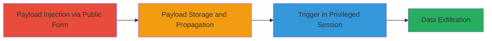

# Stored XSS in TikTok Partner Form Leading to Sensitive Data Leakage

Multi-stage attack chain demonstrating exploitation of a stored XSS vulnerability in TikTok's publicly accessible partner application form, resulting in the execution of malicious JavaScript in internal administrative sessions and the leakage of highly sensitive data.

## Chain Metrics Dashboard

| Metric | Value |
|--------|-------|
| Chain Status | Unverified |
| Total Steps | 2 |
| Execution Time | ~5 minutes |
| Skill Level | Intermediate |
| Complexity | Medium |
| Impact Level | High |

## Attack Flow Visualization

## Prerequisites & Requirements

### Required Tools

- [[tools/Web-Browser]]

### Target Environment

- Web platform with public-facing forms
- Internal services: Dorado, DataLeap (big data analytics)
- No specific ports required; operates over standard HTTPS

### Initial Access Requirements

- Public internet access to the partner application form
- No credentials needed for injection phase
- Monitoring capability for payload trigger (e.g., external server for exfiltration)

## Detailed Attack Procedures

### Step 1: Payload Injection
procedure: [[procedures/Inject-Malicious-Payload-into-Partner-Form]]

**Objective**: Inject a malicious JavaScript payload into the public partner application form, allowing it to be stored without sanitization and propagated to internal systems.

**Instructions**: Access the public partner application form using a web browser. Submit a form field (e.g., description or notes) containing a stored XSS payload, such as ``. The payload is stored unfiltered and forwarded to internal tools like Dorado/DataLeap.

**Expected Output**: Confirmation of form submission success; payload stored in backend database.

**Success Indicators**:
- Form submission accepted without errors
- Payload visible in any immediate response or logs

### Step 2: Payload Trigger and Exfiltration
procedure: [[procedures/Trigger-XSS-in-Internal-Analytics-Tool]]

**Objective**: Wait for a privileged employee to access the injected data in the internal analytics tool, triggering the XSS payload to execute JavaScript in their session and exfiltrate sensitive information.

**Instructions**: No direct action required post-injection; the payload executes automatically when an admin views the form data in the browser-based analytics tool. The JavaScript runs in the employee's context, accessing and sending session tokens, JWTs, PII, emails, phone numbers, API keys, and internal paths to an attacker-controlled endpoint.

**Expected Output**: Data received on attacker's exfiltration server, including cookies, credentials, and architecture details.

**Success Indicators**:
- Incoming requests to exfiltration endpoint with sensitive data
- Logs showing payload execution in target session

## Attack Chain Summary

### Key Achievements

1. Successful injection of unfiltered JavaScript into a public form
2. Propagation to internal secured environments without detection
3. Unauthorized access to privileged session data, enabling full backend reconnaissance

## Technique & Tactic Coverage

### MITRE ATT&CK Techniques

- [[JavaScript]]
- [[Automated Collection]]

### MITRE ATT&CK Tactics

- [[Initial Access]]
- [[Execution]]
- [[Collection]]

---

*Last updated: 2024-01-01T00:00:00Z*
