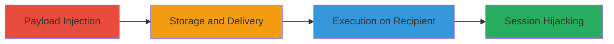

---
tags:
  - xss
  - stored-xss
  - session-hijacking
  - client-side-attack
  - tiktok
type: attack_chain
tools: []
tactics:
  - '[[Execution]]'
  - '[[Collection]]'
commands: []
platforms:
  - Web
complexity: low
procedures:
  - '[[procedures/Inject-Malicious-Payload-in-Video-Share-Text]]'
  - '[[procedures/Trigger-XSS-Execution-on-Recipient-View]]'
step_count: 2
techniques:
  - '[[JavaScript]]'
description: >-
  A multi-stage attack exploiting a stored XSS vulnerability in TikTok's video
  sharing text field to inject and execute malicious JavaScript when a recipient
  views the shared video, enabling session hijacking or impersonation.
skill_level: intermediate
impact_level: high
id: 52e43c6c-05a7-4cd6-83f8-0534f619c9e4
created_at: '2025-12-13T23:52:39.461Z'
updated_at: '2025-12-13T23:52:39.461Z'
verified: false
validated: true
submitted: true
mitre_tactics:
  - '[[Execution]]'
  - '[[Collection]]'
mitre_techniques:
  - '[[JavaScript]]'
---
# Stored XSS in TikTok Video Sharing for Recipient Session Hijacking

Multi-stage attack chain demonstrating exploitation of a stored XSS vulnerability in TikTok's video sharing feature to deliver persistent JavaScript payloads to recipients.

## Chain Metrics Dashboard

| Metric | Value |
|--------|-------|
| Chain Status | Unverified |
| Total Steps | 2 |
| Execution Time | ~5 minutes |
| Skill Level | Intermediate |
| Complexity | Low |
| Impact Level | High |

## Attack Flow Visualization

## Prerequisites & Requirements

### Required Tools

- Web browser (e.g., Chrome with developer tools for payload testing)

### Target Environment

- TikTok web or mobile app (web platform focus)
- Valid TikTok account for sender
- Recipient TikTok account

### Initial Access Requirements

- Authenticated access to TikTok as attacker
- Friend relationship or ability to send videos to target recipient
- No special network access beyond standard internet

## Detailed Attack Procedures

### Step 1: Payload Injection and Storage
procedure: [[procedures/Inject-Malicious-Payload-in-Video-Share-Text]]

**Objective**: Inject a malicious JavaScript payload into the video sharing text field, which gets stored server-side and associated with the shared video.

**Instructions**: Log into your TikTok account, select a video to share with a friend, and append a stored XSS payload to the message text field. For testing, use a benign payload like ``; for exploitation, craft a payload to exfiltrate session data, such as ``.

**Expected Output**: The video is sent successfully, and the payload is stored without immediate execution on the sender side.

**Success Indicators**:
- Video shared confirmation from TikTok
- No errors in the sharing interface

### Step 2: Trigger Execution on Recipient
procedure: [[procedures/Trigger-XSS-Execution-on-Recipient-View]]

**Objective**: Have the recipient view the shared video, triggering the stored payload execution in their browser context for session hijacking or data theft.

**Instructions**: Notify or entice the recipient to view the shared video via TikTok's messaging or feed. Upon viewing, the unsanitized message text renders the payload, executing JavaScript in the recipient's session.

**Expected Output**: JavaScript executes client-side in the recipient's browser, potentially sending session cookies to an attacker-controlled server or performing other actions like keylogging.

**Success Indicators**:
- Alert or network request observed if using a test payload
- Attacker receives exfiltrated data (e.g., cookies) on their server
- Recipient's session compromised, allowing impersonation

## Attack Chain Summary

### Key Achievements

1. Successful injection and storage of XSS payload in video share message
2. Persistent execution when recipient views the video
3. Potential for session hijacking, enabling account takeover or data theft

## Technique & Tactic Coverage

### MITRE ATT&CK Techniques

- [[JavaScript]]

### MITRE ATT&CK Tactics

- [[Execution]]
- [[Collection]]

---
*Last updated: 2023-10-01*
