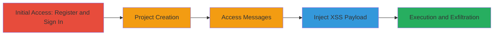

---
tags:
  - xss
  - stored-xss
  - javascript-injection
  - cookie-theft
  - csrf-token-theft
  - account-takeover
type: attack_chain
tools:
  - '[[tools/Chrome-Browser]]'
tactics:
  - '[[Execution]]'
  - '[[Collection]]'
verified: false
platforms:
  - Web
submitted: true
complexity: medium
created_at: '2023-10-01T00:00:00Z'
procedures:
  - '[[procedures/Register-and-Sign-In-to-TopCoder-Platform]]'
  - '[[procedures/Create-New-Project-on-TopCoder]]'
  - '[[procedures/Access-Project-Messages-Interface]]'
  - '[[procedures/Inject-XSS-Payload-into-Message]]'
  - '[[procedures/Observe-XSS-Execution-and-Impact]]'
step_count: 5
techniques:
  - '[[JavaScript]]'
  - '[[Steal Web Session Cookie]]'
updated_at: '2025-12-14T03:46:37.210Z'
description: >-
  A multi-stage attack exploiting a stored XSS vulnerability in TopCoder's
  project messages to inject JavaScript, execute it on victims' browsers, and
  steal session cookies and CSRF tokens for account takeover.
skill_level: intermediate
impact_level: high
id: 70d6a95c-7e5f-40f7-909a-1d3cf66c891e
validated: true
mitre_tactics:
  - '[[Execution]]'
  - '[[Collection]]'
mitre_techniques:
  - '[[JavaScript]]'
  - '[[Steal Web Session Cookie]]'
---
# Stored XSS in TopCoder Project Messages for Cookie Theft and SSO Account Takeover

Multi-stage attack chain demonstrating exploitation of a stored XSS vulnerability in the TopCoder Connect platform's project messages feature. An attacker registers an account, creates a project, injects malicious JavaScript into a message, and waits for admin approval and victim viewing to execute the payload, stealing session data for potential SSO account takeover.

## Chain Metrics Dashboard

| Metric | Value |
|--------|-------|
| Chain Status | Unverified |
| Total Steps | 5 |
| Execution Time | ~10 minutes |
| Skill Level | Intermediate |
| Complexity | Medium |
| Impact Level | High |

## Attack Flow Visualization

## Prerequisites & Requirements

### Required Tools

- [[tools/Chrome-Browser]]

### Target Environment

- Web platform: connect.topcoder.com
- Required services: SSO authentication
- Network access: Internet access to TopCoder

### Initial Access Requirements

- No prior credentials needed; new account registration
- Valid email for SSO sign-in
- No specific network position required

## Detailed Attack Procedures

### Step 1: Register and Sign In
procedure: [[procedures/Register-and-Sign-In-to-TopCoder-Platform]]

**Objective**: Gain initial access to the TopCoder platform via account creation and SSO login.

**Instructions**: Navigate to topcoder.com in [[tools/Chrome-Browser]] and complete registration, then sign in to connect.topcoder.com using SSO.

**Expected Output**: Successful login and dashboard access.

**Success Indicators**:
- Account registered
- Redirected to connect.topcoder.com dashboard

### Step 2: Create New Project
procedure: [[procedures/Create-New-Project-on-TopCoder]]

**Objective**: Establish a project that requires admin approval, setting up the environment for message injection.

**Instructions**: From the dashboard, navigate to the new project creation page and submit project details.

**Expected Output**: Project created with pending admin approval.

**Success Indicators**:
- Project ID generated
- Project listed in dashboard awaiting approval

### Step 3: Access Project Messages
procedure: [[procedures/Access-Project-Messages-Interface]]

**Objective**: Reach the messages interface where the XSS vulnerability exists.

**Instructions**: Once approved, navigate to the project's messages page using the project ID.

**Expected Output**: Messages interface loaded.

**Success Indicators**:
- URL: https://connect.topcoder.com/projects/<project_id>/messages accessible
- Chat interface visible

### Step 4: Inject XSS Payload
procedure: [[procedures/Inject-XSS-Payload-into-Message]]

**Objective**: Submit a message containing unsanitized JavaScript to store the payload.

**Instructions**: Enter a title and inject `` in the content field, then submit.

**Expected Output**: Message submitted and stored.

**Success Indicators**:
- Message appears in the list after submission
- No immediate errors on submission

### Step 5: Observe Execution
procedure: [[procedures/Observe-XSS-Execution-and-Impact]]

**Objective**: Verify payload execution on victim browsers and potential data theft.

**Instructions**: Have another user view the messages; observe alert or modify payload to exfiltrate data.

**Expected Output**: JavaScript executes, e.g., alert pops or data sent to attacker server.

**Success Indicators**:
- Alert displayed on victim view
- Stolen cookies/tokens received by attacker

## Attack Chain Summary

### Key Achievements

1. Successful registration and project creation on TopCoder
2. Injection and storage of XSS payload in project messages
3. Execution of JavaScript on victims leading to session theft
4. Potential SSO account takeover via stolen credentials

## Technique & Tactic Coverage

### MITRE ATT&CK Techniques

- [[JavaScript]]
- [[Steal Web Session Cookie]]

### MITRE ATT&CK Tactics

- [[Execution]]
- [[Collection]]

---
*Last updated: 2023-10-01T00:00:00Z*
