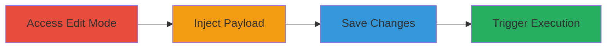

---
tags:
  - xss
  - stored-xss
  - javascript-injection
  - web-vulnerability
type: attack_chain
tools: []
tactics:
  - '[[Execution]]'
  - '[[Collection]]'
verified: false
platforms:
  - Web
submitted: true
complexity: medium
created_at: '2023-10-01T00:00:00Z'
procedures:
  - '[[procedures/Access-TopCoder-Wiki-Edit-Mode]]'
  - '[[procedures/Inject-XSS-Payload-into-Vote-Macro]]'
  - '[[procedures/Save-Malicious-Wiki-Page]]'
  - '[[procedures/Trigger-Stored-XSS-via-Page-Edit]]'
step_count: 4
techniques:
  - '[[JavaScript]]'
updated_at: '2025-12-14T03:46:26.690Z'
description: >-
  A multi-step attack exploiting a stored XSS vulnerability in the TopCoder
  wiki's vote macro to inject and trigger malicious JavaScript in authenticated
  users' browsers during page editing.
skill_level: intermediate
impact_level: high
id: ec4280b3-9ba6-4f13-93d1-7655117901bb
validated: true
mitre_tactics:
  - '[[Execution]]'
  - '[[Collection]]'
mitre_techniques:
  - '[[JavaScript]]'
---
# Stored XSS in TopCoder Wiki Vote Macro for Client-Side Execution

Multi-stage attack chain demonstrating a complete attack workflow exploiting unsanitized user input in the vote macro to store and execute JavaScript, targeting authenticated users during wiki page edits.

## Chain Metrics Dashboard

| Metric | Value |
|--------|-------|
| Chain Status | Unverified |
| Total Steps | 4 |
| Execution Time | ~5 minutes |
| Skill Level | Intermediate |
| Complexity | Medium |
| Impact Level | High |

## Attack Flow Visualization

## Prerequisites & Requirements

### Required Tools

- Web browser (e.g., Firefox for rich text editing)

### Target Environment

- TopCoder wiki platform at https://apps.topcoder.com/wiki/
- Authenticated access to wiki editing

### Initial Access Requirements

- Valid authenticated session on TopCoder
- Permissions to edit wiki pages
- Another authenticated user to trigger the payload

## Detailed Attack Procedures

### Step 1: Access Wiki Page Edit Mode
procedure: [[procedures/Access-TopCoder-Wiki-Edit-Mode]]

**Objective**: Gain access to the wiki page editor as an authenticated user to prepare for payload insertion.

**Instructions**: Log in to TopCoder and navigate to the target wiki page edit URL, such as https://apps.topcoder.com/wiki/pages/editpage.action?pageId=165871793, to enter edit mode.

**Expected Output**: The wiki page editor loads in the browser, allowing content modification.

**Success Indicators**:
- Edit interface appears
- Page content is editable

### Step 2: Inject XSS Payload into Vote Macro
procedure: [[procedures/Inject-XSS-Payload-into-Vote-Macro]]

**Objective**: Embed a malicious JavaScript payload within the vote macro syntax to bypass sanitization and store the XSS.

**Instructions**: In the rich text editor tab (e.g., on Firefox), insert the payload: {vote:What is your favorite vulnerability?} RCE SSRF XSS"> {vote}. Ensure the editor accepts the input without immediate execution.

**Expected Output**: The payload is added to the page content without errors.

**Success Indicators**:
- Payload text appears in the editor
- No sanitization blocks the script tag

### Step 3: Save the Edited Wiki Page
procedure: [[procedures/Save-Malicious-Wiki-Page]]

**Objective**: Persist the injected payload in the wiki page storage for later execution.

**Instructions**: Submit the edit form to save the changes, storing the malicious vote macro content on the server.

**Expected Output**: Confirmation of successful save, with the page now containing the stored payload.

**Success Indicators**:
- Page saves without validation errors
- Edited content is viewable in read mode

### Step 4: Trigger Stored XSS via Page Edit
procedure: [[procedures/Trigger-Stored-XSS-via-Page-Edit]]

**Objective**: Cause the payload to execute in a victim's browser by inducing them to edit the compromised page.

**Instructions**: Have another authenticated user access the edit URL for the modified page (e.g., https://apps.topcoder.com/wiki/pages/editpage.action?pageId=165871793). The payload executes automatically upon loading the editor.

**Expected Output**: An alert box displays the document domain, confirming JavaScript execution.

**Success Indicators**:
- Alert pops up in the victim's browser
- Potential for cookie theft or further exploitation

## Attack Chain Summary

### Key Achievements

1. Successful injection of unsanitized JavaScript via vote macro
2. Storage of payload without detection during save
3. Execution in victim browsers during editing, enabling client-side attacks like session hijacking
4. Demonstration of impact on authenticated users

## Technique & Tactic Coverage

### MITRE ATT&CK Techniques

- [[JavaScript]]

### MITRE ATT&CK Tactics

- [[Execution]]
- [[Collection]]

---
*Last updated: 2023-10-01T00:00:00Z*
