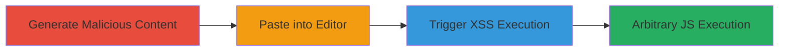

---
tags:
  - xss
  - stored-xss
  - trix-editor
  - javascript-execution
  - basecamp
type: attack_chain
tools:
  - '[[tools/Trix-Editor]]'
  - '[[tools/Browser]]'
tactics:
  - '[[Execution]]'
  - '[[Collection]]'
commands: []
platforms:
  - Web
complexity: medium
procedures:
  - '[[procedures/Generate-Malicious-Trix-Attachment-Content]]'
  - '[[procedures/Paste-Malicious-Content-into-Trix-Editor]]'
  - '[[procedures/Trigger-and-Observe-XSS-Execution]]'
step_count: 3
techniques:
  - '[[JavaScript]]'
description: >-
  A multi-stage attack exploiting improper sanitization in Trix editor 2.1.1 to
  achieve stored XSS through pasting malicious HTML, leading to arbitrary
  JavaScript execution in applications like Basecamp.
skill_level: intermediate
impact_level: high
id: 1adde67b-d7e2-4e88-8e3a-add19b159e37
created_at: '2025-12-13T23:55:06.253Z'
updated_at: '2025-12-13T23:55:06.253Z'
verified: false
validated: true
submitted: true
mitre_tactics:
  - '[[Execution]]'
  - '[[Collection]]'
mitre_techniques:
  - '[[JavaScript]]'
---
# Stored XSS in Trix Editor via Malicious Pasted Content

Multi-stage attack chain demonstrating a complete attack workflow exploiting stored XSS in Trix editor version 2.1.1.

## Chain Metrics Dashboard

| Metric | Value |
|--------|-------|
| Chain Status | Unverified |
| Total Steps | 3 |
| Execution Time | ~2 minutes |
| Skill Level | Intermediate |
| Complexity | Medium |
| Impact Level | High |

## Attack Flow Visualization

## Prerequisites & Requirements

### Required Tools

- [[tools/Trix-Editor]]
- [[tools/Browser]]

### Target Environment

- Web platform with Trix editor 2.1.1 integrated (e.g., Basecamp web or desktop app)
- No specific ports required; operates over standard HTTP/HTTPS
- Access to a Trix editor instance for pasting content

### Initial Access Requirements

- Valid user session in the target application (e.g., logged into Basecamp)
- Browser access to load custom HTML demos
- No prior privileged access needed; exploits user-level paste functionality

## Detailed Attack Procedures

### Step 1: Generate Malicious Content
procedure: [[procedures/Generate-Malicious-Trix-Attachment-Content]]

**Objective**: Create copyable HTML content with a malicious data-trix-attachment that embeds an executable script via an img onerror handler.

**Instructions**: Load a custom HTML page in the browser that initializes the Trix editor demo and generates a div element with the malicious attachment. The HTML uses document.write to output the div containing JSON-like data with an img tag where src fails and onerror triggers alert(document.domain).

**Expected Output**: A visible 'copy me' button or selectable div with the malicious content ready for clipboard copying.

**Success Indicators**:
- HTML demo loads without errors
- Malicious div element is rendered and copyable

### Step 2: Paste Malicious Content
procedure: [[procedures/Paste-Malicious-Content-into-Trix-Editor]]

**Objective**: Embed the malicious attachment into a live Trix editor instance by pasting the copied content, bypassing sanitization to store the payload.

**Instructions**: Copy the generated div from the demo, then navigate to a target Trix editor field (e.g., in Basecamp) and paste the content. The paste operation inserts the data-trix-attachment without proper validation, embedding the img tag.

**Expected Output**: The pasted content appears in the editor as an attachment or image placeholder, with no immediate errors.

**Success Indicators**:
- Content pastes successfully into the editor
- No sanitization blocks the img tag insertion

### Step 3: Trigger and Observe Execution
procedure: [[procedures/Trigger-and-Observe-XSS-Execution]]

**Objective**: Cause the malicious script to execute in the application's context, demonstrating arbitrary JavaScript injection.

**Instructions**: Interact with the editor or save/load the content to trigger rendering of the embedded img tag. The onerror event fires due to the invalid src, executing the alert.

**Expected Output**: An alert dialog pops up displaying the document domain, confirming XSS execution.

**Success Indicators**:
- Alert executes showing the application's domain
- Potential for further payload escalation, like data exfiltration

## Attack Chain Summary

### Key Achievements

1. Successful generation of bypassable malicious attachment
2. Storage of XSS payload via paste without detection
3. Arbitrary JavaScript execution in user session, enabling unauthorized actions or info disclosure

## Technique & Tactic Coverage

### MITRE ATT&CK Techniques

- [[JavaScript]]

### MITRE ATT&CK Tactics

- [[Execution]]
- [[Collection]]

---
*Last updated: 2023-10-01T00:00:00Z*
