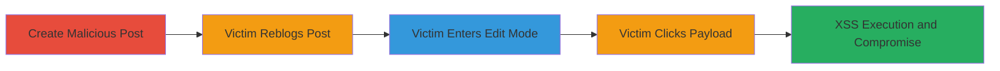

---
tags:
  - xss
  - stored-xss
  - tumblr
  - javascript
  - account-compromise
type: attack_chain
tools: []
tactics:
  - '[[Execution]]'
commands: []
platforms:
  - Web
complexity: medium
procedures:
  - '[[procedures/Create-Malicious-Tumblr-Post-with-XSS-Payload]]'
  - '[[procedures/Induce-Victim-to-Reblog-Post]]'
  - '[[procedures/Trigger-XSS-in-Victim-Edit-Mode]]'
  - '[[procedures/Execute-XSS-Payload-via-Click]]'
step_count: 5
techniques:
  - '[[JavaScript]]'
description: >-
  A multi-stage stored XSS attack on Tumblr where a malicious payload is
  embedded in a post, stored via reblog, and triggered in the victim's edit mode
  to execute JavaScript and potentially compromise the account.
skill_level: intermediate
impact_level: high
id: c28bd4ad-2b52-4d06-afe6-d3f9df5a2406
created_at: '2025-12-14T03:46:26.718Z'
updated_at: '2025-12-14T03:46:26.718Z'
verified: false
validated: true
submitted: true
mitre_tactics:
  - '[[Execution]]'
mitre_techniques:
  - '[[JavaScript]]'
---
# Stored XSS in Tumblr Posts via Reblog and Edit Mode for Account Compromise

## Overview

This attack chain exploits a stored XSS vulnerability in Tumblr's assets.txmblr.com domain. An attacker crafts a post with a malicious HTML form containing a JavaScript payload disguised as a 'CLICK ME' submit button. When a victim reblogs the post to their blog and enters edit mode, the payload renders and executes upon clicking, allowing arbitrary JavaScript execution in the victim's browser. This can lead to session hijacking, data theft, or account takeover. The vulnerability stems from insufficient sanitization of HTML in stored post content during reblog and edit rendering.

## Chain Metrics Dashboard

| Metric | Value |
|--------|-------|
| Chain Status | Unverified |
| Total Steps | 5 |
| Execution Time | ~5 minutes |
| Skill Level | Intermediate |
| Complexity | Medium |
| Impact Level | High |

## Attack Flow Visualization

## Prerequisites & Requirements

### Required Tools

- None (relies on browser and Tumblr account)

### Target Environment

- Tumblr platform (web-based)
- Victim must have a Tumblr account and interact with posts
- No specific ports or services required beyond standard web access

### Initial Access Requirements

- Attacker needs a valid Tumblr account
- Victim must view and interact with the attacker's post (social engineering implied)
- No prior network access needed; operates over public internet

## Detailed Attack Procedures

### Step 1: Create Malicious Post
procedure: [[procedures/Create-Malicious-Tumblr-Post-with-XSS-Payload]]

**Objective**: Embed a stored XSS payload in a Tumblr post that will persist when reblogged.

**Instructions**: Log in to the attacker's Tumblr account, create a new post, and insert the PoC payload: `<form><input type=submit value="CLICK ME" formaction=javascript:alert(document.domain)></form>`. Publish the post publicly to lure victims.

**Expected Output**: Post is live on the attacker's blog with the hidden payload.

**Success Indicators**:
- Post publishes without errors
- Payload HTML is stored intact

### Step 2: Induce Victim to Reblog Post
procedure: [[procedures/Induce-Victim-to-Reblog-Post]]

**Objective**: Get the victim to reblog the post, storing the payload on their blog.

**Instructions**: Share the post via social channels or wait for organic interaction. The victim reblogs the post to their own blog, which copies the content including the malicious HTML.

**Expected Output**: Payload is now stored in the victim's blog content.

**Success Indicators**:
- Victim reblogs the post
- Malicious HTML persists in victim's dashboard view

### Step 3: Victim Enters Edit Mode
procedure: [[procedures/Trigger-XSS-in-Victim-Edit-Mode]]

**Objective**: Render the payload in the victim's edit interface where it becomes interactive.

**Instructions**: The victim navigates to their blog's edit mode or the specific reblogged post's edit page. The HTML form renders as a visible 'CLICK ME' button due to improper sanitization.

**Expected Output**: 'CLICK ME' button appears in the edit interface.

**Success Indicators**:
- Edit mode loads without sanitizing the payload
- Button is clickable and visible

### Step 4: Victim Clicks Payload
procedure: [[procedures/Execute-XSS-Payload-via-Click]]

**Objective**: Trigger the JavaScript execution through user interaction.

**Instructions**: The victim clicks the 'CLICK ME' submit button, activating the `formaction=javascript:alert(document.domain)` attribute.

**Expected Output**: JavaScript executes, showing an alert with the domain (e.g., tumblr.com).

**Success Indicators**:
- Alert box pops up
- Console logs JavaScript execution

### Step 5: XSS Execution

**Objective**: Demonstrate or perform malicious actions post-trigger.

**Instructions**: Upon execution, the alert proves XSS success. In a real attack, replace the alert with code for cookie theft, keylogging, or API calls to hijack the session.

**Expected Output**: Arbitrary JS runs in victim's context; potential data exfiltration or account actions.

**Success Indicators**:
- JS payload executes without errors
- Attacker observes effects (e.g., via callback to external server)

## Attack Chain Summary

### Key Achievements

1. Successful storage of XSS payload in Tumblr post
2. Persistence through reblog mechanism
3. Triggering of XSS in authenticated edit context
4. Execution leading to potential account compromise

## Technique & Tactic Coverage

### MITRE ATT&CK Techniques

- [[JavaScript]]

### MITRE ATT&CK Tactics

- [[Execution]]

---
*Last updated: 2023-10-01*
