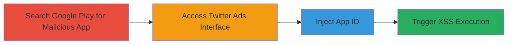

---
tags:
  - xss
  - stored-xss
  - twitter
  - google-play
  - web-vulnerability
type: attack_chain
tools:
  - '[[tools/Chrome]]'
tactics:
  - '[[Execution]]'
verified: false
platforms:
  - Web
submitted: true
complexity: medium
created_at: '2023-10-01T00:00:00Z'
procedures:
  - '[[procedures/Search-for-Malicious-App-in-Google-Play-Store]]'
  - '[[procedures/Access-Twitter-Ads-Campaign-Creation-Interface]]'
  - '[[procedures/Inject-Malicious-App-ID-into-Twitter-Ads]]'
  - '[[procedures/Trigger-and-Observe-Stored-XSS-Execution]]'
step_count: 4
techniques:
  - '[[JavaScript]]'
  - '[[Exploit Public-Facing Application]]'
updated_at: '2025-12-14T03:16:02.358Z'
description: >-
  A stored XSS vulnerability in Twitter's ads platform exploited by injecting a
  malicious app ID from Google Play, leading to arbitrary JavaScript execution
  in authenticated users' browsers.
skill_level: intermediate
impact_level: high
id: 025bfc0f-c4e4-44d8-b8af-51f97ca5874b
validated: true
mitre_tactics:
  - '[[Execution]]'
mitre_techniques:
  - '[[JavaScript]]'
  - '[[Exploit Public-Facing Application]]'
---
---

# Stored XSS in Twitter Ads via Malicious Google Play App ID

Multi-stage attack chain demonstrating a complete attack workflow exploiting a stored XSS vulnerability in Twitter's ads platform.

## Chain Metrics Dashboard

| Metric | Value |
|--------|-------|
| Chain Status | Unverified |
| Total Steps | 4 |
| Execution Time | ~5 minutes |
| Skill Level | Intermediate |
| Complexity | Medium |
| Impact Level | High |

## Attack Flow Visualization

## Prerequisites & Requirements

### Required Tools

- [[tools/Chrome]]

### Target Environment

- Web platform
- Access to Twitter Ads (requires authenticated account with ads permissions)
- Access to Google Play Store

### Initial Access Requirements

- Authenticated Twitter account with ability to create app install campaigns
- No special network access beyond internet connectivity
- Prior knowledge of XSS payloads

## Detailed Attack Procedures

### Step 1: Search for Malicious App in Google Play Store
procedure: [[procedures/Search-for-Malicious-App-in-Google-Play-Store]]

**Objective**: Locate an existing app in Google Play whose name contains an XSS payload to use for injection.

**Instructions**: Open a web browser and navigate to the Google Play Store search. Enter a search query for a common XSS payload like '>'. Review search results to find a matching app, such as one with ID 'com.rssappmaker.athe319' at https://play.google.com/store/apps/details?id=com.rssappmaker.athe319.

**Expected Output**: Identification of the app ID containing the unsanitized payload in its name.

**Success Indicators**:
- App found with payload in name
- App ID noted for later use

### Step 2: Access Twitter Ads Campaign Creation Interface
procedure: [[procedures/Access-Twitter-Ads-Campaign-Creation-Interface]]

**Objective**: Navigate to the Twitter Ads platform and reach the app installs campaign setup where the vulnerable input field is located.

**Instructions**: Log in to your Twitter Ads account using a web browser. Go to https://ads.twitter.com/accounts/18ce53wsl3g/campaigns/new_objective/app_installs (replace account ID if needed). Locate the 'Add New App' section, which includes the Google Play app ID input field.

**Expected Output**: The campaign creation page loaded with the 'Add New App' input visible.

**Success Indicators**:
- Authenticated access to ads platform
- Input field for app ID available

### Step 3: Inject Malicious App ID into Twitter Ads
procedure: [[procedures/Inject-Malicious-App-ID-into-Twitter-Ads]]

**Objective**: Submit the malicious app ID to trigger the fetching and storage of the tainted app name.

**Instructions**: In the 'Add New App' section, paste the malicious app ID 'com.rssappmaker.athe319' into the Google Play app ID input field. Click the 'Add App' button to submit.

**Expected Output**: The app is added to the campaign, with its name fetched from Google Play and displayed in the interface.

**Success Indicators**:
- App added successfully
- App name appears in the campaign details without visible errors

### Step 4: Trigger and Observe Stored XSS Execution
procedure: [[procedures/Trigger-and-Observe-Stored-XSS-Execution]]

**Objective**: View the campaign details to execute the stored XSS payload, confirming arbitrary JavaScript execution.

**Instructions**: After adding the app, view the campaign details or summary page where the app name is rendered. The unsanitized app name will trigger the XSS payload, such as displaying an alert box via onerror=alert(1).

**Expected Output**: JavaScript alert or console execution confirming the payload fired.

**Success Indicators**:
- Alert box pops up or JS executes in browser console
- No sanitization errors; payload runs as intended

## Attack Chain Summary

### Key Achievements

1. Identified a real-world app with embedded XSS payload in Google Play.
2. Exploited lack of input sanitization in Twitter Ads app fetching.
3. Achieved stored XSS leading to potential session hijacking for any user viewing the campaign.

## Technique & Tactic Coverage

### MITRE ATT&CK Techniques

- [[JavaScript]]
- [[Exploit Public-Facing Application]]

### MITRE ATT&CK Tactics

- [[Execution]]

---

*Last updated: 2023-10-01T00:00:00Z*
