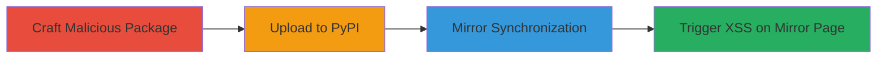

# Stored XSS in Uber's PyPI Mirror via Malicious Package Metadata Injection

Multi-stage attack chain demonstrating exploitation of a stored XSS vulnerability in Uber's PyPI mirror site, archive.uber.com. The attack involves crafting a Python package with malicious JavaScript URIs in metadata fields, uploading it to PyPI, waiting for Uber's mirroring process to ingest and render the data unsafely as HTML links, and then triggering execution by clicking the link on the mirrored page. This leads to persistent XSS affecting any user who visits and interacts with the page, potentially enabling arbitrary JavaScript execution such as data theft or session hijacking.

## Chain Metrics Dashboard

| Metric | Value |
|--------|-------|
| Chain Status | Unverified |
| Total Steps | 4 |
| Execution Time | ~30 minutes |
| Skill Level | Intermediate |
| Complexity | Medium |
| Impact Level | High |

## Attack Flow Visualization

## Prerequisites & Requirements

### Required Tools

- Python development environment with distutils
- Access to PyPI upload (requires PyPI account)

### Target Environment

- Web platform
- PyPI repository service
- Uber's archive.uber.com mirror

### Initial Access Requirements

- Valid PyPI account for package upload
- Internet access to visit mirrored pages
- No prior access to Uber systems needed

## Detailed Attack Procedures

### Step 1: Craft Malicious Package
procedure: [[procedures/Craft-Malicious-Python-Package-with-XSS-Payload]]

**Objective**: Create a Python package with injected JavaScript URIs in metadata to exploit lack of sanitization during HTML rendering.

**Instructions**: Develop a setup.py file using distutils.core, setting home_page and download_url to 'Javascript:alert(0)'. Package it into a .tar.gz archive.

**Expected Output**: A distributable Python package file ready for upload.

**Success Indicators**:
- setup.py file created with malicious parameters
- Package archives successfully without errors

### Step 2: Upload to PyPI
procedure: [[procedures/Upload-Malicious-Package-to-PyPI]]

**Objective**: Submit the malicious package to PyPI, making it available for mirroring by third-party services like Uber's.

**Instructions**: Use standard Python packaging tools to build and upload the .tar.gz to PyPI via your account.

**Expected Output**: Package appears in PyPI repository, visible via search or direct URL.

**Success Indicators**:
- Upload confirmation from PyPI
- Package metadata verifiable on PyPI

### Step 3: Wait for Mirror Synchronization
procedure: [[procedures/Wait-for-Uber-PyPI-Mirror-Synchronization]]

**Objective**: Allow Uber's automated mirroring process to sync the package from PyPI and generate an unsafe HTML page.

**Instructions**: Monitor the package page on archive.uber.com; the process typically occurs periodically without manual intervention.

**Expected Output**: Mirrored page at http://archive.uber.com/pypi/simple/[package-name]/ renders home_page and download_url as clickable <a> tags with javascript: URIs.

**Success Indicators**:
- Package page exists on archive.uber.com
- Inspect HTML source shows unsanitized href attributes

### Step 4: Trigger XSS Execution
procedure: [[procedures/Trigger-XSS-on-Uber-Mirror-Page]]

**Objective**: Visit the mirrored page and interact with the malicious link to execute the injected JavaScript.

**Instructions**: Navigate to the package URL on archive.uber.com and click the home_page or download_url link labeled as such.

**Expected Output**: JavaScript alert(0) pops up, confirming XSS execution; in a real attack, this could be replaced with malicious payload.

**Success Indicators**:
- Alert dialog appears in browser
- Browser console logs JavaScript execution

## Attack Chain Summary

### Key Achievements

1. Successful injection of persistent XSS payload into public package metadata
2. Exploitation of mirroring process's HTML rendering flaw without direct access to Uber systems
3. Demonstration of arbitrary JavaScript execution impacting all visitors to the mirrored page

## Technique & Tactic Coverage

### MITRE ATT&CK Techniques

- [[JavaScript]]
- [[Exploit Public-Facing Application]]

### MITRE ATT&CK Tactics

- [[Execution]]

---
*Last updated: 2023-10-01T00:00:00Z*
