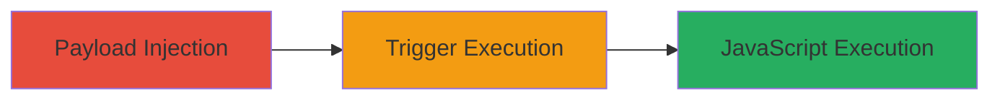

# Stored XSS in Uber Developer Portal Application Name Leading to Arbitrary JavaScript Execution

Multi-stage attack chain demonstrating a complete stored XSS workflow in Uber's developer portal at https://login.uber.com/applications.

## Chain Metrics Dashboard

| Metric | Value |
|--------|-------|
| Chain Status | Unverified |
| Total Steps | 2 |
| Execution Time | ~5 minutes |
| Skill Level | Intermediate |
| Complexity | Medium |
| Impact Level | High |

## Attack Flow Visualization

## Prerequisites & Requirements

### Required Tools

- [[tools/Firefox]]
- [[tools/Chrome]]

### Target Environment

- Web platform
- Access to Uber developer portal at https://login.uber.com/applications
- Valid Uber developer account credentials

### Initial Access Requirements

- Authenticated session as a developer
- No special privileges beyond standard app creation/deletion
- Network access to Uber's login domain

## Detailed Attack Procedures

### Step 1: Payload Injection
procedure: [[procedures/Inject-Malicious-Payload-into-Uber-App-Name]]

**Objective**: Create a new application with a stored XSS payload in the name field to persist malicious JavaScript.

**Instructions**: Log in to the Uber developer portal and navigate to the applications section. Enter the payload "> as the application name while creating a new app. Save the application to store the payload.

**Expected Output**: Application created successfully with the malicious name reflected in the list without immediate execution.

**Success Indicators**:
- Application appears in the list with the injected payload visible in the name field
- No errors during creation

### Step 2: Trigger Execution
procedure: [[procedures/Trigger-XSS-via-Uber-App-Deletion]]

**Objective**: Interact with the malicious application (e.g., via deletion) to trigger the XSS payload in the victim's browser context.

**Instructions**: From the applications list, select the maliciously named app and initiate deletion. The payload executes during the rendering of the app name in the deletion confirmation or list view.

**Expected Output**: A JavaScript alert or prompt (e.g., prompt(1)) appears in the browser, confirming execution.

**Success Indicators**:
- Arbitrary JavaScript runs, such as a prompt dialog
- Potential for further exploitation like cookie theft if payload is escalated

## Attack Chain Summary

### Key Achievements

1. Successful injection of stored XSS payload into application metadata
2. Triggering of payload execution in an authenticated user's browser
3. Demonstration of high-impact client-side attack potential, including session hijacking

## Technique & Tactic Coverage

### MITRE ATT&CK Techniques

- [[JavaScript]]

### MITRE ATT&CK Tactics

- [[Execution]]
- [[Collection]]

---
*Last updated: 2023-10-01T00:00:00Z*
