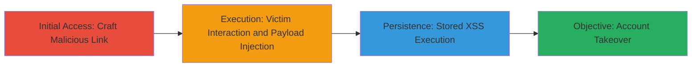

---
tags:
  - xss
  - stored-xss
  - oauth
  - account-takeover
  - uber
type: attack_chain
tools: []
tactics:
  - '[[Initial Access]]'
  - '[[Execution]]'
commands: []
platforms:
  - Web
complexity: medium
procedures:
  - '[[procedures/Exploit-Stored-XSS-in-OAuth-Redirect-URI]]'
step_count: 2
techniques:
  - '[[JavaScript]]'
  - '[[Exploit Public-Facing Application]]'
description: >-
  A multi-stage attack exploiting a stored XSS vulnerability in the OAuth
  redirect_uri parameter to execute JavaScript and takeover victim accounts on
  Uber's authentication domains.
skill_level: intermediate
impact_level: high
id: 26671062-843e-4074-a6f7-b7b639ce665f
created_at: '2025-12-13T23:52:43.880Z'
updated_at: '2025-12-13T23:52:43.880Z'
verified: false
validated: true
submitted: true
mitre_tactics:
  - '[[Initial Access]]'
  - '[[Execution]]'
mitre_techniques:
  - '[[JavaScript]]'
  - '[[Exploit Public-Facing Application]]'
---
# Stored XSS in Uber OAuth Redirect URI Leading to Account Takeover

## Overview

This attack chain demonstrates a stored XSS vulnerability in Uber's OAuth authorization endpoint at auth.uber.com/oauth/v2/authorize. Discovered by researcher corb3nik and reported on August 21, 2018, the flaw allows attackers to inject malicious JavaScript via the redirect_uri parameter. By tricking an authenticated user into visiting a crafted malicious link, the payload is stored and executes in the context of login.uber.com or auth.uber.com, enabling session hijacking and full account takeover. The attack requires social engineering to lure the victim but leverages insufficient input validation on the redirect_uri to achieve high-impact results.

## Chain Metrics Dashboard

| Metric | Value |
|--------|-------|
| Chain Status | Unverified |
| Total Steps | 2 |
| Execution Time | ~5 minutes |
| Skill Level | Intermediate |
| Complexity | Medium |
| Impact Level | High |

## Attack Flow Visualization

## Prerequisites & Requirements

### Required Tools

- Web browser with developer tools for payload testing
- URL encoder/decoder for crafting payloads

### Target Environment

- Web platform
- OAuth2 authorization server (e.g., Uber's auth.uber.com)
- Authenticated victim session on login.uber.com or auth.uber.com

### Initial Access Requirements

- Attacker must have a way to deliver a malicious link (e.g., phishing email or social engineering)
- No direct network access to Uber's internal systems required
- Victim must be authenticated with Uber

## Detailed Attack Procedures

### Step 1: Craft Malicious OAuth Authorization Link
procedure: [[procedures/Exploit-Stored-XSS-in-OAuth-Redirect-URI]]

**Objective**: Create a malicious redirect_uri containing an XSS payload that will be stored and executed upon victim authorization.

**Instructions**: Construct a URL to Uber's OAuth endpoint with a redirect_uri parameter that includes a JavaScript payload. For example, encode a payload like `` or a more advanced one to steal cookies or session tokens, such as ``. The full URL might look like: `https://auth.uber.com/oauth/v2/authorize?client_id=malicious_client&redirect_uri=https://evil.com/callback?payload=&response_type=code&scope=profile`. Use a URL encoder to ensure the payload bypasses basic filters.

**Expected Output**: A clickable link that, when visited by an authenticated user, prompts OAuth authorization and stores the payload.

**Success Indicators**:
- Link generates without errors
- Payload is accepted in redirect_uri without immediate sanitization

### Step 2: Deliver Link and Execute Takeover
procedure: [[procedures/Exploit-Stored-XSS-in-OAuth-Redirect-URI]]

**Objective**: Trick the victim into interacting with the link, triggering payload storage and execution for account takeover.

**Instructions**: Send the crafted link to the target victim via email, chat, or other social engineering means, impersonating a legitimate Uber communication (e.g., "Click to authorize a new app"). Upon clicking and authorizing, the redirect_uri payload is stored server-side. When the victim next accesses login.uber.com or auth.uber.com, the stored XSS executes arbitrary JavaScript in their session context. Use the payload to exfiltrate session cookies, tokens, or perform actions like changing account details.

**Expected Output**: JavaScript execution in victim's browser, visible via alert() for testing or network requests to attacker-controlled server for real exploitation.

**Success Indicators**:
- Victim authorizes the link
- Payload executes (e.g., data exfiltrated to attacker server)
- Attacker gains access to victim's Uber account

## Attack Chain Summary

### Key Achievements

1. Successful injection of stored XSS payload via OAuth redirect_uri
2. Execution of JavaScript in high-privilege authentication domains
3. Complete account takeover enabling unauthorized access to victim data and actions

## Technique & Tactic Coverage

### MITRE ATT&CK Techniques

- [[JavaScript]]
- [[Exploit Public-Facing Application]]

### MITRE ATT&CK Tactics

- [[Initial Access]]
- [[Execution]]

---
*Last updated: 2023-10-01*
