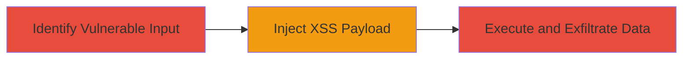

---
tags:
  - xss
  - stored-xss
  - javascript
  - web
  - data-theft
  - account-takeover
type: attack_chain
tools: []
tactics:
  - '[[Execution]]'
  - '[[Collection]]'
verified: false
platforms:
  - Web
submitted: true
complexity: medium
created_at: '2023-10-01T00:00:00Z'
procedures:
  - '[[procedures/Identify-Vulnerable-Input-Field-in-Forum-Comments]]'
  - '[[procedures/Inject-XSS-Payload-into-Forum-Comment]]'
  - '[[procedures/Observe-and-Exploit-Payload-Execution-for-Data-Theft]]'
step_count: 3
techniques:
  - '[[JavaScript]]'
  - '[[Drive-by Compromise]]'
updated_at: '2025-12-14T03:16:37.239Z'
description: >-
  A multi-step attack exploiting a stored XSS vulnerability in the
  community.ubnt.com forum to inject malicious JavaScript, execute it on other
  users' browsers, and steal sensitive data like session cookies for potential
  account takeover.
skill_level: intermediate
impact_level: high
id: 0ac5a110-b3c2-4ec1-b448-233fbfb47b34
validated: true
mitre_tactics:
  - '[[Execution]]'
  - '[[Collection]]'
mitre_techniques:
  - '[[JavaScript]]'
  - '[[Drive-by Compromise]]'
---
# Stored XSS in Ubiquiti Community Forum for User Data Theft and Account Takeover

Multi-stage attack chain demonstrating a complete attack workflow exploiting inadequate input validation in the Ubiquiti community forum.

## Chain Metrics Dashboard

| Metric | Value |
|--------|-------|
| Chain Status | Unverified |
| Total Steps | 3 |
| Execution Time | ~5 minutes |
| Skill Level | Intermediate |
| Complexity | Medium |
| Impact Level | High |

## Attack Flow Visualization

## Prerequisites & Requirements

### Required Tools

- Browser with developer tools (e.g., Chrome DevTools)
- Attacker-controlled server for data exfiltration (e.g., a simple HTTP server)

### Target Environment

- Web platform: community.ubnt.com forum
- Required services/ports: HTTP/HTTPS on port 80/443
- Network access requirements: Public internet access to the forum

### Initial Access Requirements

- No credentials required for posting comments (anonymous or registered user)
- Network position: External attacker
- Prior access needed: None

## Detailed Attack Procedures

### Step 1: Identify Vulnerable Input Field
procedure: [[procedures/Identify-Vulnerable-Input-Field-in-Forum-Comments]]

**Objective**: Locate input fields in the forum that accept unsanitized HTML and JavaScript, such as comment sections under posts.

**Instructions**: Navigate to any post on community.ubnt.com and attempt to post a comment. Test with a basic payload like `` to check for execution without sanitization.

**Expected Output**: The alert pops up when the page loads or the comment is previewed, confirming lack of input validation.

**Success Indicators**:
- Payload executes in the poster's browser
- No error or stripping of script tags

### Step 2: Inject XSS Payload
procedure: [[procedures/Inject-XSS-Payload-into-Forum-Comment]]

**Objective**: Post a malicious comment containing JavaScript that will execute when other users view the thread, targeting sensitive data like cookies.

**Instructions**: In the comment field under a forum post, enter a payload such as ``. Submit the comment and verify it appears in the thread.

**Expected Output**: The comment is stored and visible in the forum thread without modification.

**Success Indicators**:
- Comment posts successfully
- Script tag is preserved in the HTML source

### Step 3: Observe and Exploit Payload Execution
procedure: [[procedures/Observe-and-Exploit-Payload-Execution-for-Data-Theft]]

**Objective**: Monitor execution of the injected script on victims' browsers to collect session cookies and enable account takeover.

**Instructions**: Have a victim (or wait for users) view the thread containing the malicious comment. On the attacker's server, capture the exfiltrated data via the image src request.

**Expected Output**: Incoming HTTP requests to attacker.com with cookie data in the query string.

**Success Indicators**:
- Data received on attacker server
- Stolen cookies can be used to hijack sessions

## Attack Chain Summary

### Key Achievements

1. Successful identification of stored XSS in forum comments
2. Injection and persistence of malicious JavaScript
3. Exfiltration of user cookies leading to potential account takeover

## Technique & Tactic Coverage

### MITRE ATT&CK Techniques

- [[JavaScript]]
- [[Drive-by Compromise]]

### MITRE ATT&CK Tactics

- [[Execution]]
- [[Collection]]

---
*Last updated: 2023-10-01T00:00:00Z*
