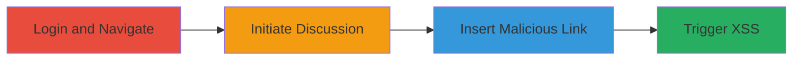

---
tags:
  - xss
  - stored-xss
  - udemy
  - javascript-injection
type: attack_chain
tools:
  - '[[tools/Google-Chrome]]'
tactics:
  - '[[Execution]]'
commands: []
verified: false
platforms:
  - Web
submitted: true
complexity: low
procedures:
  - '[[procedures/Inject-Malicious-Link-for-Stored-XSS-in-Udemy-Discussions]]'
step_count: 10
techniques:
  - '[[JavaScript]]'
description: >-
  Demonstrates a stored XSS vulnerability in Udemy's discussion feature by
  injecting a malicious URL payload into a link, leading to JavaScript execution
  upon clicking.
skill_level: beginner
impact_level: low
id: 96af724e-7a90-4a9e-8dd7-97144e805287
created_at: '2025-12-14T03:15:10.466Z'
updated_at: '2025-12-14T03:15:10.466Z'
validated: true
mitre_tactics:
  - '[[Execution]]'
mitre_techniques:
  - '[[JavaScript]]'
---
# Stored XSS in Udemy Course Discussions via Malicious Link Injection

Multi-stage attack chain demonstrating exploitation of a stored XSS vulnerability in Udemy's course discussion feature through malicious link insertion.

## Chain Metrics Dashboard

| Metric | Value |
|--------|-------|
| Chain Status | Unverified |
| Total Steps | 10 |
| Execution Time | ~5 minutes |
| Skill Level | Beginner |
| Complexity | Low |
| Impact Level | Low |

## Attack Flow Visualization

## Prerequisites & Requirements

### Required Tools

- [[tools/Google-Chrome]]

### Target Environment

- Web platform (Udemy website)
- Enrolled Udemy course access
- No specific services/ports required beyond standard HTTPS

### Initial Access Requirements

- Valid Udemy account credentials
- Enrollment in at least one course
- Standard internet access

## Detailed Attack Procedures

### Step 1: Log in to the Udemy Account

**Objective**: Gain access to the user dashboard to reach course discussions.

**Instructions**: Open a web browser and navigate to the Udemy login page. Enter valid credentials to authenticate.

**Expected Output**: Redirect to the user dashboard upon successful login.

**Success Indicators**:
- Dashboard loads with personalized content
- Account menu visible

### Step 2: Navigate to My Courses

**Objective**: Access the list of enrolled courses to select a target for discussion.

**Instructions**: From the dashboard, click on the 'My Courses' section.

**Expected Output**: Display of enrolled courses list.

**Success Indicators**:
- Course tiles or list appears
- Ability to select a course

### Step 3: Select Any Enrolled Course

**Objective**: Enter the course environment where discussions are hosted.

**Instructions**: Choose and click on any course from the enrolled list.

**Expected Output**: Course page loads with lectures and discussion tabs.

**Success Indicators**:
- Course content visible
- Discussion section accessible

### Step 4: Click on Add Discussion

**Objective**: Initiate creation of a new discussion post to access the editor.

**Instructions**: Locate and click the 'Add Discussion' button within the course.

**Expected Output**: Discussion editor interface opens.

**Success Indicators**:
- Text editor and formatting toolbar appear
- Option to insert links available

### Step 5: Click on Link -> Insert Link

**Objective**: Open the link insertion dialog to prepare for payload injection.

**Instructions**: In the editor toolbar, select the Link option and choose 'Insert Link'.

**Expected Output**: Dialog box with URL and text fields appears.

**Success Indicators**:
- URL input field ready for entry
- Link text field available

### Step 6: Enter the Malicious Payload in the URL Field
procedure: [[procedures/Inject-Malicious-Link-for-Stored-XSS-in-Udemy-Discussions]]

**Objective**: Inject the XSS payload to break out of the URL attribute and execute JavaScript.

**Instructions**: In the URL field, enter the payload: `">`.

**Expected Output**: Payload accepted without immediate error.

**Success Indicators**:
- Payload entered successfully
- No validation blocking the input

### Step 7: Enter Any Text for the Link Display

**Objective**: Provide visible text for the malicious link to make it clickable.

**Instructions**: In the link text field, enter arbitrary text such as 'Click Me'.

**Expected Output**: Link preview shows the entered text.

**Success Indicators**:
- Text associated with the link
- Preview renders as a hyperlink

### Step 8: Click on Insert

**Objective**: Embed the malicious link into the discussion post.

**Instructions**: Submit the dialog by clicking 'Insert'.

**Expected Output**: Link inserted into the editor as HTML.

**Success Indicators**:
- Link appears in the discussion body
- No sanitization alters the payload

### Step 9: Click on the Inserted Text Link

**Objective**: Trigger the stored XSS by interacting with the injected link.

**Instructions**: In the discussion preview or after posting, click the created link.

**Expected Output**: JavaScript executes via the onerror handler.

**Success Indicators**:
- Browser prompts for interaction
- No errors in console blocking execution

### Step 10: Observe JavaScript Execution

**Objective**: Verify the impact of the XSS payload.

**Instructions**: Note the prompt dialog displaying the document domain.

**Expected Output**: Alert or prompt box shows 'udemy.com' or similar.

**Success Indicators**:
- JavaScript code runs in the context of the page
- Prompt confirms domain access

## Attack Chain Summary

### Key Achievements

1. Successful injection of XSS payload into a discussion link without sanitization.
2. JavaScript execution upon link click, demonstrating arbitrary code capability.
3. Identification of self-affecting stored XSS with limited persistence.

## Technique & Tactic Coverage

### MITRE ATT&CK Techniques

- [[JavaScript]]

### MITRE ATT&CK Tactics

- [[Execution]]

---
*Last updated: [TIMESTAMP]*
