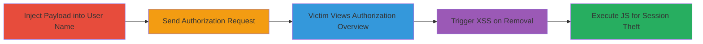

# Stored XSS in User Name Leading to Session Hijacking via Authorization Removal

Multi-stage attack chain demonstrating a complete stored XSS workflow on the Mobile Vikings web platform, where an attacker injects a payload into their user name, propagates it via an authorization request, and triggers execution in the victim's browser during authorization management.

## Chain Metrics Dashboard

| Metric | Value |
|--------|-------|
| Chain Status | Unverified |
| Total Steps | 4 |
| Execution Time | ~5 minutes |
| Skill Level | Intermediate |
| Complexity | Medium |
| Impact Level | High |

## Attack Flow Visualization

## Prerequisites & Requirements

### Required Tools

- None (relies on web browser and platform access)

### Target Environment

- Web platform: Mobile Vikings account management at https://mobilevikings.be/
- Required services/ports: HTTPS (443)
- Network access requirements: Internet access to the target site

### Initial Access Requirements

- Attacker account on Mobile Vikings
- Ability to modify user name (possibly via prior cookie-based XSS)
- Victim interaction with authorization features

## Detailed Attack Procedures

### Step 1: Inject XSS Payload into User Name
procedure: [[procedures/Inject-XSS-Payload-into-User-Name]]

**Objective**: Store a malicious JavaScript payload in the attacker's user name field to persist it for later propagation.

**Instructions**: Leverage a prior vulnerability (e.g., cookie manipulation) to set the user name to an XSS payload such as `` or a more advanced one like ``.

**Expected Output**: User name updated successfully in the account profile, with the payload stored server-side.

**Success Indicators**:
- Payload visible in account settings without immediate execution
- No sanitization errors during update

### Step 2: Send Malicious Authorization Request
procedure: [[procedures/Send-Malicious-Authorization-Request]]

**Objective**: Propagate the stored payload to a target victim by initiating an authorization request from the compromised account.

**Instructions**: From the attacker's account dashboard, navigate to the authorization section and send a request to the victim's account. The request will carry the tainted user name.

**Expected Output**: Authorization request sent and pending in the victim's account.

**Success Indicators**:
- Confirmation email or notification sent to victim
- Request appears in victim's authorization list with tainted user name

### Step 3: Induce Victim to Access Authorization Overview
procedure: [[procedures/Induce-Victim-to-Access-Authorization-Overview]]

**Objective**: Lure the victim into viewing the authorization management page where the payload is present but dormant.

**Instructions**: Use social engineering (e.g., email phishing) to prompt the victim to log in and check their authorizations at https://mobilevikings.be/en/account/authorization/overview/.

**Expected Output**: Victim loads the overview page, displaying pending authorizations including the attacker's tainted one.

**Success Indicators**:
- Victim confirms accessing the page (via follow-up or monitoring)
- No immediate payload execution on page load

### Step 4: Trigger XSS via Authorization Removal
procedure: [[procedures/Trigger-XSS-via-Authorization-Removal]]

**Objective**: Execute the stored XSS payload in the victim's browser by interacting with the authorization modal.

**Instructions**: Instruct or wait for the victim to click 'Remove authorization' on the malicious request, opening a modal where the parameter `x:authorization-to-first-name` renders the unsanitized user name, firing the JavaScript.

**Expected Output**: Arbitrary JavaScript executes, e.g., stealing session cookies and sending them to the attacker's server.

**Success Indicators**:
- Alert or network request to attacker's domain observed
- Victim's session data exfiltrated

## Attack Chain Summary

### Key Achievements

1. Persistent storage of XSS payload in user profile
2. Propagation via legitimate platform feature (authorizations)
3. Victim-side execution leading to client-side compromise
4. Potential for session hijacking and further attacks on authenticated users

## Technique & Tactic Coverage

### MITRE ATT&CK Techniques

- [[JavaScript]]

### MITRE ATT&CK Tactics

- [[Execution]]
- [[Collection]]

---
*Last updated: 2023-10-01T00:00:00Z*
