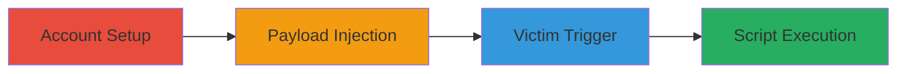

# Stored XSS in User Profile Animal Name Field for Arbitrary Script Execution

Multi-stage attack chain demonstrating a complete stored XSS exploitation workflow on a web application, allowing arbitrary JavaScript execution in victims' browsers.

## Chain Metrics Dashboard

| Metric | Value |
|--------|-------|
| Chain Status | Unverified |
| Total Steps | 5 |
| Execution Time | ~10 minutes |
| Skill Level | Intermediate |
| Complexity | Medium |
| Impact Level | High |

## Attack Flow Visualization

## Prerequisites & Requirements

### Required Tools

- Web browser (e.g., Chrome, Firefox)

### Target Environment

- Web application with user registration and profile features
- No specific ports or services required beyond standard HTTP/HTTPS

### Initial Access Requirements

- No prior credentials needed; attacker creates their own account
- Victim must have access to the profile viewing functionality

## Detailed Attack Procedures

### Step 1: Register New Account
procedure: [[procedures/Register-New-Account]]

**Objective**: Create an attacker-controlled account to access profile editing features.

**Instructions**: Navigate to the application's registration page and provide basic details like email and password. Submit the form to create the account.

**Expected Output**: Confirmation of account creation, typically via email or on-screen message.

**Success Indicators**:
- Account registered successfully
- Registration email received

### Step 2: Verify Account
procedure: [[procedures/Verify-Account]]

**Objective**: Activate the account to enable login and profile access.

**Instructions**: Check the registered email for a verification link and click it to confirm the account.

**Expected Output**: Account verification success message or redirect to login page.

**Success Indicators**:
- Verification email processed
- Account status updated to active

### Step 3: Login to Account
procedure: [[procedures/Login-to-Account]]

**Objective**: Authenticate as the attacker to access profile settings.

**Instructions**: Go to the login page, enter the attacker's credentials (email and password), and submit.

**Expected Output**: Successful login redirect to the dashboard or profile page.

**Success Indicators**:
- Session established
- Access to user profile settings granted

### Step 4: Inject Stored XSS Payload
procedure: [[procedures/Inject-Stored-XSS-Payload]]

**Objective**: Insert malicious JavaScript into the animal name field, which is stored and reflected without sanitization.

**Instructions**: From the profile settings page, locate the animal name input field and enter a payload such as `` or a more advanced one like ``. Save the changes.

**Expected Output**: Profile updated without errors; payload stored in the backend.

**Success Indicators**:
- Profile saves successfully
- No immediate errors or sanitization warnings

### Step 5: Trigger XSS Execution
procedure: [[procedures/Trigger-XSS-Execution]]

**Objective**: Cause the payload to execute in a victim's browser by having them view the attacker's profile.

**Instructions**: As a victim user, log in with victim credentials and navigate to the attacker's profile URL (e.g., /profile/attacker-id). The unsanitized animal name field will render the payload, executing the script.

**Expected Output**: JavaScript alert or other payload effects in the victim's browser, such as cookie access or session manipulation.

**Success Indicators**:
- Script executes (e.g., alert pops up)
- Victim's browser context compromised

## Attack Chain Summary

### Key Achievements

1. Successful account creation and payload injection without detection
2. Persistent storage of malicious script in user profile
3. Arbitrary JavaScript execution upon profile view, enabling session hijacking or data theft

## Technique & Tactic Coverage

### MITRE ATT&CK Techniques

- [[JavaScript]]

### MITRE ATT&CK Tactics

- [[Execution]]

---
*Last updated: 2023-10-01T00:00:00Z*
